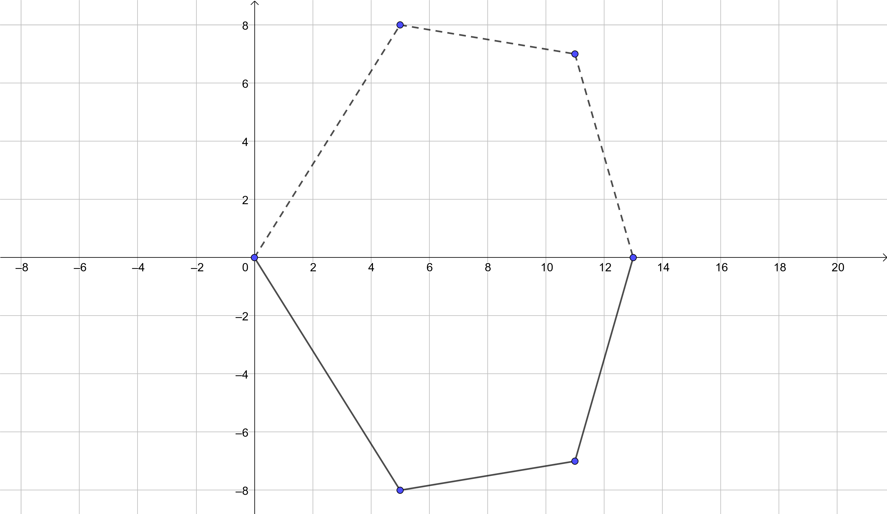

# (PART\*) Modelos discretos{-}

# Entramados

La siguiente figura ilustra cuatro puntos masivos unidos por tres barras de longitudes conocidas $\ell_{01}, \ell_{12}, \ell_{23}$, y masas despreciables. Los extremos etiquetados por $0$ y $3$ tienen posiciones fijas y los nodos intermedios de masas $m_1$ y $m_2$ ocupan posiciones de equilibrio. ¿A partir de cuales ecuaciones se podrían determinar las posiciones $q_i=(x_i,y_i)$ de estos nodos?

<iframe src="https://www.geogebra.org/classic/psru5cr9?embed" width="800" height="600" allowfullscreen style="border: 1px solid #e4e4e4;border-radius: 4px;" frameborder="0"></iframe>

<!--
```{python, echo=FALSE}

import matplotlib.pyplot as plt

plt.plot([0,1,3,4], [0,-2,-3,0],[0,1,3,4], [0,-2,-3,0],'ro')

ts = 14

plt.text(0.1,-0.1,'0',fontsize=ts)
plt.text(1.05,-1.9,'1',fontsize=ts)
plt.text(3.1,-3,'2',fontsize=ts)
plt.text(3.8,-0.1,'3',fontsize=ts)


plt.text(0.6,-1,'$\ell_{01}$',fontsize=ts)
plt.text(1.7,-2.6,'$\ell_{12}$',fontsize=ts)
plt.text(3.55,-1.7,'$\ell_{23}$',fontsize=ts)

plt.show()
```
-->

Antes de proceder a plantear el sistema de ecuaciones recordemos que por lo general el número de ecuaciones e incógnitas deben ser iguales para que este esté bien planteado, es decir que existan soluciones y que sean únicas (al menos localmente). En nuestro caso tenemos cuatro incógnitas, los dos pares de coordenadas de cada nodo libre. Además debemos considerar las restricciones impuestas por las distancias entre los nodos, es decir tres ecuaciones. Hasta el momento el sistema es indeterminado, tiene más incógnitas (4) que ecuaciones (3), sin embargo aún nos falta incorporar la información del fenómeno de equilibrio:

$$
\begin{cases}
(x_1-0)^2 + (y_1-0)^2 = \ell_{01}^2,\\
(x_1-x_2)^2 + (y_1-y_2)^2 = \ell_{12}^2,\\
(x_2-3)^2 + (y_2-0)^2 = \ell_{23}^2.
\end{cases}
$$

En cada nodo libre actúan tres fuerzas: dos tensiones y la gravedad $(= -m_ige_y)$. Por ejemplo, la tensión $T_{12}$ sobre el nodo 1 y que se produce sobre el segmento que une los nodos 1 y 2 es proporcional al vector $q_2-q_1$, es decir $T_{12} = \lambda_{12} (q_2-q_1)$ para un cierto escalar $\lambda_{12}$. Similarmente podemos razonar sobre las demás interacciones, introduciendo así cuatro nuevas variables $\lambda_{10}, \lambda_{12}, \lambda_{21}$, y $\lambda_{23}$. Para que el sistema se encuentre en equilibrio, la suma de las fuerzas sobre cada nodo debe anularse, lo cual nos da igualmente cuatro ecuaciones:

$$
\begin{cases}
\lambda_{10}(x_{0}-x_{1})+\lambda_{12}(x_{2}-x_{1}) = 0,\\
\lambda_{10}(y_{0}-y_{1})+\lambda_{12}(y_{2}-y_{1}) = m_{1}g,\\
\lambda_{23}(x_{3}-x_{2})+\lambda_{21}(x_{1}-x_{2}) = 0,\\
\lambda_{23}(y_{3}-y_{2})+\lambda_{21}(y_{1}-y_{2}) = m_{2}g.
\end{cases}
$$

Pareciera que no hemos logrado mucho en términos del sistema que sigue siendo indeterminado con ocho incógnitas (2 $x$'s, 2 $y$'s y 4 $\lambda$'s) y siete ecuaciones (3 distancias y 4 balances de fuerzas). Sin embargo, la tercera ley de Newton nos dice que las interacciones entre pares de nodos guarda una simetría: toda acción produce una reacción opuesta de la misma magnitud. En nuestro modelo esto se refleja en $T_{12} = -T_{21}$, de donde obtenemos la última ecuación

$$
\lambda_{12}=\lambda_{21}.
$$

De hecho es más sencillo eliminar una de las incógnitas ($\lambda_{21}$) que añadir otra ecuación. En conclusión obtenemos el siguiente sistema con siete ecuaciones e incógnitas

$$
\begin{cases}
\lambda_{10}(x_{0}-x_{1})+\lambda_{12}(x_{2}-x_{1}) = 0\\
\lambda_{10}(y_{0}-y_{1})+\lambda_{12}(y_{2}-y_{1}) = m_{1}g\\
\lambda_{23}(x_{3}-x_{2})+\lambda_{12}(x_{1}-x_{2}) = 0\\
\lambda_{23}(y_{3}-y_{2})+\lambda_{12}(y_{1}-y_{2}) = m_{2}g\\
(x_1-0)^2 + (y_1-0)^2 = \ell_{01}^2\\
(x_1-x_2)^2 + (y_1-y_2)^2 = \ell_{12}^2\\
(x_2-3)^2 + (y_2-0)^2 = \ell_{23}^2
\end{cases}
$$

Una forma de obtener solución a este sistema es el método de Newton. Por ejemplo, para los valores $\ell_{01}=\sqrt{5}, \ell_{12}=\sqrt{5}, \ell_{23}=\sqrt{10}, m_1=1, m_2=2, q_0=(0,0), q_3=(4,0)$ la siguiente implementación ilustra como obtener la solución usando Python^[**Advertencia:** El código es sensible a las condiciones iniciales para la iteración y no siempre converge.].

```{python}
#Librerías

import matplotlib.pyplot as plt
import numpy as np
from scipy.optimize import fsolve

#Parámetros

l01=np.sqrt(5)
l12=np.sqrt(5)
l23=np.sqrt(10)
x3,y3=4,0
m1=1
m2=2

#Sistema de ecuaciones y gráfica

def f(x):
  x1,y1,x2,y2,lambda01,lambda12,lambda23 = x
  f=np.zeros(7)
  f[0] = x1**2+y1**2-l01**2
  f[1] = (x2-x1)**2+(y2-y1)**2-l12**2
  f[2] = (x3-x2)**2+(y3-y2)**2-l23**2
  f[3] = -lambda01*x1+lambda12*(x2-x1)
  f[4] = -lambda01*y1+lambda12*(y2-y1)-m1
  f[5] = lambda12*(x1-x2)+lambda23*(x3-x2)
  f[6] = lambda12*(y1-y2)+lambda23*(y3-y2)-m2
  return f

r = fsolve(f,[1,-1,3,-2,0,0,0])

x1,y1=r[0],r[1]
x2,y2=r[2],r[3]

fig, ax = plt.subplots()
ax.plot([0,r[0],r[2],x3], [0,r[1],r[3],y3])
ax.plot(0,0,color='tab:blue', marker='o', label='$q_0=(0,0)$')
ax.plot(x1,y1,color='tab:orange', marker='o', label="$q_1=({:.4f},{:.4f})$".format(x1, y1))
ax.plot(x2,y2,color='tab:green', marker='o', label="$q_1=({:.4f},{:.4f})$".format(x2, y2))
ax.plot(x3,y3,color='tab:red', marker='o', label="$q_1=({},{})$".format(x3, y3))
leg = ax.legend();

plt.show()
```

Estas ideas son fácilmente generalizables a configuraciones lineales con más nodos. En el límite se obtiene el *problema de la catenaria*. También podemos considerar estructuras más complejas, por ejemplo un pañuelo sujeto por las esquinas. Para poder dar una generalización de estos modelos presentamos en la siguiente sección algunas nociones básicas de teoría de grafos. Una referencia entretenida con aplicaciones en arquitectura está en el siguiente enlace:

<iframe width="560" height="315" src="https://www.youtube.com/embed/KXP_kPPc7LY" title="YouTube video player" frameborder="0" allow="accelerometer; autoplay; clipboard-write; encrypted-media; gyroscope; picture-in-picture" allowfullscreen></iframe>

---

::: {.exercise}
Calcula $m_2$ para que el entramado esté en equilibrio dado que los nodos en $(0,0)$ y $(13,0)$ están fijos

{width=70%}
:::

<details>
  <summary>Solución</summary>
Las fuerzas en el nodo $1$ están dadas por
$$
\begin{cases}
5\lambda_{01}=6\lambda_{12},\\
8\lambda_{01}+\lambda_{12}=g
\end{cases} \qquad\Rightarrow\qquad \lambda_{01}=\frac{6g}{53}, \lambda_{12}=\frac{5g}{53}
$$
Las fuerzas en el nodo $2$ están dadas por
$$
\begin{cases}
6\lambda_{12}=2\lambda_{23},\\
-\lambda_{12}+7\lambda_{23}=m_2g
\end{cases} \qquad\Rightarrow\qquad \lambda_{23}=\frac{15g}{53}, m_2=\frac{100}{53}.
$$
</details>

---

::: {.exercise}
Demuestra que si un dado entramado como en la figura, y con extremos en el eje horizontal, está en equilibro, entonces su correspondiente reflexión en el eje horizontal también está en equilibrio. ¿Será posible generalizar este principio a un entramado general?

{width=70%} 
:::

<details>
  <summary>Solución</summary>
Denotamos por $\lambda_i=\lambda_{i,i-1} = -\lambda_{i-1,i}$.

En cada nodo del entramado original se tiene el balance de fuerzas está dado por
$$
\begin{cases}
(x_i-x_{i-1})\lambda_i=(x_{i+1}-x_{i})\lambda_{i+1},\\
(y_{i-1}-y_{i})\lambda_i+(y_{i+1}-y_{i})\lambda_{i+1}=m_ig
\end{cases}
$$
Al tomar la reflexión en el eje horizontal las coordenadas de los nodos pasan a ser $(x_i,y_i)\mapsto (x_i',y_i') = (x_i,-y_i)$. Gracias a las relaciones previas, se observa que estas coordenadas satisfacen igualmente las ecuaciones de balance de fuerzas cuando igualmente reemplazamos $\lambda_i\mapsto \lambda_i' =-\lambda_i$
$$
\begin{cases}
(x_i'-x_{i-1}')\lambda_i'=(x_{i+1}'-x_{i}')\lambda_{i+1}',\\
(y_{i-1}'-y_{i}')\lambda_i'+(y_{i+1}'-y_{i}')\lambda_{i+1}'=m_ig.
\end{cases}
$$
Este principio se generaliza a un entramado general con una notación adecuada.
</details>