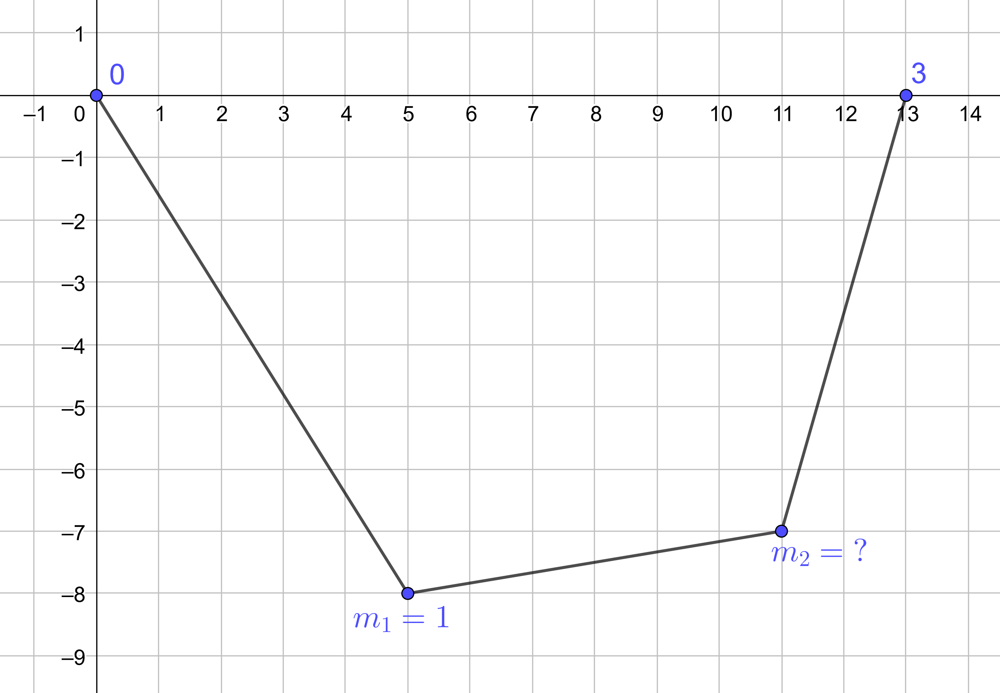
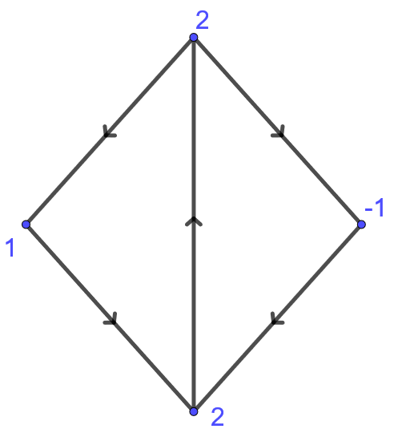
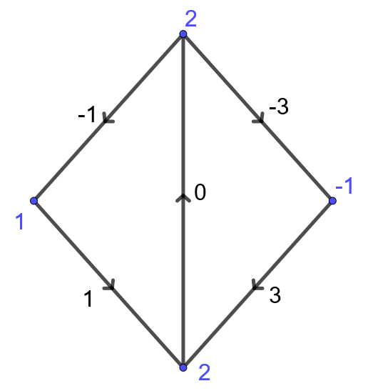
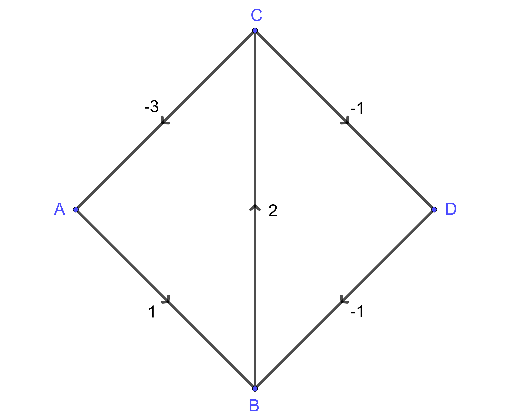
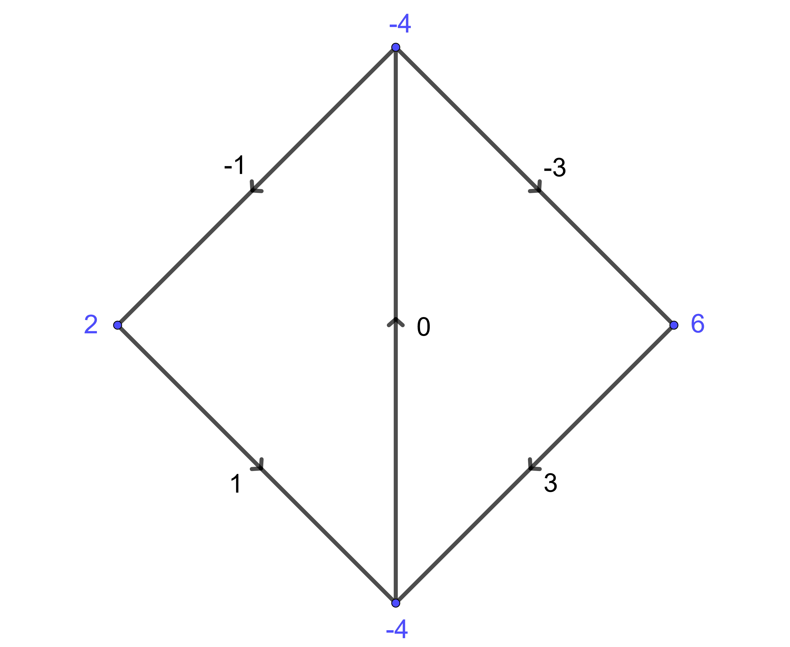
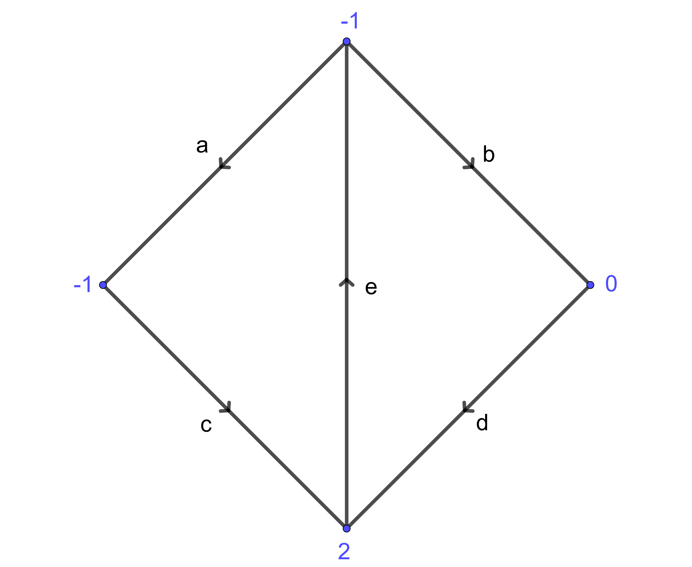
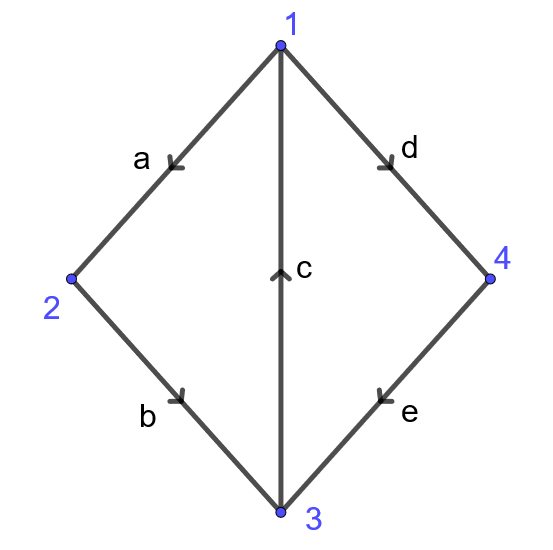
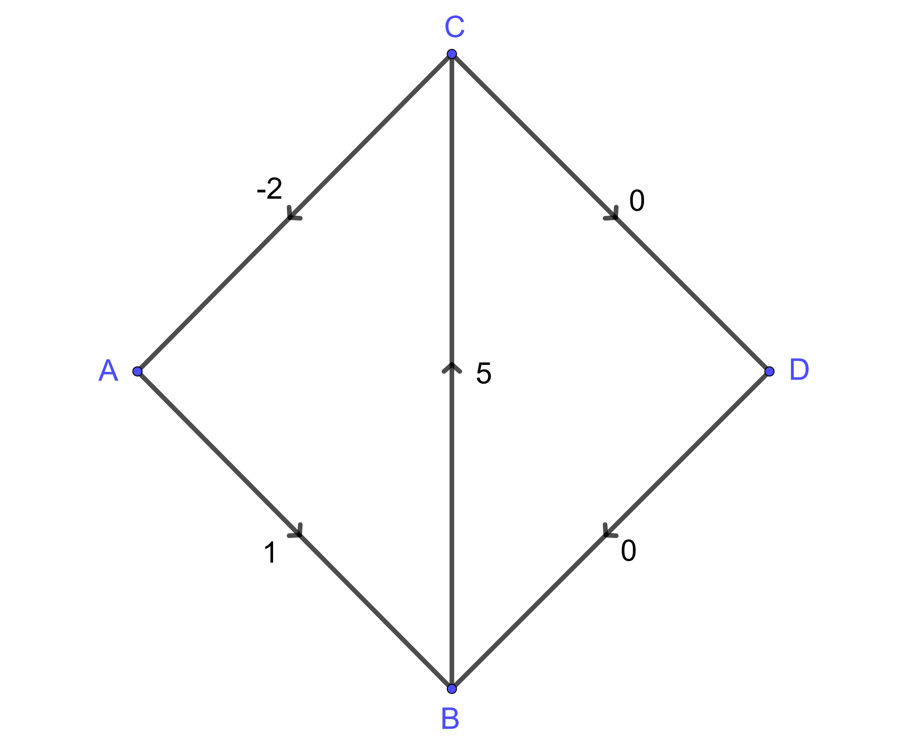
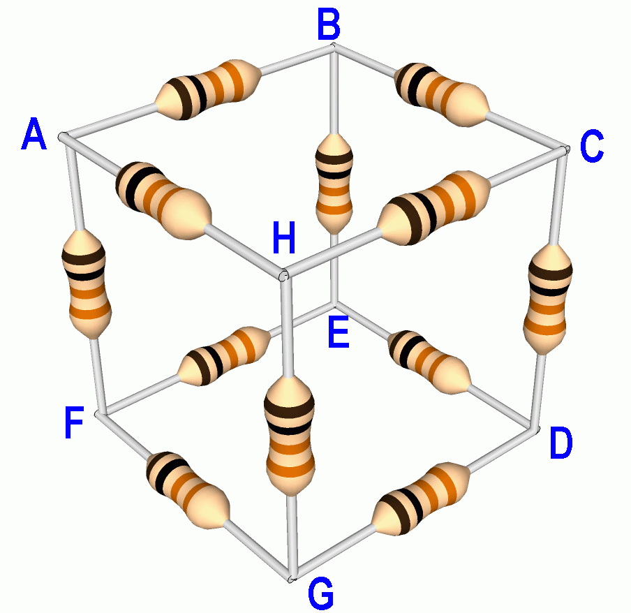
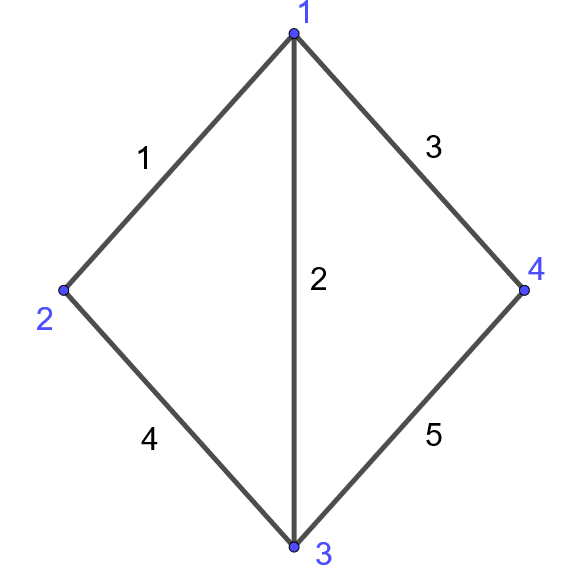

# Cálculo discreto

Una grafo dirigido $G = (V,E)$ consiste de un conjunto de vértices $V$, también llamados nodos, y un conjunto de aristas $E \subseteq V^2$, es decir pares ordenados de $V$.

Dado $e = (a,b)\in E$, denotamos por $e_-=a$ y $e_+=b$ los nodos de partida y llegada de $e$ respectivamente y decimos que $e$ está orientado del nodo de salida $a$ al nodo de llegada $b$.

En general trabajaremos con grafos con aristas simples, es decir que a lo sumo existe una arista que conecta dos vértices en cualquier orientación. Sin embargo, cuando $e=(a,b)\in E$ podríamos hacer referencia a la arista $-e:=(b,a)$ como la arista $e$ pero con el sentido opuesto. Denotaremos $-E = \{-e \in V^2:e\in E\}$.

Finalmente, podemos considerar también conjuntos de aristas no orientadas en cuyo caso decimos que el grafo es no dirigido.

---

::: {.exercise}
Dibuja el grafo $G=(V,E)$ para
$$
V = \{1,2,3,a,b,c\}, \qquad E = \{(1,a),(1,b),(1,c),(2,a),(2,b),(2,c),(3,a),(3,b),(3,c)\}.
$$
:::

<details>
  <summary>Solución</summary>

<iframe src="https://www.geogebra.org/classic/xtjh7atb?embed" width="800" height="600" allowfullscreen style="border: 1px solid #e4e4e4;border-radius: 4px;" frameborder="0"></iframe>
</details>

---

Las redes eléctricas son uno de los modelos más conocidos que se pueden formular en términos de grafos. Sobre el grafo podemos caracterizar por ejemplo el potencial o voltaje como una función $u:V\to \mathbb R$ y la corriente como una función $i:E\to \mathbb R$. Siguiendo un poco la nomenclatura que sugiere este modelo, distinguimos dos tipos de funciones en $G$:

1. **Potencial:** Es una función sobre el conjunto de vértices $u: V \to \mathbb R$.
1. **Flujo:** Es una función sobre el conjunto de aristas $f: E \to \mathbb R$.

En algunos casos también podríamos considerar que dichas funciones tomen valores en $\mathbb C$, $\mathbb R^n$ ó $\mathbb C^n$.

También denominamos como flujos a funciones que están definidas en $E\cup -E$, es decir que consideran ambas orientaciones de las aristas. Decimos que $f:E\cup -E\to\mathbb R$ es **par** cuando no depende de la orientación $f(-e) = f(e)$, y decimos que **impar** si en cambio $f(-e) = -f(e)$. Una función $f:E\to\mathbb R$ en un grafo no dirigido es equivalente a una función par en el mismo grafo y con cualquier orientación sobre las aristas.
 
---

:::{.example}
En el modelo de [entramados](#entramados) en la sección anterior, el grafo no dirigido $G=(V,E)$ con $V = \{0,1,2,3\}$ y $E=\{\{0,1\},\{1,2\},\{2,3\}\}$ nos proporciona la información sobre cuales nodos están conectados entre si. Las posiciones de los nodos se caracterizan por $q:V\to \mathbb R^2$ y las longitudes de los enlaces están determinadas por $\ell:E\to\mathbb R$.

{width=70%}

Para modelar las tensiones es conveniente considerar el grafo dirigido $G=(V,E')$ de alguna forma arbitraria, quizás $E'=\{(0,1),(1,2),(2,3)\}$. De esta forma contamos con la función par $\lambda:E'\cup-E'\to\mathbb R$ y la función impar $T: E'\cup-E' \to \mathbb R^2$ tales que
$$
T(e) = \lambda(e)(q(e_+)-q(e_-))
$$
es la tensión sobre el nodo $e_-$ a lo largo de $e$. A su vez y gracias a la ley de acción y reacción, $T(-e) = -T(e)$ es la tensión sobre el nodo $e_+$ a lo largo de $e$ pero en la orientación opuesta, es decir $-e$.
:::

---

:::{.example}
Un potencial $u:V\to\mathbb R$ sobre una red de resistencia genera una corriente $i:E\to \mathbb R$ que modelamos usando la ley de Ohm para una dada resistencia $R:E\cup -E \to (0,\infty)$ (función par). Esto quiere decir que la corriente $i(e)$ que atraviesa una arista $e = (e_-,e_+)$ es proporcional a la diferencia de los potenciales en los extremos de la arista
$$
i(e) = \frac{u(e_+) - u(e_-)}{R(e)}, \qquad R(e) >0: \text{ Resistencia.}
$$
:::

---

## Gradiente

Tanto en la construcción de las tensiones $T$, como en la de la corriente eléctrica $i$, estamos considerando la variación de una dada función (las posiciones $q$ ó el potencial $u$) a lo largo de una arista dada. Esto es una versión discreta de la derivada direccional. En este caso requerimos que el grafo sea orientado.

:::{.definition}
Dado potencial $u:V\to\mathbb R$ sobre un grafo dirigido $G=(V,E)$, definimos el gradiente $Du: E\cup -E \to \mathbb R$ tal que
$$
Du(e) = u(e_{+})-u(e_{-}).
$$
:::

En particular, el gradiente es una función impar.

---

:::{.exercise}
Calcula el gradiente de la función dada en los vértices del siguiente grafo


{width=70%}
:::

<details>
  <summary>Solución</summary>
{width=70%}
</details>

---

:::{.exercise}
Verifica que el gradiente satisface la identidad de Leibniz
$$
D(u_1u_2) = u_1^+ Du_2 + u_2^-Du_1
$$
donde $u^\pm:E\to\mathbb R$ se define a partir de $u:V\to\mathbb R$ como $u^\pm(e) = u(e_\pm)$.
:::

<details>
  <summary>Solución</summary>
  $$
  \begin{aligned}
  D(u_1u_2)(e) &= u_1(e_+)u_2(e_+) - u_1(e_-)u_2(e_-),\\
               &= u_1(e_+)u_2(e_+) - u_1(e_+)u_2(e_-) + u_1(e_+)u_2(e_-) - u_1(e_-)u_2(e_-),\\
               &= u_1(e_+)(u_2(e_+)-u_2(e_-)) + u_2(e_-)(u_1(e_+)-u_1(e_-)),\\
               &= u_1(e_+)Du_2(e) + u_2(e_-)Du_1(e),\\
               &= (u_1^+Du_2 + u_2^-Du_1)(e).
  \end{aligned}
  $$
</details>
---

### Ley de ciclos

No toda función (impar) $f:E\cup -E \to \mathbb R$ es necesariamente un gradiente. Una condición necesaria y suficiente es la **ley de ciclos**. Para poder enunciar esta ley es conveniente dar algunas definiciones previas para un dado grafo dirigido $G=(V,E)$.

:::{.definition}
Un **camino no orientado** es una sucesión de vértices $x_0,x_1, \dots, x_n \in V$ tal que $(x_j,x_{j+1}) \in E\cup -E$ para todo $j\in\{0,1,\ldots,(n-1)\}$. Se dice que el camino es un **ciclo** si además $x_n=x_0$.
:::

:::{.definition}
Una **componente conexa** de $G$ es un subconjunto $V'\subseteq V$ tal que:
  
- Todos los vértices en $V'$ están conectados entre si por algún camino.
    
- Ningún vértice de $V'$ está conectado con ningún vértice de $V\setminus V'$.

Decimos que $G$ es **conexo** si tiene una única componente conexa.
:::

:::{.theorem name="Ley de ciclos"}
Sea $G=(V,E)$ un grafo dirigido finito. Una función impar $f:E\cup -E\to\mathbb R$ es igual al gradiente de una función $u:V\to \mathbb R$ si y solo si para todo ciclo $x_0,x_1, \dots, x_n=x_0$ se tiene que
$$
\sum_{j=0}^{n-1} f(x_j,x_{j+1}) = 0.
$$
:::

:::{.proof}
Por un lado es fácil verificar la identidad para flujos gradientes usando la propiedad telescópica. Dado un ciclo $x_0,x_1, \dots, x_n=x_0$
$$
\sum_{j=0}^{n-1} Du(x_j,x_{j+1}) = \sum_{j=0}^{n-1} (u(x_{j+1})-u(x_j)) = u(x_n)-u(x_0)=0.
$$

Podemos construir $u:V'\to \mathbb R$ sobre cada una de las componentes conexas de $G$ de la siguiente forma: Fijemos $x_0 \in V'$ y definimos
$$
u(x) := \sum_{j=0}^{n-1} f(x_j,x_{j+1})
$$
donde $x_0,x_1, \dots, x_n=x$ es un camino no orientado que conecta $x_0$ con $x\in V'$.

La hipótesis dada por la ley de ciclos garantiza que esta construcción no depende del camino escogido, es decir que está bien definida sin posible ambigüedad: Dados dos caminos $x_0,\ldots,x_n=x$ y $y_0=x_0,\ldots,y_m=x$ se tiene que $z_0=x_0,\ldots,z_n=x_n,z_{n+1}=y_{m-1},\ldots,z_{n+m}=y_0$ es un ciclo y por lo tanto
$$
0 = \sum_{j=0}^{n+m-1} f(z_j,z_{j+1}) = \sum_{j=0}^{n-1} f(x_j,x_{j+1}) - \sum_{j=0}^{m-1} f(y_j,y_{j+1}).
$$

Veamos finalmente que $Du = f$. Dado $e\in E$ con $e_\pm$ en la misma componente que $x_0$, tomamos un camino $x_0,x_1,\ldots, x_n=e_-$ de $x_0$ a $e_-$ y luego añadimos $x_{n+1}=e_+$ para formar un camino de $x_0$ a $e_+$. Por lo tanto
$$
Du(e) = u(e_+)-u(e_-) = \sum_{j=0}^{n} f(x_j,x_{j+1})-\sum_{j=0}^{n-1} f(x_j,x_{j+1}) = f(e),
$$
con lo cual concluímos la demostración.
:::

Este argumento nos permite apreciar que $u$ está únicamente determinado salvo potenciales constantes en cada componente conexa de $G$. Las constantes son los valores arbitrarios que daríamos a $u$ sobre el nodo $x_0$, que en nuestra demostración fue cero. En otras palabras, la nulidad del gradiente captura el número de componentes conexas del grafo.

---

:::{.exercise}
Calcula los potenciales que generan el flujo dado en la siguiente figura

{width=70%}
:::

<details>
  <summary>Solución</summary>
  
  El flujo satisface la ley de ciclos. Por ejemplo en el triángulo de la izquierda la suma correspondiente es $-3+1+2=0$ y de igual forma podemos verificar en el triángulo de la derecha ($2+(-1)+(-1)=0$) o en el cuadrado exterior ($(-3)+1-(-1)-(-1)=0$). Si tomamos $u(A)=0$ sin pérdida de generalidad tenemos que
  $$
  \begin{cases}
  u(B) = 1 + u(A) = 1,\\
  u(C) = 3 + u(A) = 3,\\
  u(D) = -1 + u(C) = 2.
  \end{cases}
  $$
  Verificamos además que con estos valores se obtiene el gradiente prescrito
  $$
  \begin{cases}
  Du(AB) = u(B)-u(A) = 1-0 = 1,\\
  Du(BC) = u(C)-u(B) = 3-1 = 2,\\
  Du(CA) = u(A)-u(C) = 0-3 = -3,\\
  Du(CD) = u(D)-u(C) = 2-3 = -1,\\
  Du(DB) = u(B)-u(D) = 1-2 = -1.
  \end{cases}
  $$
  En general, $u$ tiene el gradiente prescrito si y solo si
  $$
  u(A) = C, \qquad u(B) = 1+C, \qquad u(C) = 3+C, \qquad u(D)=2+C.
  $$
</details>

---

<details>
  <summary>**Margen de cálculo:** El lema de Poincaré</summary>
Como ya el lector habrá notado, estas construcciones y propiedades encuentran paralelos en cálculo multivariable, y de hecho las demostraciones reproducen las mismas ideas: Los caminos son curvas, los ciclos son lazos o curvas cerradas y la expresión $\sum_{j=0}^{n-1} f(x_j,x_{j+1})$ es análoga a la integral de línea o el trabajo de un campo vectorial sobre una curva.

El resultado que acabamos de enunciar se conoce como el **Lema de Poincaré global**. Recordemos su enunciado junto con el resultado local.

**Lema de Poincaré (global):** Un campo vectorial $f \in C(\Omega\subseteq\mathbb R^n\to\mathbb R^n)$ es el gradiente de algún potencial $u\in C^1(\Omega\to\mathbb R)$ si y sólo si para cualquier curva cerrada $\gamma \in C^1([a,b]\to\Omega)$ (i.e. $\gamma(b)=\gamma(a)$) se tiene que el trabajo que ejerce $f$ sobre la curva $\gamma$ se anula
$$
\int_\gamma f = \int_a^b f(\gamma(t))\cdot \gamma'(t)dt = 0.
$$

**Lema de Poincaré (local):** Si $\Omega\subseteq\mathbb R^n$ es simplemente conexo^[es decir que cualquier ciclo puede ser deformado continuamente a un punto. Por ejemplo, si $n=2$ dice que $\Omega$ no tiene hoyos.] entonces $f \in C^1(\Omega\to\mathbb R^n)$ es un gradiente si y solo si $\partial_if_j = \partial_jf_i$.
</details>

## Divergencia

Otro operador diferencial que tiene su análogo en grafos es la divergencia. Heurísticamente, la divergencia de un campo vectorial mide cuando es positiva la cantidad de flujo que sale o diverge del nodo dado, mientras que cuando es negativa mide la cantidad de flujo que recibe o converge en el nodo.

:::{.definition}
Dado $f: E \to \mathbb R$ denotamos por $\operatorname{div} f:V\to \mathbb R$ a la divergencia de $f$ donde
$$
\operatorname{div} f(v) = \sum_{e_-=v}f(e)-\sum_{e_+=v}f(e)
$$
:::

---

:::{.example}
En la siguiente figura se calculó la divergencia de la función dada en las aristas

{width=70%}
:::

---

:::{.example}
Las ecuaciones de balance para un entramado se escriben en términos de la divergencia de las tensiones sobre los nodos libres como
$$
\operatorname{div} T = mge_y
$$
:::

---

:::{.example}
La ley de Kirchhoff dice que en en un nodo que no está conectado a la batería, la corriente que entra y sale de este son iguales. En términos de la divergencia quiere decir que
$$
\operatorname{div} i = 0
$$
:::

---

### Fórmula de la divergencia

Al igual que antes, podríamos preguntarnos si todo potencial es la divergencia de algún campo. Esto no es necesariamente cierto, la divergencia satisface la **ley de conservación**, análoga al teorema de la divergencia. Un caso particular ilustrativo de esta ley postula que la suma de la divergencia sobre un grafo finito es igual a cero
$$
\sum_{v\in V} \operatorname{div} f(v) = 0.
$$
Una vez más la justificación se basa en una propiedad telescópica para la suma: Cada arista aparece dos veces en la suma con signos opuestos dependiendo si se considera su vértice origen o de llegada.

Para dar una versión discreta del teorema de la divergencia consideramos el campo normal exterior $n_\Omega:E\to \mathbb R$ tal que
$$
n_\Omega(e) = \begin{cases}
+1 \text{ si $e_-\in \Omega$ y $e_+\in V\setminus \Omega$},\\
-1 \text{ si $e_-\in V\setminus \Omega$ y $e_+\in \Omega$},\\
0 \text{ en cualquier otro caso}
\end{cases}
$$
en este caso el signo de $n_\Omega(e)$ indica cuando la arista orientada conecta a $\Omega$ con su complemento o viceversa.

---

:::{.exercise}
El campo normal es el gradiente de una dada función ¿Cuál?.
:::

<details>
  <summary>Solución</summary>
  $n_\Omega = D1_{V\setminus \Omega}$ donde
  $$
  1_{V\setminus \Omega}(x) = \begin{cases}
  1 \text{ si } x\in V\setminus \Omega,\\
  0 \text{ en cualquier otro caso}.
  \end{cases}
  $$
</details>

---

:::{.theorem name="Fórmula de la divergencia"}
Sea $G=(V,E)$ un grafo dirigido finito y $\Omega \subseteq V$. La divergencia de $f:E\to \mathbb R$ verifica
\begin{equation}
\sum_{v\in \Omega} \operatorname{div} f(v) = \sum_{e\in E} f(e)n_\Omega(e)
(\#eq:div)
\end{equation}
:::

De hecho la suma en el lado derecho ocurre en realidad sobre un subconjunto de aristas que podemos definir como el borde de $\partial\Omega$
$$
\partial \Omega := \{e\in E\ | \ \{e_+,e_-\} \cap \Omega \neq \emptyset \text{ y } \{e_+,e_-\} \cap V\setminus \Omega \neq \emptyset\}.
$$
Es decir las aristas que conectan $\Omega$ con su complemento en cualquier orientación.

La cantidad $f(e)n_\Omega(e)$ es positiva cuando $e_-\in \Omega$, $e_+\in V\setminus \Omega$ y $f(e)>0$; o bien cuando $e_-\in V\setminus \Omega$, $e_+\in \Omega$ y $f(e)<0$. En cualquier caso, $f(e)n_\Omega(e)$ se interpreta como el flujo que escapa de $\Omega$ por medio de $e$. Un razonamiento similar se dá cuando $f(e)n_\Omega(e)$ es negativo para el flujo que entra. El balance total nos dice que la masa que se produce o absorbe en $\Omega$ se puede medir de dos formas, sumando las divergencias en $\Omega$ u observando las contribuciones que escapan o entran por las aristas que conectan a $\Omega$ con su complemento $V\setminus \Omega$ en cualquier orientación.

:::{.proof}
Sean $1_\pm:V\times E\to \mathbb R$ definidas según
$$
1_\pm(v,e) := \begin{cases}
1 \text{ si } e_\pm = v,\\
0 \text{ en cualquier otro caso}.
\end{cases}
$$
En particular usaremos que
$$
\sum_{v\in \Omega} 1_\pm(v,e) = \begin{cases}
1 \text{ si } e_\pm \in \Omega,\\
0 \text{ en cualquier otro caso}
\end{cases}
$$

Tenemos así que
$$
\begin{aligned}
\sum_{v\in \Omega} \operatorname{div} f(v) &= \sum_{v\in \Omega} \sum_{e_-=v} f(e) - \sum_{v\in \Omega} \sum_{e_+=v} f(e),\\
&= \sum_{v\in \Omega} \sum_{e \in E} f(e)1_-(v,e) - \sum_{v\in \Omega} \sum_{e \in E} f(e)1_+(v,e),\\
&= \sum_{e \in E} \sum_{v\in \Omega}f(e)1_-(v,e) - \sum_{e \in E} \sum_{v\in \Omega}f(e)1_+(v,e),\\
&= \sum_{e_-\in \Omega} f(e) -\sum_{e_+\in \Omega} f(e),\\
&= \sum_{\substack{e_-\in \Omega\\e_+\in V\setminus \Omega}} f(e) + \sum_{e_-, e_+\in \Omega} f(e) - \sum_{\substack{e_+\in \Omega\\e_-\in V\setminus \Omega}} f(e) - \sum_{e_-, e_+\in \Omega} f(e),\\
&= \sum_{\substack{e_-\in \Omega\\e_+\in V\setminus \Omega}} f(e) - \sum_{\substack{e_+\in \Omega\\e_-\in V\setminus \Omega}} f(e)
\end{aligned}
$$

Esta última expresión es por definición de $n_\Omega$ igual a
$$
\sum_{e\in E} f(e)n_\Omega(e),
$$
con lo cual se concluye la demostración.
:::

<details>
  <summary>**Margen de cálculo:** El teorema de la divergencia</summary>
  El teorema de la divergencia nos dice que dado un subconjunto $\Omega \subset\mathbb R^n$ con frontera localmente de clase $C^1$ a trozos, y campo $v\in C^1(\overline{\Omega}\to\mathbb R^n)$, entonces
$$
\int_\Omega \operatorname{div} v = \int_{\partial \Omega} v\cdot n
$$
donde $n$ es el vector normal exterior a $\Omega$.

El lado derecho integra el flujo que escapa o entra en $\Omega$ a través de su borde. En concreto, si en un punto dado del borde  $v\cdot n >0$ entonces $v$ apunta en la dirección de $n$ y el flujo escapa con una tasa igual a $v\cdot n$,  si en cambio  $v\cdot n < 0$ el flujo estaría entrando, y si $v\cdot n=0$ se tiene que $v$ es tangente y el flujo apenas roza la superficie. El lado izquierdo de la expresión es una integral sobre $\Omega$ que representa la producción/absorción de flujo por el campo $v$.
</details>

### Lema de Poincaré para la divergencia

:::{.theorem}
Sea $G=(V,E)$ un grafo dirigido finito y conexo. Para cualquier $\mu:V\to\mathbb R$ tal que
$$
\sum_{x\in V}\mu(x)=0
$$
existe por lo menos una solución $f:E\to\mathbb R$ de
$$
\operatorname{div} f = \mu.
$$
:::

:::{.proof}
Tomemos un nodo arbitrario $x_0\in V$ y consideremos inductivamente caminos no orientados que vayan conectando a $x_0$ con cada uno de los nodos restantes y de tal forma que nunca se formen ciclos en esta construcción. Es decir, estamos proponiendo un [**árbol generador**](https://en.wikipedia.org/wiki/Spanning_tree) del grafo con raíz en el nodo $x_0$^[En otras palabras un sub-grafo $T_0 := (V_0=V,E_0\subseteq E)$ libre de ciclos y conexo]. Denotaremos dicho árbol por $T_0=(V_0=V,E_0)$. Fijamos $f=0$ en las aristas de $E\setminus E_0$ y en los demás ajustaremos $f$ para que satisfaga la ecuación dada.

En la siguiente construcción estaremos definiendo a $f:E\cup-E\to \mathbb R$ como una función impar.

La idea consiste en ir podando las ramas del árbol a medida que asignamos $f$ convenientemente. Si $|V_0|=1$ el problema sería trivial, asumamos así que $|V_0|>1$. En el primer paso tomamos una hoja de $T_0$, es decir un $x\in V_0$ con un único nodo $y \sim_{T_0} x$. Declaramos así $f(x,y) = \mu(x)$ de modo que se tiene que $\operatorname{div}f(x) = \mu(x)$. Una vez declarado $f$ en la arista $e=(x,y)$ procedemos a considerar el árbol $T_1 = (V_0\setminus \{x\},E_1:=E_0\setminus \{(x,y),(y,x)\})$.

Asumamos de forma inductiva que luego de $k$ pasos contamos con los árboles
$$
T_k = (V_k,E_k) \subset T_{k-1} := (V_{k-1},E_{k-1}) \subset \ldots \subset T_0
$$
tales que $f$ ha sido definida en $E\setminus E_k$ tal que $\operatorname{div}f=\mu$ se satisface sobre $V\setminus V_k$. Para el siguiente paso tomamos una hoja $x \in V_k$ y fijamos $f$ sobre la (única) arista $(x,y) \in E_k\cup-E_k$ de modo que la ecuación ahora se satisfaga sobre el nodo $x$. Para el siguiente paso podamos a $x$ de $T_k$, es decir que
$$
T_{k+1}:= (V_{k+1}=V_k\setminus\{x\},E_{k+1}:=E_k\setminus\{(x,y),(y,x)\}).
$$
Claramente esta construcción garantiza que las hipótesis inductivas se siguen cumpliendo en el siguiente paso.

Una vez terminado este algoritmo garantizamos que $\operatorname{div} f=\mu$ se cumple en $V\setminus \{x_0\}$ (la raíz del árbol). Como última observación tenemos que la ecuación también debe cumplirse en $x_0$ gracias a que $\sum_{x\in V} \operatorname{div} f(x)=\sum_{x\in V} \mu(x)=0$.
:::

Notemos que si $x_0,\ldots,x_k=x_0$ es un dado ciclo del grafo, entonces si tomamos $f=1$ en las aristas del ciclo y cero por fuera de estas, obtenemos una solución de $\operatorname{div} f=0$. De hecho, todas las soluciones homogéneas se obtienen por superposiciones de este ejemplo. El núcleo de la divergencia es un espacio vectorial generado por los ciclos independientes del grafo y su dimensión es un importante invariante topológico conocido como el **primer número de Betti**.

---

:::{.exercise}
Calcula los flujos $f:E\to \mathbb R$ tal que $\operatorname{div} f=\mu$ para la función $\mu$ dada sobre los nodos del siguiente grafo.

{width=70%}
:::

<details>
  <summary>Solución</summary>
  Verificamos primero que la suma de los valores en los nodos se anula.
  
  Para calcular una solución particular tomamos el árbol generador con aristas $a$, $b$, $-e$ y definimos así
  $$
  f(c)=f(d)=0, \qquad f(a)=1, \qquad f(e)=2, \qquad f(b)=0
  $$
  el cual verifica fácilmente la ecuación de divergencia esperada en todos los nodos.
  
  Cualquier otra solución se obtiene como la superposición de la solución previa con las del sistema homogéneo
  $$
  \begin{cases}
  f(a)+f(b)-f(e)=0,\\
  -f(a)+f(c)=0,\\
  -f(b)+f(d)=0,\\
  -f(c)-f(d)+f(e)=0.
  \end{cases}
  $$
  Dos soluciones linealmente independientes se obtienen por ejemplo de los ciclos $a,c,e$ y $b,d,e$ respectivamente
  $$
  \begin{aligned}
  &f(a)=f(c)=f(e)=1,\qquad f(b)=f(d)=0,\\
  &f(a)=f(c)=0, \qquad f(b)=f(d)=f(e)=1.
  \end{aligned}
  $$
  Si usamos la reducción de Gauss-Jordan podemos verificar que esta es además una base de las soluciones homogéneas.
</details>

---

:::{.exercise}
El primer número de Betti de $G=(V,E)$ es igual a $|E|-|V|+C$ donde $C$ es el número de componentes conexas.
:::

<details>
  <summary>Solución</summary>
  Asumamos sin pérdida de generalidad que $G$ es conexo, es decir $C=1$, y en el caso general podemos aplicar el siguiente razonamiento a cada componente conexa de $G$.
  
  Un árbol generador $T=(V,E_0)$ de $G$ tiene $|V|-1$ aristas. Por definición, cualquier arista en $E\setminus E_0$ cierra un ciclo en $G$ y genera las soluciones triviales del problema $\operatorname{div} f=0$.
</details>

## Integración por partes

En esta sección identificamos a las funciones $u:V\to \mathbb R$ con vectores de $\mathbb R^{|V|}$. Igualmente identificamos a las funciones $f:E\to \mathbb R$ con vectores de $\mathbb R^{|E|}$. Eventualmente también podríamos considerar funciones complejas.

El gradiente $D:\mathbb R^{|V|}\to\mathbb R^{|E|}$ se representa así por la matriz $(D_{e,x}) \in \mathbb R^{|E|\times |V|}$ tal que
$$
D_{e,x} = \begin{cases}
1 \text{ si } x=e_+,\\
-1 \text{ si } x=e_-,\\
0 \text{ en cualquier otro caso}.
\end{cases}
$$
Mientras que la divergencia $\operatorname{div}:\mathbb R^{|E|}\to\mathbb R^{|V|}$ se representa por la matriz $(\operatorname{div}_{x,e}) \in \mathbb R^{|V|\times |E|}$ tal que
$$
\operatorname{div}_{x,e} = \begin{cases}
-1 \text{ si } e_+=x,\\
1 \text{ si } e_-=x,\\
0 \text{ en cualquier otro caso}.
\end{cases}
$$
Descubrimos de esta forma que $D^T = -\operatorname{div}$ o equivalentemente la fórmula de **integración por partes**
$$
\sum_{e\in E} (fDu)(e) = f\cdot Du = -u\cdot \operatorname{div} f = -\sum_{x\in V} (u\operatorname{div} f)(x).
$$

---

:::{.exercise}

Calcula las matrices asociadas con el gradiente y la divergencia para el siguiente grafo

{width=70%}
:::

<details>
  <summary>Solución</summary>
  $$
  D = \begin{pmatrix}
  -1 &  1 &  0 &  0\\
   0 & -1 &  1 &  0\\
   1 &  0 & -1 &  0\\
  -1 &  0 &  0 &  1\\
   0 &  0 &  1 & -1
  \end{pmatrix} \qquad \operatorname{div} = -D^T = \begin{pmatrix}
  1 & 0 & -1 & 1 & 0\\
  -1 & 1 & 0 & 0 & 0\\
  0 & -1 & 1 & 0 & -1\\
  0 & 0 & 0 & -1 & 1
  \end{pmatrix}.
  $$
</details>

---

:::{.exercise}
Demuestra la fórmula de integración por partes sobre un dominio $\Omega \subseteq V$
\begin{equation}
\sum_{\Omega} u\operatorname{div}f = \sum_{E} u^-fn_\Omega - \sum_{e_+\in \Omega} fDu.
(\#eq:ipv)
\end{equation}
En particular, si $u=1$ recuperamos la fórmula de la divergencia \@ref(eq:div).
:::

<details>
  <summary>Solución</summary>
  Basta con usar que $Dv\cdot f = - v\cdot \operatorname{div} f$ para $v := u 1_{\Omega}$.
</details>

---

<details>
  <summary>**Margen de cálculo:** Integración por partes en $\mathbb R^n$</summary>
La fórmula de integración por partes nos dice que dado un subconjunto $\Omega \subset\mathbb R^n$ con frontera localmente de clase $C^1$ a trozos, un campo *vectorial* $v\in C^1(\overline{\Omega}\to\mathbb R^n)$, y un campo *escalar* $u\in C^1(\overline{\Omega}\to\mathbb R^n)$ entonces
$$
\int_\Omega u \operatorname{div} v = \int_{\partial \Omega} u (v\cdot n) - \int_\Omega Du\cdot v
$$
donde $n$ es el vector normal exterior a $\Omega$.
</details>

### Descomposición de Helmholtz

La relación $D^T=-\operatorname{div}$ nos permite dar la descomposición ortogonal
$$
\mathbb R^{|E|} = D(\mathbb R^{|V|}) + \ker(\operatorname{div}).
$$
también conocida como la **descomposición de Helmholtz**. Es decir que cualquier $f:E\to\mathbb R$ puede escribirse de forma *única*^[Dado $f:E\to \mathbb R$, el potencial $u$ no es único pero su gradiente $Du$ sí.] como
$$
f = Du + g
$$
tal que
$$
\operatorname{div} g = 0,
$$
y como corolario $Du \perp g$.

En términos físicos, cualquier flujo se descompone en una parte que preserva la masa ($g$) y en un flujo gradiente ($Du$).

---

<details>
  <summary>**Margen de álgebra lineal:** El teorema fundamental de álgebra lineal</summary>
Dado $A:\mathbb R^M\to \mathbb R^{N}$ se tiene que
$$
A(\mathbb R^{M})^\perp = \ker(A^T).
$$
Si $x \perp A(\mathbb R^M)$ entonces $0 = x\cdot AA^Tx = \|A^T x\|^2$, lo cual implica $A^Tx=0$. Por otro lado si $A^Tx=0$ entonces para $y\in \mathbb R^M$ arbitrario $x\cdot Ay = A^Tx\cdot y=0$.
</details>

---

:::{.exercise}

Calcula la descomposición de Helmholtz para el siguiente flujo

{width=70%}
:::

<details>
  <summary>Solución</summary>
Sea $f:E\to \mathbb R$ los valores que se muestran en la gráfica. Buscamos calcular $u:V\to \mathbb R$ y $g:E\to \mathbb R$ tales que $f=Du+g$ y $\operatorname{div}g=0$. Si tomamos así la divergencia en la expresión $f=Du+g$ encontramos que $u$ satisface
$$
\begin{cases}
-2u(A)+u(B)+u(C)=3,\\
u(A)-3u(B)+u(C)+u(D)=4,\\
u(A)+u(B)-3u(C)+u(D)=-7,\\
u(B)+u(C)-2u(D)=0.
\end{cases}
$$
Las soluciones homogéneas del sistema son los potenciales constantes^[Esto puede verificarse de la reducción de Gauss-Jordan en este caso, y además será demostrado con mayor generalidad.]. Ajustando esta constante de forma que $u(A)=0$ obtenemos un sistema que podemos resolver numéricamente
```{python}
import numpy as np

A = np.array([[ 1, 1, 0],
              [-3, 1, 1],
              [ 1,-3, 1]])
B = np.array([3, 4, -7])
X = np.linalg.inv(A).dot(B)

Du = [X[0],X[1]-X[0],-X[1],X[2]-X[1],X[0]-X[2]]
f = np.array([1,5,-2,0,0])
g = f-Du

print("[Du(AB), Du(BC), Du(CA), Du(CD), Du(DB)] = {}.".format(Du))
print("[g(AB), g(BC), g(CA), g(CD), g(DB)] = {}.".format(g))
```
</details>

## Laplaciano

El Laplaciano es un operador diferencial que se construye aplicando sucesivamente el gradiente y la divergencia. Es decir que mide la producción de masa del gradiente. Además, luego de una manipulación algebraica, observamos que es proporcional a la diferencia entre el promedio en los vértices adyacentes y el valor en el centro.

:::{.definition}
Dado $u: V \to \mathbb R$, el Laplaciano $\Delta u: V \to \mathbb R$ se define tal que
$$
\Delta u(v) = \operatorname{div}(D u)(v) = \sum_{w \sim v} (u(w)-u(v)).
$$
donde $w \sim v$ si existe una arista que une a $v$ y $w$ en cualquier orientación.
:::

A pesar de que tanto el gradiente como la divergencia requieren que el grafo tenga una orientación, **el Laplaciano está bien definido en grafos no dirigidos**.

Cuando $u: V \to \mathbb R$ es un potencial tal que $\Delta u=0$ en $\Omega \subseteq V$, decimos que $u$ es una función **armónica** sobre $\Omega$.

---

:::{.example}
Considera una red eléctrica con resistencias de un Ohm ($R(e)=1$) la cual modelamos como una grafo dirigido de forma arbitraria. Una batería de un voltio entre dos nodos $v_+,v_-\in V$ genera un potencial eléctrico $u:V\to \mathbb R$ que se puede determinar a partir de la ley de Ohm y la ley de Kirchhoff.

Según la ley de Ohm tenemos que la corriente se calcula según
$$
i=Du.
$$

Según la ley de Kirchhoff tenemos que fuera de los nodos donde se conecta la bateria, la corriente se conserva, es decir
$$
0=\operatorname{div}i = \Delta u \text{ en } V\setminus\{v_\pm\}
$$

Junto con las condiciones de borde en los nodos donde se conecta la batería
$$
\qquad u(v_+) = 1, \qquad u(v_-) = 0,
$$
obtenemos un sistema de ecuaciones lineales con igual número de ecuaciones que de incógnitas.
:::

---

:::{.exercise}
Calcula el potencial eléctrico que se genera en un cubo de resistencias de un Ohm, cuando se conecta una batería de un voltio entre dos nodos opuestos del cubo

{width=70%}
:::

<details>
  <summary>Solución</summary>
  Asumamos sin pérdida de generalidad que se conecta la bateria de los nodos $A$ a $D$ tal que $v(A)=1$ y $v(D)=0$. Tenemos un sistema de ecuaciones lineales de dimensiones 6 por 6. De existir una única solución^[Una vez más, esto puede chequearse a mano o con una herramienta numérica.] observamos que por simetría se debe cumplir que $v(B)=v(F)=v(H)=\alpha$ (los nodos adyacentes a $A$) y $v(C)=v(E)=v(G)=\beta$ (los nodos adyacentes a $E$). Esto reduce el sistema a uno de 2 por 2
  $$
  \begin{cases}
  -9\alpha+6\beta = -3,\\
  6\alpha -9\beta = 0
  \end{cases} \qquad\Rightarrow\qquad \alpha = \frac{3}{5}, \qquad \beta = \frac{2}{5}.
  $$
  Finalmente es inmediato verificar que con estos valores se obtiene una solución satisfactoria. Más adelante veremos que las soluciones de estos sistemas siempre son únicas ([inyectividad del Laplaciano](#existencia-y-unicidad-de-soluciones)).
</details>

---

:::{.exercise}
Calcula la matriz asociada al Laplaciano para el grafo a continuación

{width=70%}
:::

<details>
  <summary>Solución</summary>
  $$
  \Delta = \operatorname{div} D = \begin{pmatrix}
  1 & 0 & -1 & 1 & 0\\
  -1 & 1 & 0 & 0 & 0\\
  0 & -1 & 1 & 0 & -1\\
  0 & 0 & 0 & -1 & 1
  \end{pmatrix}\begin{pmatrix}
  -1 &  1 &  0 &  0\\
   0 & -1 &  1 &  0\\
   1 &  0 & -1 &  0\\
  -1 &  0 &  0 &  1\\
   0 &  0 &  1 & -1
  \end{pmatrix} = \begin{pmatrix}
  -3 & 1 & 1 & 1\\
  1 & -2 & 1 & 0\\
  1 & 1& -3 & 1\\
  1 & 0 & 1 & -2
  \end{pmatrix}
  $$
</details>

---

:::{.exercise}
Da un análogo discreto para la fórmula de Green
$$
\int_\Omega (u_1\Delta u_2 - u_2\Delta u_1) = \int_{\partial\Omega} (u_1Du_2 - u_2 Du_1)\cdot n
$$
:::

<details>
  <summary>Solución</summary>
De la fórmula de integración por partes \@ref(eq:ipv)
$$
\sum_\Omega u_i \Delta u_j = \sum_{E} u_i^- Du_j n_\Omega - \sum_{e_+\in \Omega} Du_iDu_j
$$
Por lo tanto al tomar la resta se cancelan el segundo término a la deracha quedando así
$$
\sum_\Omega (u_1 \Delta u_2-u_2 \Delta u_1) = \sum_{E} (u_1^- Du_2 - u_2^- Du_1)n_\Omega.
$$
</details>

---

En general podemos añadir una operación intermedia entre el gradiente y la divergencia. Esto genera operadores con características similares al Laplaciano.

---

:::{.example}
Considera ahora una red eléctrica con resistencias variables. La ley de Ohm consiste en tomar el gradiente del potencial y luego dividir por las resistencias para obtener la corriente. Al recíproco de la resistencia también se le conoce como la capacitancia y puede ser más conveniente de usar en este ejemplo. En este caso las ecuaciones de balance para el potencial eléctrico tienen la forma
$$
\operatorname{div} (CDu) = 0 \qquad C = 1/R : \text{Capacitancia}
$$
(fuera de los nodos donde se conecta la batería).

En el caso particular de las resistencias dadas en la siguiente gráfica,

{width=70%}

obtenemos el operador lineal asociado a la siguiente matriz
```{python}
import numpy as np

# Gradiente
D = np.array([[-1, 1, 0, 0],
              [0, -1, 1, 0],
              [1, 0, -1, 0],
              [-1, 0, 0, 1],
              [0, 0, 1, -1]])
              
# Capacitancia (C=1/R)
C = np.array([[1, 0, 0, 0, 0],
              [0, 1/4, 0, 0, 0],
              [0, 0, 1/2, 0, 0],
              [0, 0, 0, 1/5, 0],
              [0, 0, 0, 0, 1/3]])

# Operador L = div(CD)
L = -np.matmul(D.T,np.matmul(C,D))

print(L)
```
:::

---

:::{.example}
Las ecuaciones de balance en los [entramados](#entramados) se implementan en tres pasos:

1. Se toman las posiciones relativas entre nodos adyacentes, es decir el gradiente de las posiciones $q:V\to\mathbb R^2$.

1. Se forman las tensiones a partir de las posiciones relativas y los multiplicadores $\lambda:E\to \mathbb R$.

1. Se propone el balance de fuerzas en términos de la divergencia de la tensión.

En síntesis se obtiene que en los nodos libres
$$
\operatorname{div} (\lambda D q) = mge_2
$$
A diferencia de los problemas de redes eléctricas, tanto $q$ como $\lambda$ son variables por ser determinadas lo cual hace que el problema sea no-lineal en dichas incógnitas. 
:::