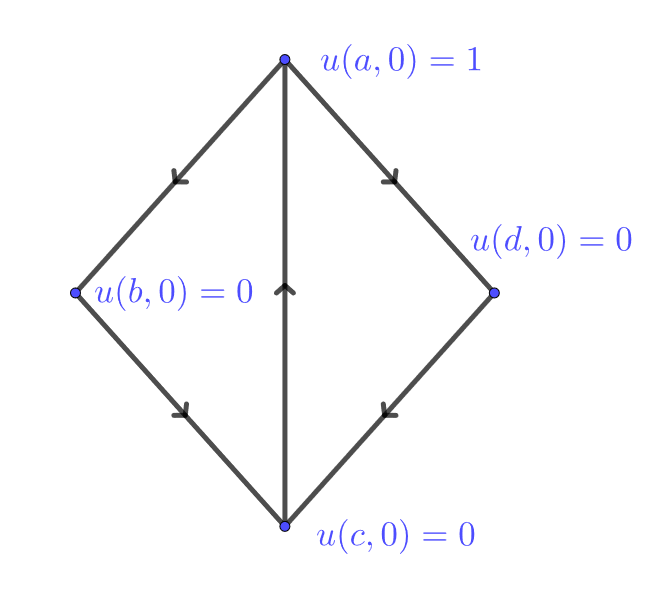

# Dinámica

<!--  
```{python}
import numpy as np
import matplotlib.pyplot as plt
from matplotlib import animation
from matplotlib.animation import PillowWriter

def f(x,t):
  return np.exp(-(x-5*t)**2)*np.sin(10*x-5*t)

x = np.linspace(0,10*np.pi,1000)

fig, ax = plt.subplots(1,1,figsize=(8,4))
ln, = plt.plot([],[])
ax.set_xlim(0,10*np.pi);
ax.set_ylim(-1.5,1.5);

def animate(i):
  ln.set_data(x,f(x,i/50))

ani = animation.FuncAnimation(fig, animate, frames=240, interval = 50)
ani.save('anim.gif',writer='pillow',fps=50,dpi=100)
plt.clf()
```


-->

## Transporte

Consideremos un grafo dirigido $G=(V,E)$ y una familia de densidades $u(x,t)$ que toma valores reales para cada vértice $x\in V$ en tiempo $t\in\mathbb R$. Decimos que un flujo $f(e,t)$ transporta a $u$ si en cada instante salen $f(e,t)$ unidades de masa de $e_-$ hacia $e_+$ por la arista $e$. Es decir que sobre cada $x\in V$ se tiene que
$$
\partial_t u(x,t) = \sum_{e_+=x} f(e,t) - \sum_{e_-=x} f(e,t) = -\operatorname{div} f(x,t).
$$

Observamos que si en un dado nodo $x\in V$ se tiene que $\operatorname{div} f(x)>0$ entonces $u$ es decreciente. Esto quiere decir que el flujo hace que la densidad se esparza o diverja sobre  dicho nodo. De igual forma, si $\operatorname{div} f(x)<0$, $u$ es creciente y el flujo hace que la densidad en cambio converga en dicho nodo.

---

:::{.example}
Consideremos una densidad $u:V\times \mathbb R\to \mathbb R$ transportada por un flujo $f := \mu u^-$ donde $\mu:E\to \mathbb R$ son tazas de movilidad dadas sobre las aristas en el grafo a continuación y recordemos que $u^-(e)=u(e_-)$


Comenzando de la distribución de densidades
$$
u(0) = (1,0,0,0)
$$
integramos numericamente las cuatro ecuaciones dadas por
$$
\partial_t u = -\operatorname{div}(\mu u^-) \qquad\Leftrightarrow \qquad \begin{cases}
u(1)' = -3u(1)+3u(3),\\
u(2)' = u(1) - u(2),\\
u(3)' = u(2) - 3u(3) + 2u(4),\\
u(4)' = 2u(1)-2u(4).
\end{cases}
$$
y obtenemos lo siguiente:

```{python}
import numpy as np
import matplotlib.pyplot as plt
import scipy as sp
from scipy.integrate import odeint

A = np.array([[-3, 0, 3, 0],
              [1, -1, 0, 0],
              [0, 1, -3, 2],
              [2, 0, 0, -2]])

def dudt(u,t):
  return np.matmul(A,u)

u0 = np.array([1,0,0,0])

t = np.linspace(0,2,1000)
sol = odeint(dudt,u0,t)

plt.plot(t,sol[:,0], label='1')
plt.plot(t,sol[:,1], label='2')
plt.plot(t,sol[:,2], label='3')
plt.plot(t,sol[:,3], label='4')
plt.legend()
plt.show()
```
:::

---

Adicionalmente podemos considerar modelos donde además del fenómeno de transporte, una o más densidades tienen distintas reacciones en cada uno de los nodos.

---

:::{.example}
Las funciones $S,I:V\to \mathbb R$ representan poblaciones de individuos susceptibles e infectados para una dada epidemia modelada geográficamente sobre un grafo dirigido $G=(V,E)$. Cada una de estas poblaciones se mueve sobre las aristas por flujos dados por
$$
f_S := \mu_S S^-, \qquad f_I := \mu_I I^-.
$$
donde $\mu_S,\mu_I: E\to \mathbb R$ son tazas de movilidad sobre las aristas.

La dinámica de la epidemia en cada nodo está dada por las tazas de transmisión ($\beta$) y recuperación ($\gamma$). En específico planteamos el modelo de $2|V|$ ecuaciones de primer orden no-lineales
$$
\partial_t S = -\beta SI + \operatorname{div}(\mu_S S^-), \qquad \partial_t I = \beta SI - \gamma I + \operatorname{div}(\mu_I I^-),\\
$$
:::

---

:::{.exercise}
Demuestra que el total de la población susceptible o infectada es una función decreciente. 
:::

<details>
  <summary>Solución</summary>
  $$
  \partial_t \sum_{V} (S+I) = \sum_{V} (-\gamma I + \operatorname{div} f_S+\operatorname{div}f_I) = - \gamma \sum_{V} I \leq 0.
  $$
</details>

---

:::{.exercise}
Considera una epidemia dada en la siguiente red con los parámetros dados. En las aristas se muestran ciertas tasas de movilidad, para los susceptibles estas deben multiplicarse por $10^{-2}$ y para los infectados por $10^{-4}$. Implementa numéricamente y grafica las soluciones en el intervalo $[0,160]$ con condiciones iniciales
$$
S(0) = (1,1,1,1), \qquad I(0) = (0, 10^{-6},0,0).
$$

{width=70%}
:::

<details>
  <summary>Solución</summary>
```{python}
import numpy as np
import matplotlib.pyplot as plt
import scipy as sp
from scipy.integrate import odeint

beta = 0.5
gamma = 0.3

L = np.array([[-5, 1, 2, 1],
              [2, -3, 1, 0],
              [1, 2, -4, 2],
              [2, 0, 1, -3]])


def dSIdt(SI,t):
  S = SI[:4]
  I = SI[4:]
  dS = -beta*S*I + 0.01*np.matmul(L,S)
  dI = beta*S*I - gamma*I + 0.0001*np.matmul(L,I)
  return np.concatenate((dS,dI))

S0 = np.array([1,1,1,1])
I0 = np.array([0,0.00000001,0,0])
SI0 = np.concatenate((S0,I0))

t = np.linspace(0,160,1000)
sol = odeint(dSIdt,SI0,t)

fig, ax = plt.subplots(2,2,figsize=(10,5))

ax[0,0].plot(t,sol[:,0], label='S1')
ax[0,0].plot(t,sol[:,4], label='I1')
ax[0,0].legend()

ax[1,0].plot(t,sol[:,1], label='S2')
ax[1,0].plot(t,sol[:,5], label='I2')
ax[1,0].legend()

ax[0,1].plot(t,sol[:,2], label='S3')
ax[0,1].plot(t,sol[:,6], label='I3')
ax[0,1].legend()

ax[1,1].plot(t,sol[:,3], label='S4')
ax[1,1].plot(t,sol[:,7], label='I4')
ax[1,1].legend()
```
</details>

## Difusión

Así como vimos en los ejemplos anteriores donde el flujo era proporcional a $u^-$, en general puede darse el caso de que $f$ esté determinada por alguna otra función de $u$, esto se conoce como una **ley constitutiva**. Un caso muy común es que $f$ sea proporcional a $-Du$, en el cual obtenemos un modelo de **difusión**.

---

:::{.example}
Sea $G=(V,E)$ un grafo que modela una red de habitaciones en renta y $u:V\times \mathbb R\to\mathbb R$ la población que vive en dicha red. Asumiendo la ley de oferta y demanda, el precio de renta $p=p(x,t)$ de una habitación $x$ en el instante $t$ debe ser proporcional a la demanda, la cual podemos considerar en nuestro caso proporcional a la población que habita dicho nodo, digamos por ejemplo que $p = k_1u$. La población busca moverse entre nodos adyacentes si percibe que el precio le es favorable, por ejemplo $f=-k_2Dp$. Llegamos así a la ecuación
$$
\partial_t u = -\operatorname{div} f = \operatorname{div}(k_2Dp) = \operatorname{div}(aDu), \qquad a := k_1k_2.
$$
:::

---

El problema $\partial_t u = \operatorname{div}(aDu)$, también conocido como la **ecuación de calor** o **difusión**, representa un sistema de EDOs lineales y de primer orden con tantas ecuaciones e incógnitas como la cardinalidad de $V$.

---

:::{.exercise}
Considera una difusión de la forma $\partial_t u = \Delta u$ sobre el siguiente grafo. Calcula $u$ para todo tiempo dadas las condiciones iniciales ilustradas en la figura. ¿Converge la solución a algún punto fijo?

{width=70%}
:::

<details>
  <summary>Solución</summary>
  El sistema de 4 EDOs se presenta como
  $$
  \frac{d}{dt}\begin{pmatrix}
  u(a)\\
  u(b)\\
  u(c)\\
  u(d)
  \end{pmatrix} = \begin{pmatrix}
  -3 & 1 & 1 & 1\\
  1 & -2 & 1 & 0\\
  1 & 1 & -3 & 1\\
  1 & 0 & 1 & -2
  \end{pmatrix}\begin{pmatrix}
  u(a)\\
  u(b)\\
  u(c)\\
  u(d)
  \end{pmatrix}
  $$
  Dada que la condición inicial es $(1,0,0,0)^T$ buscamos la primera columna de la matriz exponencial. El siguiente resultado se obtuvo con la ayuda de [sympy](https://live.sympy.org/), una librería de cálculo simbólico de python
  
```{python, results='asis'}
from sympy import *
  
t = Symbol('t')
mt = Matrix([[-3, 1, 1, 1],
             [1, -2, 1, 0],
             [1, 1, -3, 1],
             [1, 0, 1, -2]]) * t
mexp = mt.exp()
print('$$' + latex(mexp) + '$$')
```

Observamos que cuando $t\to\infty$ la solución converge exponencialemente al vector $(1/4,1/4,1/4,1/4)^T$. De hecho **esto sucede para cualquier condición incial**.
</details>

---

:::{.exercise}
Sea $G=(V,E)$ un grafo lineal con 100 vértices
$$
V=\{1,2,\ldots,100\}, \qquad E = \{(1,2),(2,3),\ldots,(99,100)\}.
$$
Sea $u$ solución de la ecuación de calor $\partial_t u=\Delta u$ en $G$ con condición inicial
$$
u(0) = e_{50} = (0,\ldots,0,1,0,\ldots,0).
$$
Calcula el primer $t>0$ tal que $u(50,t)\leq 0.1$. 
:::

<details>
  <summary>Solución</summary>
  En este caso la dificultad está en cómo implementar el Laplaciano y encontrar el primer índice donde la solución baje de $0.1$.
```{python}
import numpy as np
import matplotlib.pyplot as plt
from scipy.integrate import odeint

Delta = -2*np.eye(100)+np.eye(100,k=1)+np.eye(100,k=-1)
Delta[0,0] = -1
Delta[99,99] = -1

def dudt(u,t):
  return np.matmul(Delta,u)

u0 = np.zeros(100)
u0[49] = 1

t = np.linspace(0,20,1000)

sol = odeint(dudt,u0,t)
index = np.where(sol[:,49]<0.1)[0][0]
plt.plot(t,sol[:,49])
plt.plot(t[index],sol[index,49],'ro',label="({:.2f},{:.2f})".format(t[index],sol[index,49]))
plt.legend()
plt.title("u(50,t)")
plt.show()
```
</details>


## Oscilación

El sistema de EDOs lineales y de segundo orden dado por
$$
\partial_t^2 u = \operatorname{div}(aDu)
$$
también es común en distintos modelos. Esta se conoce como la **ecuación de onda**.

---

:::{.example}
Un grafo $G=(V,E)$ modela las conexiones en un sistema de masas $m:V\to (0,\infty)$ unidas por resortes con constantes $k:E\to[0,\infty)$. Sea $q:V\to \mathbb R^n$ los desplazamientos de las masas a partir de una configuración dada de equilibrio. A partir de la ley de Hooke planteamos el sistema $n\times|V|$ ecuaciones e incógnitas,
$$
m\partial_t^2 q = \operatorname{div}(kDq).
$$
:::

Recordemos que cualquier sistema de segundo orden puede ser llevado a un sistema de primer orden tomando a las velocidades como incógnitas del sistema. Por ejemplo,
$$
\partial_t^2 u = \operatorname{div}(aDu) \qquad \Leftrightarrow\qquad \begin{cases}
\partial_t u = v,\\
\partial_t v = \operatorname{div}(aDu).
\end{cases}
$$

---

:::{.example}
El grafo $G=(V,E)$ vuelve a modelar una red de habitaciones en renta, $u:V\times \mathbb R\to\mathbb R$ la población que vive en dicha red y $p:V\times \mathbb R\to\mathbb R$ los precios. Una vez más asumimos que la población se mueve según el flujo $f = -Dp$. Por otro lado los precios se modifican gradualmente dependiendo de la demanda en relación a los nodos adyacentes.

Esto último puede ser reflejado por ejemplo en la ecuación $\partial_t p = -\Delta u$, es decir que el precio disminuye si el promedio de la población vecina es mayor la población en el nodo en consideración, con la intención de atraerla.

En resumen obtenemos el sistema de ecuaciones
$$
\partial_t u = \Delta p, \qquad \partial_t p = -\Delta u.
$$
Estas implican las ecuaciones de onda desacopladas para el bilaplaciano
$$
\partial_t^2 u = -\Delta^2 u, \qquad \partial_t^2 p = -\Delta^2p.
$$
:::

---

:::{.exercise}
Considera una oscilación de la forma $\partial_t^2 u = -\Delta^2 u$ sobre el siguiente grafo. Calcula $u$ para todo tiempo dadas las condiciones iniciales ilustradas en la figura, partiendo del reposo. Grafica la solución en el intervalo $[0,6]$.

{width=70%}
:::

<details>
  <summary>Solución</summary>
  El sistema de 4 EDOs se presenta como
  $$
  \frac{d}{dt}\begin{pmatrix}
  u(a)\\
  u(b)\\
  u(c)\\
  u(d)\\
  u'(a)\\
  u'(b)\\
  u'(c)\\
  u'(d)
  \end{pmatrix} = \begin{pmatrix}
  0_4 & I_4\\
  -\Delta^2 & 0_4
  \end{pmatrix}\begin{pmatrix}
  u(a)\\
  u(b)\\
  u(c)\\
  u(d)\\
  u'(a)\\
  u'(b)\\
  u'(c)\\
  u'(d)
  \end{pmatrix}, \qquad \Delta = \begin{pmatrix}
  -3 & 1 & 1 & 1\\
  1 & -2 & 1 & 0\\
  1 & 1 & -3 & 1\\
  1 & 0 & 1 & -2
  \end{pmatrix}
  $$
  
  Para calcular la solución analítica usamos el paquete simbólico de python.
  
```{python, results='asis'}
import numpy as np
import matplotlib.pyplot as plt
import sympy as smp
from sympy.plotting import plot

Delta = smp.Matrix([[-3,1,1,1],
              [1,-2,1,0],
              [1,1,-3,1],
              [1,0,1,-2]])

t = smp.symbols('t',real='True')

B = smp.Matrix(smp.BlockMatrix([[smp.ZeroMatrix(4,4),smp.Identity(4)],
            [-Delta*Delta,smp.ZeroMatrix(4,4)]]))*t
eB = smp.re(B.exp())
y0 = smp.Matrix([0,1,2,3,0,0,0,0])
y_s = eB*y0
print('$$' + smp.latex(y_s[:4]) + '$$')
```

Las gráficas están dadas por

```{python}
eB_f = smp.lambdify(t,eB)

t = np.linspace(0,6,600)
y0 = np.array([0,1,2,3,0,0,0,0])
y = np.einsum('ijk,j->ik',eB_f(t),y0)
plt.plot(t,y[0,:],label='a')
plt.plot(t,y[1,:],label='b')
plt.plot(t,y[2,:],label='c')
plt.plot(t,y[3,:],label='d')
plt.legend(loc='lower right')
```
</details>
<!--


\begin{center}
\colorbox[HTML]{E5F3CC}{
\begin{minipage}[c]{450px}
\begin{ejemplo}
Demuestra que la población total, la suma de los precios, y $\sum(u^2+p^2)$ permanecen constantes.
\end{ejemplo}
\end{minipage}}
\end{center}
-->
