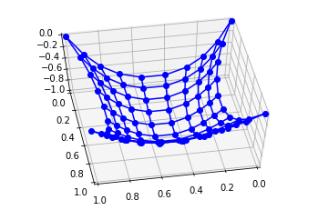

# Implementación del entramado

En esta sección veremos como poner en práctica los conceptos aprendidos para modelar una red cuadrada sujetada por sus cuatro esquinas. Recordemos que a pesar de que podemos dar una forma explícita de las ecuaciones que se deben resolver, el método de Newton parece ser muy sensible a las condiciones iniciales, por lo que hay que ingeniarse una forma alternativa.

La idea que tenemos en mente es proponer que las conexiones entre nodos son inicialmente elásticas con un mecanismo adicional de amortiguamiento (para poder llevar el sistema al reposo). La configuración final en este caso no es exactamente la deseada puesto que la deformación del resorte no satisface exactamente la restricción de longitud sobre las aristas. Sin embargo podemos luego ir haciendo la dureza (stiffness) de los resortes cada vez más y más grande, aproximando así la configuración de equilibrio cuando las barras son rígidas.

## Librerías y datos

Para fijar ideas proponemos una red con $N$ por $N$ nodos de masa $m>0$ como la ilustrada a continuación. La esquinas serán colgadas en los puntos $(0,0,0)$, $(1,0,0)$, $(1,1,0)$, y $(0,1,0)$.

{width=70%}

Entre cada par de nodos adyacentes se ubica un resorte cuya longitud natural es $l > 1/(N-1)$, dureza $k\gg 1$, y amortiguación $\gamma > 0$. Es decir que si dos nodos adyacentes están a distancia $d$, la magnitud de la fuerza que ejerce el resorte entre ellos es $k|d-l|$. Esta fuerza es paralela a la línea que contiene a estos nodos y la dirección (o el signo) dependen de como se compare $d$ respecto de $l$: Para $d>l$ el resorte atrae a los nodos entre si, y para $d<l$ el resorte los repele.

```{python}
import numpy as np
from numpy import linalg as la
import scipy as sp
import scipy.sparse as sps
from scipy.integrate import odeint

N = 10        # Longitud de la red
m = 0.1       # Masa de los nodos
gamma = 1     # Coeficiente de amortiguación
k = 100       # Coeficiente de dureza
l = 1.1/(N-1) # Longitud natural del resorte

fijos = [0, N-1, N**2-N, N**2-1] # Esquinas fijas

# Listas para enumerar las aristas de la red

# Aristas verticales

ini_v = list(range(N**2-N))
fin_v = list(range(N,N**2))

# Aristas horizontales

ini_h = list(range(N**2))
del ini_h[slice(N-1,N**2,N)]
fin_h = list(range(1,N**2+1))
del fin_h[slice(N-1,N**2,N)]

ini = ini_h + ini_v     # Nodos de salida
fin = fin_h + fin_v     # Nodos de llegada
Ne = len(ini)           # Número de aristas
```

## Ecuación diferencial

La ecuación diferencial que buscamos modelar para la posición $p=(x,y,z)$ de cada nodo está dada por las leyes de Newton:
$$
mp'' = \text{gravedad} + \text{tensión} + \text{amortiguación}
$$

De estos tres tréminos la gravedad y la amortiguación son fáciles de calcular. Respectivamente son $-mge_z$ y $-\gamma p'$. Asumiendo el sistema internacional de unidades tomamos $g = 9.8$. La dificultad reside ahora en implementar el cálculo de las tensiones.

Recordemos además que para poder resolver nuestra EDO usando la librería de integración numérica de Scipy (odeint) debemos transformar el sistema a uno de primer orden. Esto significa que las velocidades pasan a ser parte de las incógnitas. Codificamos en la curva $s=s(t)$ las configuraciones de nuestro sistema de la siguiente forma
$$
s = (pos,vel) = ((x,y,z),(vx,vy,vz)) \in (\mathbb R^{N^2}\times\mathbb R^{N^2}\times\mathbb R^{N^2})\times(\mathbb R^{N^2}\times\mathbb R^{N^2}\times\mathbb R^{N^2})
$$
Dadas las posiciones $p_{ini}$ y $p_{fin}$ de dos nodos extremos sobre una arista dada tenemos que la tensión sobre dicha arista se calcula por
$$
T := k(d-l)\theta, \qquad d := |p_{fin}-p_{ini}|, \qquad \theta := \frac{p_{fin}-p_{ini}}{d}
$$
Esta es justamente la tensión que se ejerce sobre el nodo inicial de la arista, siendo la fuerza opuesta en el otro nodo gracias a la tercera ley de Newton. Un paso técnico a partir de acá consiste en transferir está informaición dada sobre las aristas a los nodos.

Estas consideraciones teóricas quedan reflejadas en la siguiente función:

```{python}
def dsdt(s,t):
  pos = np.reshape(s[:3*N**2],(3,N**2)).T
  vel = np.reshape(s[3*N**2:],(3,N**2)).T

  pos_rel = pos[fin] - pos[ini]
  lon_rel = np.tile(la.norm(pos_rel,axis=1),(3,1)).T   # d
  dir_rel = pos_rel/lon_rel                            # theta
  ten_esc = k*(lon_rel-l*np.ones((Ne,3)))              # Magnitud de la tensión (signada)
  ten_ari = ten_esc*dir_rel                            # Tensión sobre el nodo inicial
  
  # Tensión total sobre cada nodo. Usamos una estructura de matrices ralas (sparse) para codificarlas eficientemente.
  
  data = np.concatenate((ten_ari.T.reshape(-1),-ten_ari.T.reshape(-1)))
  fila = 3*ini+3*fin
  colu = 2*(Ne*[0]+Ne*[1]+Ne*[2])
  ten_nod = sps.coo_matrix((data, (fila, colu))).toarray()
  
  # Fuerzas y aceleración
  
  fue_gra = -9.8*m*np.tile(np.array([0,0,1]),(N**2,1)) # Gravedad
  visc = -gamma*vel                                     # Amortiguación
  acel = (ten_nod + fue_gra + visc)/m                   # Aceleración

  acel[fijos,:] = [0,0,0]                               # Esquinas fijas
  
  return np.concatenate((s[3*N**2:],acel.T.reshape(-1)))
```

## Integración y graficación

Una vez modelada la ecuación diferencial ya podemos proceder a integrarla usando por ejemplo el comando odeint de la librería Scipy. Para ello necesitamos dar adicionalmente un intervalo de tiempo discreto y una condición inicial.

```{python}
px, py = np.meshgrid(np.linspace(0,1,N),np.linspace(0,1,N))
s0 = np.concatenate((px.reshape(-1), py.reshape(-1),np.zeros(N**2),np.zeros(3*N**2)))
t = np.linspace(0,10,2000)

sol = odeint(dsdt,s0,t)
```

Visualización de los instantes $t\in \{0.05j\ | \ j\in\{0,1,\ldots,10\}\}$

```{python}
import numpy as np
import matplotlib.pyplot as plt
from mpl_toolkits.mplot3d import Axes3D
from matplotlib.animation import FuncAnimation
from IPython.display import HTML

def update_plot(i):
    ax.clear()
    ax.set_xlim3d(left=0, right=1);
    ax.set_ylim3d(bottom=0, top=1);
    ax.set_zlim3d(bottom=-1, top=0);
    
    sol_fin = sol[30*i,:]
    pos = np.reshape(sol_fin[:3*N**2],(3,N**2)).T
    for j in range(N):
        ax.plot3D(pos[j*N:(j+1)*N,0], pos[j*N:(j+1)*N,1], pos[j*N:(j+1)*N,2],'bo-')
        ax.plot3D(pos[j:N**2:N,0], pos[j:N**2:N,1], pos[j:N**2:N,2],'b-')

# Set up the figure and subplots
fig = plt.figure(figsize=(10, 6))
ax = fig.add_subplot(111, projection='3d')

# Define the initial plot
ax.set_xlim3d(left=0, right=1);
ax.set_ylim3d(bottom=0, top=1);
ax.set_zlim3d(bottom=-1, top=0);
sol_fin = sol[0,:]
pos = np.reshape(sol_fin[:3*N**2],(3,N**2)).T
for j in range(N):
    ax.plot3D(pos[j*N:(j+1)*N,0], pos[j*N:(j+1)*N,1], pos[j*N:(j+1)*N,2],'bo-')
    ax.plot3D(pos[j:N**2:N,0], pos[j:N**2:N,1], pos[j:N**2:N,2],'b-')

# Set up the animation
ani = FuncAnimation(fig, update_plot, frames=10, interval=100)

# Display the animation in the notebook
HTML(ani.to_jshtml())
```

## Incremento en la rigidez de los resortes

