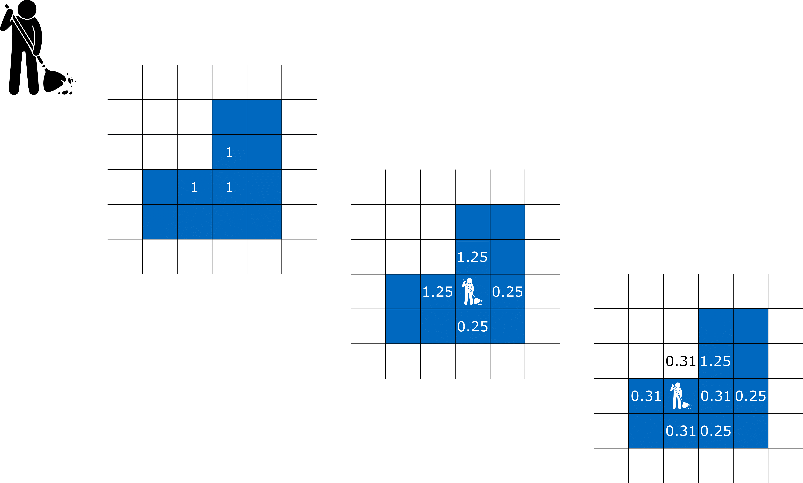
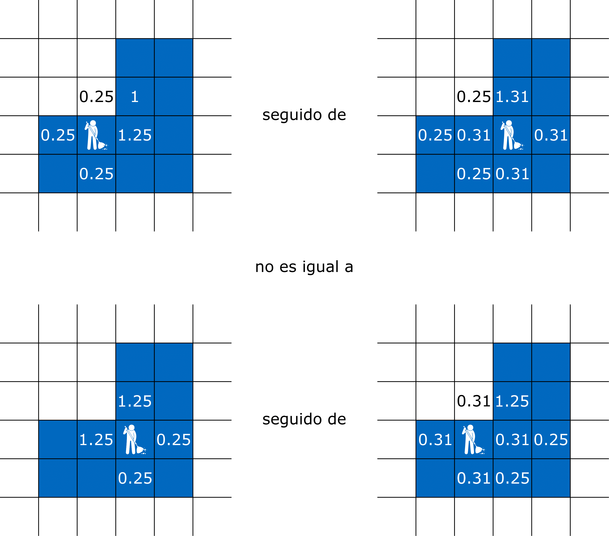

# El problema de Dirichlet

Un barrendero tiene la tarea de limpiar una dada región (acotada) en cuarto cubierto de baldosas. Cada vez que este barre una baldosa, toda la masa que se encuentra en ella se distribuye en porciones iguales entre las cuatro baldosas adyacentes. En general, limpiar la región es un proceso que entendemos en el límite de un número infinito de pasos.

{width=70%}

El orden en que se barren las baldosas no es conmutativo, véase por ejemplo la figura a continuación. Sin embargo, descubrimos que en el límite se recupera una cierta propiedad Abeliana: Una vez limpia la región, la distribución de masa alrededor de ella es independiente de como se haya barrido.

{width=70%}

El problema lo podemos modelar en un grafo general pero con la intención de ilustrar un caso concreto pensemos en la retícula $\mathbb Z^2$ con la relación de adyacencia $x\sim y$ cuando $\|x-y\| = 1$. Es decir que cada baldosa tiene exactamente cuatro baldosas adyacentes en cada una de las direcciones cardinales.

Sea $\mu:\mathbb Z^2\to [0,\infty)$ la distribución de masa inicial que buscamos barrer de algún $\Omega\subseteq\mathbb Z^2$. Un plan de barridas está dado por una lista de baldosas $b_1,b_2,\ldots \in \Omega$, las que iremos barriendo en el orden respectivo. Si $\infty_i:\mathbb Z^2\to [0,\infty)$ denota la distribución de masa luego del $i^{mo}$ paso, se tiene entonces la siguiente fórmula recursiva comenzando de $\mu_0:=\mu$,
$$
\mu_i(x) := 
\begin{cases}
0 \text{ si } x=b_i\\
\mu_{i-1}(x) + \tfrac{1}{4}\mu_{i-1}(b_i) \text{ si } x\sim b_i\\
\mu_{i-1}(x) \text{  en cualquier otro caso}.
\end{cases}
$$

Decimos que el plan plan $b_1,b_2,\ldots \in \Omega$ barre a $\mu$ de $\Omega$ si
$$
\lim_{i\to\infty} \mu_i(x) = 0, \qquad \forall x\in \Omega.
$$

Nuestro teorema puede ser entonces formulado de la siguiente manera.

:::{.theorem #tma1}
Dado $\Omega\subseteq\mathbb Z^2$ finito y $\mu:\mathbb Z^2\to [0,\infty)$ se tiene que cualesquiera dos planes $b_1,b_2,\ldots \in \Omega$ y $b_1',b_2',\ldots \in \Omega$ que barren a $\mu$ de $\Omega$ satisfacen que los siguientes límites existen para todo $x\in \mathbb Z^2$ y
$$
\lim_{i\to \infty} \mu_i(x) = \lim_{i\to \infty} \mu'_i(x).
$$
:::

Daremos la demostración del teorema en la Sección [Principio del mínimo](#principio-del-mínimo) luego de presentar y motivar algunas construcciones auxiliares.

## Ley de conservación

Una idea útil es llevar el registro de cuánta masa ha salido de una dada baldosa $x$ hasta una dada iteración. Para ser precisos definimos para cada subíndice $i\geq 0$ las funciones $u_i:\mathbb Z^2\to [0,\infty)$ comenzando por $u_0=0$ y de forma inductiva según
$$
u_i := u_{i-1} + \mu_{i-1}(b_i) 1_{b_i}
$$
Observemos que para cualquier plan $b_1,b_2,\ldots \in \Omega$ se tiene necesariamente que $u_i=0$ en $\mathbb Z^2\setminus \Omega$.

La función $u_i$ nos permite dar una fórmula para la **ley de conservación de masas**: En los primeros $i$ pasos, la masa que entra menos la que sale de una baldosa $x$ es justamente la diferencia entre las distribuciones $\mu_i$ menos $\mu_0$ en $x$
$$
\underbrace{\mu_i(x)}_{\text{masa final}}-\underbrace{\mu_0(x)}_{\text{masa inicial}} = \underbrace{\frac{1}{4}\sum_{y\sim x} u_i(y)}_{\text{masa que entra}} - \underbrace{u_i(x)}_{\text{masa que sale}} = \tfrac{1}{4}\Delta u(x)
$$
Esta puede ser demostrada por un argumento inductivo que dejamos de ejercicio.

Volviendo al modelo del barrendero, vemos que si $\mu_i \to \mu_\infty$ entonces $u_i$ también converge a una función $u:\mathbb Z^2\to[0,\infty)$^[Daremos una prueba rigurosa de este hecho en la Sección [Principio del Mínimo](#principio-del-mínimo)] tal que $\tfrac{1}{4}\Delta u = \mu_\infty - \mu_0 = \mu_\infty-\mu$. Si el plan barre a $\Omega$ recuperamos el siguiente sistema de ecuaciones lineales
$$
\begin{cases}
-\tfrac{1}{4}\Delta u = -\mu \text{ en } \Omega,\\
u = 0 \text{ en } \mathbb Z^2\setminus \Omega.
\end{cases}
(\#eq:lap)
$$

Veamos a grandes rasgos las ideas en la demostración del Teorema \@ref(thm:tma1) a partir de estas construcciones. Si el sistema que satisface $u$ tiene una \underline{única} solución, entonces esta función queda determinada por $\mu$ y $\Omega$ y es independientemente del plan. Usando que $\mu_\infty = \mu + \lim_{i\to\infty} \tfrac{1}{4}\Delta u_i = \mu+\tfrac{1}{4}\Delta u$ vemos que también $\mu_\infty$ es independientemente del plan, lo cual concluiría la demostración.

---

:::{.exercise}
Asumiendo la estrategia esbozada en esta sección, calcula la distribución final $\mu_\infty$ si $\Omega = \{(0,0),(1,0),(0,1)\}$ y $\mu= 1_\Omega$.
:::

Solución

## Existencia y unicidad de soluciones

El principio del mínimo nos permitirá demostrar que el sistema dado por \@ref(eq:lap) no tiene más de una solución. Para problemas lineales con igual número (finito) de ecuaciones e incógnitas, esto equivale a decir que el sistema de hecho siempre tiene solución.

### Principio del mínimo

La idea consiste en el siguiente principio general: Si $u:V\to\mathbb R$ es no-negativa en $V\setminus \Omega$ y satisface $\Delta u\leq 0$ en $\Omega$ entonces $u$ es necesariamente no-negativa en $\Omega$. Como veremos en la siguiente demostración, esto es una manifestación del criterio de la segunda derivada (discreto): $\Delta u(x^*)\geq 0$ si $u$ alcanza su mínimo en $x^*$.

:::{.lemma name="Principio del Mínimo"}
Sea $u:V\to\mathbb R$ tal que para $\Omega\subseteq V$ finito $\Delta u \leq 0$ en $\Omega$. Entonces
$$
\inf_{V\setminus\Omega} u \geq 0 \qquad\Rightarrow\qquad \min_{\Omega} u\geq 0.
$$
:::

:::{.proof}
Asumamos por contradicción que $m:= \min_{\Omega} u < 0$ y sea $\Omega'=\{x\in \Omega : u(x) = m\}$ finito y no vacío, más aún sabemos que es finito dado que $\Omega'\subseteq\Omega$. Tomemos ahora $x^*\in \Omega'$ tal que existe $y\sim x^*$ para el cual $u(y)>u(x^*)$. Vemos ahora que tenemos la siguiente contradicción a partir de evaluar la ecuación $\Delta u\leq 0$ sobre $x^*$
$$
0 < \sum_{z\sim x^*} (u(z) -u(x^*)) = \Delta u(x^*) \leq 0.
$$
:::

:::{.corollary name="Existencia y unicidad de soluciones"}
Para $\Omega\subseteq V$ finito y $\mu,\varphi:V\to\mathbb R$ el siguiente sistema tiene solución única
$$
\begin{cases}
\Delta u = \mu \text{ en } \Omega,\\
u = \varphi \text{ en } V\setminus \Omega.
\end{cases}
$$
:::

:::{.proof}
Basta con demostrar que el sistema lineal dado por las ecuaciones en $\Omega$, con $N=|\Omega|$ ecuaciones e incógnitas, tiene a lo sumo una solución. En otras palabras, el operador lineal asociado de $\mathbb R^N$ en si mismo es inyectivo, y por lo tanto también es biyectivo gracias al teorema fundamental del álgebra lineal.

Si $u,v:V\to \mathbb R$ son dos soluciones, entonces $w:=u-v$ satisface $\Delta w=0$ en $\Omega$ y $w = 0$ en $V\setminus \Omega$. Gracias al principio del mínimo obtenemos que $w\geq 0$ en $\Omega$ y por lo tanto en todo $V$. Si aplicamos el mismo razonamiento a $-w$ obtenemos la otra desigualdad de donde concluimos $w=0$, es decir que queda establecida la unicidad de soluciones y con ello la demostración.
:::

---

:::{.exercise}
Demuestra que si $\Omega = \{x = (x_1,x_2) \in \mathbb Z^2 : x_2>0\}$ entonces existen por lo menos dos soluciones distintas del problema
$$
\begin{cases}
\Delta u = 0 \text{ en } \Omega,\\
u = 0 \text{ en } \mathbb Z^2\setminus \Omega.
\end{cases}
$$
Es decir que la hipótesis de que $\Omega$ sea finito es necesaria para la unicidad de soluciones.
:::

Solución

---

:::{.proof name="Teorema \@ref(thm:tma1)"}
Construimos de forma recursiva y partiendo de $u_0 := 0$ las funciones $u_i := u_{i-1} + \mu_{i-1} 1_{b_i}$ las cuales verifican
$$
\begin{cases}
\tfrac{1}{4}\Delta u_i = \mu_i-\mu \text{ en } \Omega,\\
u_i = 0 \text{ en } \mathbb Z^2\setminus \Omega.
\end{cases}
$$
Definimos también $u:\mathbb Z^2\to \mathbb R$ como la solución de
$$
\begin{cases}
\tfrac{1}{4}\Delta u = -\mu \text{ en } \Omega,\\
u = 0 \text{ en } \mathbb Z^2\setminus \Omega.
\end{cases}
$$

Debemos corroborar entonces los siguientes puntos:

1. $\mu_{\infty} := \lim_{i\to\infty}\mu_i$ está bien definido.

1. $u_\infty := \lim_{i\to\infty}u_i$ está bien definido.

1. $u_\infty = u$.

Para ver el primer punto basta con fijarse en el comportamiento de $\mu_i$ en $\mathbb Z^2\setminus \Omega$, ya que sabemos por hipótesis que estas tienden a cero en $\Omega$. En $\mathbb Z^2\setminus \Omega$ se tiene que $\mu_i$ es una sucesión no-decreciente de funciones que está mayorizada por $\mu + \sum_{x\in\Omega} \mu(x)$.

Como $u_i$ es no-decreciente, basta con probar que $u\geq u_i$ para demostrar el segundo punto y adicionalmente obtener $u\geq u_\infty$. La diferencia $v_i := u-u_i$ satisface
$$
\begin{cases}
\Delta v_i = \Delta u - \Delta u_i = -4\mu_i \leq 0 \text{ en } \Omega,\\
v_i = 0 \text{ en } \mathbb Z^2\setminus \Omega.
\end{cases}
$$
Gracias principio del mínimo se deduce que $\min_\Omega v_i \geq 0$ y por lo tanto $u\geq u_i$.

Dado que $b_1,b_2,\ldots\in\Omega$ barre a $\mu$ de $\Omega$ tenemos que tomando $i\to\infty$ en el sistema para $u_i$
$$
\begin{cases}
\tfrac{1}{4}\Delta u_\infty = -\mu \text{ en } \Omega,\\
u_\infty = 0 \text{ en } \mathbb Z^2\setminus \Omega.
\end{cases}
$$
Por la unicidad de soluciones del problema lineal llegamos a que necesariamente $u_\infty=u$.

Finalmente para concluir la demostración podemos calcular $\mu_\infty$ a partir de $\mu_\infty = \mu+\tfrac{1}{4}\Delta u_\infty$. Recordemos que $u_\infty=u$ está igualmente definido por un sistema de ecuaciones lineales que depende solamente de $\Omega$ y $\mu$ y no del plan. Esto indica que $\mu_\infty$ también está definida independientemente del plan.
:::

Nuestro teorema garantiza que para cualquier $\Omega\subseteq\mathbb Z^2$ finito y $\mu:\mathbb Z^2\to [0,\infty)$ se tiene que si $\mu$ puede ser barrido de $\Omega$, entonces la distribución de masa que queda por fuera de $\Omega$ es independiente del plan. Queda abierta la pregunta de si podemos en todo caso barrer o no a $\mu$ de $\Omega$.

:::{.theorem}
Dado $\Omega\subseteq\mathbb Z^2$ finito y $\mu:\mathbb Z^2\to[0,\infty)$ existe un plan $b_1,b_2,\ldots\in\Omega$ que barre a $\mu$ de $\Omega$.
:::

:::{.proof}
Sea $b_1,b_2,\ldots\in\Omega$ un plan que recorre cada baldosa un número infinito de veces. Ciertamente estos planes existen incluso si $\Omega$ es infinito (usando un argumento de diagonal de Cantor). Esta condición implica que para cada $x\in\Omega$, existe un número infinito de sub-índices tales que $\mu_i(x)=0$. Basta probar así que $\mu_\infty = \lim_{i\to\infty}\mu_i$ existe para deducir que necesariamente $\mu_\infty=0$ en $\Omega$.

Definimos $u_i$ y $u$ exactamente como en la demostración anterior. Recordemos que $u_i$ es no-decreciente y (por el principio del mínimo) acotada por $u$, por lo tanto $u_\infty:=\lim_{i\to\infty}u_i$ está bien definida. Dado que $\mu_i = \mu + \Delta u_i$ tenemos que la existencia del límite para $\mu_i$ queda demostrada por la existencia del límite para $u_i$.
:::

---

:::{.exercise}
Demuestra que existe un plan que barre a $\mu= 1_{(1,0)}$ de $\Omega = \mathbb Z^2\setminus \{(0,0)\}$.
:::

Solución

---

:::{.exercise}
Sea $\Omega\subseteq\mathbb Z^2$ finito, $\mu:\mathbb Z^2\to[0,\infty)$ y $\mu_\infty$ la distribución que resulta al barrer $\mu$ de $\Omega$. Demuestra ley de conservación de masa dada por
$$
\sum_{x\in\mathbb Z^2} \mu_\infty(x) = \sum_{x\in \mathbb Z^2} \mu(x).
$$
:::

Solución

---

:::{.exercise}
Sea $\mu= 1_{(1,0)}$ y $\mu_\infty$ la distribución que resulta al barrer $\mu$ de $\Omega= \mathbb Z^2\setminus \{(0,0)\}$. ¿Será cierto que $\mu_\infty(0,0) = 1$, o habrá masa que escapa a infinito?^[**Pista:** El problema se puede reducir a verificar que $\Delta u(0,0) = -\Delta u(1,0)$. La función $u$ parece tener una simetría en el eje $x=1/2$ la cual podría ser demostrada por un resultado de unicidad (Liouville): Las funciones armónicas y acotadas en $\mathbb Z^2$ son únicamente las constantes.]
:::

Solución

### Método de Balayage

Poincaré propuso a finales del siglo XIX el siguiente algoritmo para resolver el sistema
$$
\begin{cases}
\Delta u = 0 \text{ en } \Omega,\\
u = \varphi \text{ en } \mathbb Z^2\setminus \Omega.
\end{cases}.
$$

Asumamos $\Omega$ finito y sea $\partial\Omega := \{y \in \mathbb Z^2\setminus \Omega : \exists x\in \Omega \text{ adyacente a } y\}$. Comenzamos entonces a partir de
$$
u_0(x) := \begin{cases}
\max_{\partial\Omega}\varphi \text{ si } x\in\Omega,\\
\varphi(x) \text{ en cualquier otro caso}.
\end{cases},
$$
tal que
$$
\begin{cases}
\Delta u_0 \leq 0 \text{ en } \Omega,\\
u_0 = \varphi \text{ en } \mathbb Z^2\setminus \Omega.
\end{cases}
$$
Hagamos notar que por el principio del mínimo, $u_0\geq \min_{\partial\Omega} \varphi$.

Sea $b_1,b_2,\ldots \in \Omega$ tal que para cada $x\in \Omega$ el conjunto de índices $\{i : b_i=x\}$ es infinito. Definimos ahora $u_i$ modificando a $u_{i-1}$ en $b_i$ de forma que $\Delta u_i(b_i) =0$, es decir
$$
u_i(x) := \begin{cases}
\frac{1}{4} \sum_{y\sim b_i} u_{i-1}(y) \text{ si } x = b_i,\\ 
u_{i-1}(x) \text{ en cualquier otro caso}.
\end{cases}
$$
En otras palabras, en el paso $i$ estamos barriendo el Laplaciano de $u_{i-1}$ en $b_i$.

Se puede demostrar por inducción que cada $u_i$ satisface
$$
\begin{cases}
\Delta u_i \leq 0 \text{ en } \Omega,\\
u_i = \varphi \text{ en } \mathbb Z^2\setminus \Omega.
\end{cases}
$$
Gracias a esto observamos que la sucesión es decreciente. También, cuando la restringimos a $\Omega$, está acotada por debajo por $\min_{\partial\Omega}\varphi$. Como consecuencia converge a la solución que se busca calcular.

---

:::{.exercise}
Implementa el método de balayage. El programa debe recibir un conjunto $\Omega\subseteq\mathbb Z^2$ finito junto con $\varphi:\partial\Omega\to\mathbb R$, debe devolver la solución correspondiente del problema de Dirichlet $u:\Omega\to \mathbb Z^2$.
:::

Solución

## Fórmulas de representación

### La función de Green

Para $\Omega\subseteq V$ finito, definimos la **función de Green** $G_\Omega:V^2\to\mathbb R$ tal que $u(y)=G_\Omega(x,y)$ es la solución de
$$
\begin{cases}
\Delta u = - 1_x \text{ en } \Omega,\\
u=0 \text{ en } V\setminus \Omega.
\end{cases}
$$

---

:::{.example}
Si $\Omega=\{x_0\}$, entonces
$$
G_\Omega(x,y) = \begin{cases}
1/\deg(x_0) \text{ si } y=x=x_0,\\
0 \text{ en cualquier otro caso}.
\end{cases}
$$
donde $\deg(x_0)$ es el grado del vértice $x_0$, es decir cuantas aristas llegan y salen de $x_0$.
:::

Igualmente definimos $G_\Omega$ sobre una distribución $\mu:V\to\mathbb R$ tal que $u(y)=G_\Omega(\mu,y)$ es la solución de
$$
\begin{cases}
\Delta u = -\mu \text{ en } \Omega,\\
u=0 \text{ en } V\setminus \Omega.
\end{cases}
$$
Es decir que en particular $G_\Omega(x,\cdot) = G_\Omega( 1_x,\cdot)$.

Gracias al principio de superposición tenemos que a partir de esta podemos resolver 
$$
\begin{cases}
\Delta u = -\mu \text{ en } \Omega,\\
u=0 \text{ en } V\setminus \Omega.
\end{cases}
$$
usando la fórmula de representación
$$
u(y) = \sum_{x\in V} \mu(x)G_\Omega(x,y) = G_\Omega(\mu,y).
$$

---

:::{.example}
Para el problema del barrendero ($V=\mathbb Z^2$) tenemos que $u(y)= 4G_\Omega(\mu,y)$ indica cuanta masa sale de $y$ cuando se barre $\mu$ de $\Omega$.
:::

---

:::{.example}
Veamos como calcular la función de Green para $\Omega = [1,n] \subseteq V=\mathbb Z$ con $n\geq 1$ y la relación de adyacencia dada por $x\sim y$ si $|x-y|=1$. Denotamos a lo largo de este ejemplo a $g_{i,j} := G_\Omega(i,j)$ con $i,j\in \{0,1,\ldots,n,n+1\}$, los valores de interés ($G_\Omega(x,y) = 0$ fuera de estos casos).

Para $j\in[1,i-1]$, tenemos la ecuación
$$
2g_{i,j} = g_{i,j-1}+g_{i,j+1},
$$
la cual junto a $g_{i,0} = 0$ indica que $g_{i,j}=\alpha j$ para $j\in[0,i]$.

Para $j\in[i+1,n]$, tenemos también la ecuación
$$
2g_{i,j} = g_{i,j-1}+g_{i,j+1},
$$
la cual junto a $g_{i,n+1} = 0$ indica que $g_{i,j}=\beta(n+1-j)$ para $j\in[i,n+1]$.

Por un lado sabemos que $\alpha i = \beta(n+1-i)$ y adicionalmente usando la ecuación para $j=i$
$$
-1=g_{i,i-1}+g_{i,i+1}-2g_{i,i} = -\alpha-\beta
$$
obtenemos que $\alpha=(n+1-i)/(n+1)$ y $\beta=i/(n+1)$. En conclusión
$$
g_{i,j} = \begin{cases}
(n+1-i)j/(n+1) \text{ si } j\in[1,i),\\
(n+1-j)i/(n+1) \text{ si } j\in(i,n],\\
0 \text{ en cualquier otro caso}.
\end{cases}
$$
:::

---

:::{.exercise}
Calcula la función de Green para $\Omega = [1,n]\times\{0\}\cap \mathbb Z^2$.
:::

Solución

---

Los ejemplos previos sugieren la siguiente simetría
$$
G_\Omega(x,y)=G_\Omega(y,x).
$$

:::{.proof}
Usaremos en repetidas ocasiones que si alguno de los nodos $x$ o $y$ están en $V\setminus \Omega$ se tiene automáticamente que $G_\Omega(x,y)=G_\Omega(y,x)=0$.

Basta ver que $(x,y) \mapsto G_\Omega(y,x)$ satisface las mismas condiciones para la definición de $G_\Omega$, es decir que $v(y) = G_\Omega(y,x)$ cumple
$$
\begin{cases}
\Delta v = -  1_x \text{ en } \Omega,\\
v = 0 \text{ en } V\setminus \Omega.
\end{cases}
$$

Las condición de borde ya sabemos que se satisface. Para ver la ecuación asumimos que $x\in \Omega$ (el otro caso siendo tivial) y comprobaremos que $w(x) = \Delta_1 G(y,x)+ 1_y(x) = \Delta_1 G(y,x)+ 1_x(y)=0$ para cualquier $y\in \Omega$. Por un lado tenemos la condición de borde
$$
w(x) = 0+0 = 0 \text{ si } x\in V\setminus \Omega.
$$
Por el otro tenemos que 
$$
\Delta w (x) = \Delta_2\Delta_1G(y,x)+\Delta  1_y(x) = \Delta_1\Delta_2 G(y,x)+\Delta  1_y(x) = \Delta  1_{y}(x) - \Delta  1_y(x)=0.
$$
Gracias a la unicidad de la solución trivial podemos finalmente concluir la demostración.
:::

### El núcleo de Poisson

Para $\Omega\subseteq V$ finito, $x,y \in V$ definimos el **núcleo de Poisson**
$$
P_\Omega(x,y) :=  1_x (y) + \Delta_2 G_\Omega(x,y).
$$
Observemos los valores no triviales de $P_\Omega(x,y)$ ocurren cuando $x\in \Omega$ y $y\in V\setminus \Omega$. Si $x\in V\setminus \Omega$ entonces $G_\Omega(x,\cdot) = 0$ y $P_\Omega(x,y) =  1_x (y)$. Si $y\in \Omega$ entonces $\Delta_2 G_\Omega(x,y) = - 1_x (y)$ y $P_\Omega(x,y)=0$.

En particular, la simetría de $G$ **no** implica la propiedad análoga para $P_\Omega$.

Igualmente extendemos la construcción para $\mu:V\to \mathbb R$ usando
$$
P_\Omega(\mu,y) :=  \mu(y) + \Delta_2 G_\Omega(\mu,y).
$$

---

:::{.example}
Si $\Omega=\{x_0\}$, entonces
$$
P_\Omega(x,y) = \begin{cases}
1/\deg(x_0) \text{ si } x=x_0,\\
0 \text{ en cualquier otro caso}.
\end{cases}
$$
:::

---

:::{.example}
Para el problema del barrendero ($V=\mathbb Z^2$) tenemos que al barrer $\mu$ de $\Omega$ la distribución de masa que resulta está dada por $P_\Omega(\mu)$.
:::

---

De la linealidad del problema junto con la existencia y unicidad de soluciones se deduce que
$$
P_\Omega(\alpha\mu+\beta\nu) = \alpha P_\Omega(\mu) +\beta P_\Omega(\nu).
$$

Gracias a la interpretación de núcleo de Poisson en términos del problema del barrendero es natural pensar que dados $\Omega_1\subseteq\Omega_2\subseteq V$ finitos, se tiene la siguiente propiedad
$$
P_{\Omega_2} = P_{\Omega_2}\circ P_{\Omega_1}.
$$
Denominaremos a esta como la **propiedad de semi-grupo**.

\begin{proof}
Sea $\mu:V\to[0,\infty)$ arbitraria y $u,v,w:V\to\mathbb R$ tales que
$$
\begin{cases}
\Delta u = -\mu \text{ en }\Omega_1,\\
u=0 \text{ en } V\setminus \Omega_1.
\end{cases}\qquad
\begin{cases}
\Delta v = -P_{\Omega_1}(\m) \text{ en }\Omega_2,\\
v=0 \text{ en } V\setminus \Omega_2.
\end{cases}\qquad
\begin{cases}
\Delta w = -\mu \text{ en }\Omega_2,\\
w=0 \text{ en } V\setminus \Omega_2.
\end{cases}
$$
por definición sabemos así que
$$
P_{\Omega_1}(\m) = \mu + \Delta u, \qquad P_{\Omega_2}(P_{\Omega_1}(\m)) = P_{\Omega_1}(\m)+\Delta v,\qquad P_{\Omega_2}(\m) = \mu+\Delta w.
$$
Basta con demostrar que $w=u+v$ para obtener de esta forma que
$$
P_{\Omega_2}(\m) = \mu+\Delta w = \mu+\Delta u+\Delta v = P_{\Omega_1}(\m)+\Delta v = P_{\Omega_2}(P_{\Omega_1}(\m)).
$$

Ambas funciones $w$ y $u+v$ se anulan en $V\setminus \Omega$, veamos entonces que $\Delta (u+v) = \Delta w = -\mu$ en $\Omega_2$ para concluir por unicidad la identidad esperada. En $\Omega_1\subseteq\Omega_2$ tenemos que $P_{\Omega_1}(\m) = 0$ y por lo tanto $\Delta(u+v) = -\mu + P_{\Omega_1}(\m) = -\mu$. En el complemento $\Omega_2\setminus \Omega_1$ usamos que $\Delta v = -P_{\Omega_1}(\m) = -(\mu + \Delta u)$ y por lo tanto $\Delta(u+v) = -\mu$. Esto concluye la demostración.
\end{proof}

Como consecuencia de la linealidad y la propiedad de semi-grupo tenemos la siguiente **interpretación dual del núcleo de Poisson**: Para $y\in V$ fijo, la función $u(x) = P_\Omega(x,y)$ es la solución de
$$
\begin{cases}
\Delta u = 0 \text{ en } \Omega,\\
u= 1_{y} \text{ en } V\setminus \Omega.
\end{cases}
$$
Esta formulación es más sencilla de recordar y conveniente al momento de calcular $P_\Omega$ sin necesidad de calcular la función de Green.

\begin{proof}
La condición de borde se sigue de la definición de $P_\Omega$ sin mucho problema. Preferimos en cambio dar una justificación en términos del problema del barrendero. Cuando $x\in V\setminus \Omega$ entonces no hay que hacer nada para barrer $\mu= 1_x$ de $\Omega$, por lo tanto $P_\Omega(x,y)= 1_x(y) =  1_y(x)$ es el dato de borde esperado.

Para verificar la ecuación usamos la propiedad de semi-grupo con $\Omega_1=\{x\}\subseteq\Omega$ y $\mu= 1_x$ tal que
$$
P_\Omega( 1_x) = P_\Omega(P_{\{x\}}( 1_x)) = P_\Omega\1\sum_{y\sim x} \frac{1}{\deg(x)} 1_y\2 = \frac{1}{\deg(x)}\sum_{y\sim x} P_\Omega( 1_y).
$$
En otras palabras $\Delta_x P_\Omega(x,y) = 0$.
\end{proof}

Como consecuencia de la formulación dual de núcleo de Poisson y el principio de superposición tenemos la **fórmula de representación**
$$
u(x) = \sum_{y\in V} \varphi(y) P_\Omega(x,y) \qquad\Leftrightarrow\qquad\begin{cases}
\Delta u = 0 \text{ en } \Omega,\\
u= \varphi \text{ en } V\setminus \Omega.
\end{cases}
$$
Más aún, si a esta añadimos la fórmula de representación para la función de Green, junto con su propia simetría, obtenemos que
$$
u(x) = \sum_{y\in V} \varphi(y) P_\Omega(x,y)+\mu(y) G_\Omega(x,y) \qquad\Leftrightarrow\qquad \begin{cases}
\Delta u = -\mu \text{ en }\Omega,\\
u=\varphi \text{ en } V\setminus \Omega.
\end{cases}.
$$

---

:::{.example}
Veamos como calcular el núcleo de Poisson para $\Omega = [1,n] \subseteq V=\mathbb Z$ con $n\geq 1$ y la relación de adyacencia dada por $x\sim y$ si $|x-y|=1$. Denotamos a lo largo de este ejemplo a $p_{i,j} := P_\Omega(i,j)$ con $i,j\in \{0,1,\ldots,n,n+1\}$, los valores de interés ($P_\Omega(x,y) = 0$ fuera de estos casos). En realidad solamente debemos calcular $p_{i,0}$ y $p_{i,n+1}$, los demás valores también se anulan.

Para $j=0$, tenemos la ecuación
$$
2p_{i,0} = p_{i-1,0}+p_{i+1,0},
$$
la cual junto a $p_{0,0} = 1$ y $p_{n+1,0}=0$ indica que $p_{i,0}=(n+1-i)/(n+1)$ para $i\in[0,n+1]$.\\

Para $j=n+1$, tenemos también la ecuación
$$
2p_{i,n+1} = p_{i-1,n+1}+p_{i+1,n+1},
$$
la cual junto a $p_{0,n+1} = 0$ y $p_{n+1,n+1}=1$ indica que $p_{i,n+1}=i/(n+1)$ para $i\in[0,n+1]$.
:::

---

:::{.exercise}
Calcula el núcleo de Poisson para $\Omega=[1,n]\times \{0\}\cap \mathbb Z^2$.
:::

Solución

## Caminatas Aleatorias

Consideremos ahora un problema que afinará nuestra intuición con respecto a las herramientas que hemos presentado. Volvemos a trabajar en la retícula $\mathbb Z^2$ a pesar de que el modelo es claramente generalizable a otros grafos.

Un borracho parte de una posición inicial $x\in\mathbb Z^2$ y se mueve con igual probabilidad a cualquiera de sus cuatro posiciones adyacentes. Es decir que si $x_i$ es la posición (aleatoria) del borracho luego de $i$ pasos, tenemos que las **probabilidades de transición** están dadas por
$$
\mathbb P(x_i = y \ | \ x_{i-1} = x) = \begin{cases}
1/4 \text{ si } y \sim x,\\
0 \text{ en cualquier otro caso}.
\end{cases}
$$

Dado $\Omega \subseteq\mathbb Z^2$, sea $\tau$ el número de pasos que toma el borracho para salir de $\Omega$ por primera vez, también conocido como el **tiempo de salida** de la caminata
$$
\tau := \min\{i \geq 0 : x_i \in \mathbb Z^2\setminus \Omega\}.
$$
Para nuestro modelo, podemos interpretar $\mathbb Z^2\setminus \Omega$ como la región en la ciudad $\mathbb Z^2$ donde hay ley seca. El borracho pasea en $\Omega$ y una vez que sale de $\Omega$ se queda dormido o lo atrapa la policía.

Dado $A \subseteq\mathbb Z^2$ (quizás sea la casa del nuestro protagonista) queremos calcular la probabilidad de que el paseo en $\Omega$ termine (felizmente) en $A$ dado que comienza en $x$, es decir
$$
p(x) := \mathbb P(x_\tau \in A \ | \ x_0 = x).
$$

Si inicialmente $x \in \mathbb Z^2\setminus\Omega$, tenemos que $x_\tau =x_0=x$ y por lo tanto $p=  1_A$. Si en cambio $x \in \Omega$, la probabilidad $p(x)$ puede ser calculada si conocemos los valores de $p(y)$ para $y\sim x$. Para $y\sim x$ fijo, tenemos que con probabilidad $1/4$ se tiene que $x_1=y$, y a partir de $y$ tenemos que el paseo en $\Omega$ sale por $A$ con probabilidad $p(y)$. En otras palabras
$$
p(x) = \frac{1}{4}\sum_{y\sim x}p(y).
$$

En términos del Laplaciano podemos caracterizar a la probabilidad $p$ como la solución del sistema
$$
\begin{cases}
\Delta p = 0 \text{ en } \Omega,\\
p =  1_A \text{ en } \mathbb Z^2\setminus \Omega.
\end{cases}.
$$
Cuando $A=\{y\}$ conseguimos interpretar al núcleo de Poisson $P_\Omega(x,y) = p(x)$ como la probabilidad de que la caminata que comienza en $x$ termine en $y$. Esto es una probabilidad de transición para el tiempo aleatorio $\tau$
$$
P_\Omega(x,y) = \mathbb P(x_\t=y\ | \ x_0=x).
$$
La interpretación probabilista de la fórmula de representación para el núcleo de Poisson está dada en cambio por el valor esperado
$$
u(x) = \mathbb E(\varphi(x_\tau) \ | \ x_0=x) \qquad \Leftrightarrow\qquad \begin{cases}
\Delta u = 0 \text{ en }\Omega,\\
u=\varphi \text{ en } \mathbb Z^2\setminus \Omega.
\end{cases}
$$

---

:::{.exercise}
Dos borrachitos se encuentran paseando en la avenida $\Omega = [1,n]\times \{0\} \cap \mathbb Z^2$ con $n\geq 2$. Uno parte de $x=(1,0)$, el otro de $y = (n,0)$, y ambos toman pasos simultáneamente en $\mathbb Z^2$ con igual probabilidad en las cuatro direcciones cardinales. Da una fórmula para la probabilidad $p(n)$ de que se encuentren en $\Omega$ (es decir que ambos coinciden en la misma casilla al mismo tiempo, no vale que se crucen) antes de que alguno de ellos salga de $\Omega$.
:::

Solución

---

Dado $A\subseteq\mathbb Z^2$, otra variable aleatoria de interés es el número de veces que encontramos $x_i \in A$ para $i < \tau$, es decir antes de salir de la región $\Omega$. Esta variable también se conoce como el **tiempo de ocupación** de $A$ y está definida de forma precisa por
$$
N := \sum_{i=0}^{\tau-1}  1_A(x_i). 
$$

El valor esperado en función de la posición inicial de la caminata
$$
n(x) := \mathbb E(N \ | \ x_0=x),
$$
también satisface un sistema de ecuaciones lineales
$$
\begin{cases}
\tfrac{1}{4}\Delta n = - 1_A \text{ en } \Omega,\\
n = 0 \text{ en } \mathbb Z^2\setminus \Omega.
\end{cases}.
$$

Por un lado la condición de borde es automática puesto que si $x_0=x\in \mathbb Z^2\setminus\Omega$ entonces como ya está fuera de $\Omega$, nunca puede visitar a $A$ en su paseo (inexistente) por $\Omega$. Por otro lado, para $x\in \Omega$, $n(x)$ se puede obtener a partir de los valores de $n(y)$ para $y\sim x$. Dado $y\sim x$, la probabilidad de que $x_1=y$ es un cuarto, y a partir de acá consideramos dos casos:

- Si $x\in A$ entonces el tiempo de ocupación partiendo de $x$ es uno más que el tiempo de ocupación partiendo de $y$.

- Si $x\in \Omega\setminus A$, el tiempo de ocupación partiendo de $x$ es el mismo tiempo de ocupación partiendo de $y$.

Tomando los valores esperados
$$
n(x) =  1_A(x) + \frac{1}{4}\sum_{y\sim x} n(y).
$$
Lo cual es equivalente a $\tfrac{1}{4}\Delta n = - 1_A$ en $\Omega$. Es decir que $n=4G_\Omega( 1_A)$ está dado en términos de la función de Green.

En términos probabilistas interpretamos la fórmula de representación para la función de Green como,
$$
u(x) = \mathbb E\left(\sum_{i=0}^{\tau-1}\mu(x_i) \ | \ x_0=x\right) \qquad\Leftrightarrow\qquad \begin{cases}
\frac{1}{4}\Delta u = -\mu \text{ en } \Omega,\\
u=0 \text{ en } \mathbb Z^2\setminus \Omega.
\end{cases}.
$$

Finalmente observamos que la simetría de la función de Green se interpreta como una propiedad de reversibilidad para las caminatas aleatorias. Es decir que el número promedio de veces que una caminata que comienza en $x$ visita a $y$ antes de salir de $\Omega$ ($G_\Omega(x,y)$) es igual al número promedio de veces que una caminata que comienza en $y$ visita a $x$ antes de salir de $\Omega$ ($G_\Omega(y,x)$). Esto se debe a que las caminatas de $x$ a $y$ que permanecen en $\Omega$ están en biyección con las caminatas de $y$ a $x$ que permanecen en $\Omega$, simplemente cambiando la orientación.