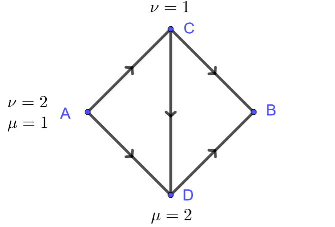

# Optimización

Consideremos una vez más el grafo $G=(V,E)$. Otra perspectiva para el Laplaciano aparece cuando consideramos la **energía de Dirichlet** para una función $u:V\to \mathbb R$
$$
\mathcal E[u] := \frac{1}{2}\sum_{e\in E} (Du(e))^2.
$$
Recordemos que podemos pensar igualmente a $\mathcal E$ como una función de $\mathbb R^{|V|}$ a $\mathbb R$, y como tal podemos calcular su gradiente en una dada $u$ como un vector de $\mathbb R^{|V|}$ o equivalentemente una función real sobre $V$. Dado $x\in V$
$$
D\mathcal E[u](x) = \left.\frac{d}{d\epsilon}\right|_{\epsilon=0}\mathcal E[u+\epsilon 1_{x}] = \sum_{e\in E} Du(e) D 1_{x}(e).
$$

Dado que
$$
D 1_{x}(e) = \begin{cases}
1 \text{ si } e_+=x,\\
-1 \text{ si } e_-=x,\\
0 \text{ en cualquier otro caso},\\
\end{cases}
$$
llegamos a que
$$
D\mathcal E[u](x) = \sum_{e_+=x} Du(e) - \sum_{e_-=x} Du(e) = -\operatorname{div}(Du)(x) = -\Delta u(x).
$$

---

:::{.exercise}
Sea $f:V\to \mathbb R$ y $\mathcal F:\mathbb R^V\to \mathbb R$ tal que
$$
\mathcal F[u] = \mathcal E[u] + \sum_{x\in V} f(x)u(x).
$$
Demuestra que $\mathcal F$ es acotada por debajo si y solo si $\sum_{x\in V} f(x)=0$
:::

Solución

---

:::{.exercise}
Demuestra que si $\partial_t^2u=\Delta u$ entonces la energía total del sistema definida a continuación permanece constante
$$
E = \underbrace{\frac{1}{2}\sum_{x\in V} (\partial_t u(x))^2}_{\text{Cinética}} + \underbrace{\mathcal E[u]}_{\text{Potencial}}.
$$
:::

Solución

---

:::{.example}
Modelamos una imagen en blanco y negro está dada por una función $u:V\to [0,1]$ definida sobre la retícula $V = \mathbb Z^2\cap [1,N]^2$. El problema de restauración de imágenes consiste en proponer una imagen $u$ que aproxime una dada imagen $f$ que quizás esté contaminada con algún tipo de ruido.

Por ejemplo, podemos proponer $u$ como aquella que minimiza el funcional
$$
\mathcal F[u] = \frac{1}{2}\sum_{x\in V} (u(x)-f(x))^2+\alpha(Du(x))^2.
$$
El primer término penaliza el funcional cuando $u$ se aleja de la señal dada $f$ y se conoce como el término de fidelidad. El segundo término penaliza las oscilaciones de $u$ y se conoce como el término de regularización. El parámetro $\alpha>0$ debe ser ajustado empíricamente para obtener un balance entre la fidelidad de la imagen y la regularización.

Tenemos entonces la ecuación de punto crítico la cual debe satisfacerse para todo $x\in V$
$$
0 = D\mathcal F[u](x) = u(x)-f(x) - \alpha\Delta u(x).
$$
Observemos que $\Delta$ posee autovalores negativos, esto indica que el operador $I-\alpha\Delta$ tiene autovalores estrictamente positivos, en particular la ecuación $u-\alpha\Delta u=f$ tiene una única solución para $f:V\to \mathbb R$ arbitraria.
:::

---

:::{.exercise}
El término de penalización dado por la energía de Dirichlet es conveniente al momento de calcular el gradiente, sin embargo en la práctica este difumina los contornos. Una mejor alternativa es usar en término de **variación total**
$$
\mathcal F[u] = \sum_{x\in V} \frac{1}{2}(u(x)-f(x))^2+\alpha|Du(x)|.
$$
Calcula las ecuaciones de punto crítico de $\mathcal F$.
:::

Solución

---

:::{.exercise}
El término de variación total tiene la desventaja de no ser diferenciable en todos lados. Una alternativa consiste en tomar para $\epsilon>0$ pequeño
$$
\mathcal F[u] = \sum_{x\in V} \frac{1}{2}(u(x)-f(x))^2+\alpha\sqrt{(Du(x))^2+\epsilon^2}.
$$
Calcula las ecuaciones de punto crítico de $\mathcal F$.
:::

Solución

---

:::{.example}
Un dado conjunto de datos puede estar dado en términos de un grafo $G=(V,E)$ para el cual pensamos que dos vértices adyacentes son de alguna forma semejantes. El propósito es clasificar los vértices de acuerdo a $k$ etiquetas que modelamos usando los vectores canónicos $\{e_1,\ldots,e_k\}\in \mathbb R^k$. De hecho el problema está planteado en un subconjunto de vértices $\Omega\subseteq V$, dado que en el complemento las etiquetas vienen predeterminadas por una función $g:V\setminus\Omega\to\{e_1,\ldots,e_k\}$.

Una forma de llevar a cabo esta tarea consiste en minimizar el funcional de Dirichlet bajo el dato de borde en $V\setminus \Omega$
$$
\min\{\mathcal E[u]\ | \ u=g\text{ en } V\setminus \Omega\}.
$$
Bajo esta condición $u:V\to \mathbb R^k$ debe ser calculado según
$$
\begin{cases}
\Delta u = 0 \text{ en } \Omega,\\
u=g\text{ en } V\setminus \Omega.
\end{cases}
$$
Dado que la solución $u(x)$ no necesariamente toma valores en $\{e_1,\ldots,e_k\}$, tomamos la etiqueta para $x$ como el $e_j$ más cercano a $u(x)$.
:::

---

:::{.exercise}
Dado que $u=(u_1,\ldots,u_k)$ satisface
$$
\begin{cases}
\Delta u = 0 \text{ en } \Omega,\\
u=g\text{ en } V\setminus \Omega.
\end{cases}
$$
con $g$ tomando valores en $\{e_1,\ldots,e_k\}$, demuestra que para todo $x\in V$
$$
u(x) \in \{y\in [0,1]^k \ | \ y_1+\ldots+y_k=1\}.
$$
:::

Solución

## Métrica de Sobolev

Consideremos para $G = (V,E)$ conexo
$$
\dot H^1 := \left\{u:V\to\mathbb R\ | \ \sum_V u = 0\right\}.
$$
Este espacio vectorial admite el producto interno,
$$
\langle u,v\rangle_{\dot H^1} := \sum_{e\in E} Du(e)Dv(e).
$$
Recordemos rápidamente las propiedades que verifica para poder ser efectivamente un producto:

- Simétrico: $\langle u,v\rangle_{\dot H^1}=\langle v,u\rangle_{\dot H^1}$,

- Lineal: $\langle \alpha u+\beta v,w\rangle_{\dot H^1} = \alpha\langle u,w\rangle_{\dot H^1}
    +\beta\langle v,w\rangle_{\dot H^1}$.

- Positivo: $\|u\|_{\dot H^1}^2 := \langle u,u\rangle_{\dot H^1}\geq 0$

- No degenerado: $\|u\|_{\dot H^1} = 0$ si y solo si $u=0$.

De todas estas propiedades, la no degeneración es la más delicada. De $\|u\|_{\dot H^1} = 0$ se deduce que $u$ es constante ($G$ es conexo). Dado que $\sum u=0$ se llega a que necesariamente dicha constante es cero.

## Capacitancia

Dado $\Omega\subseteq V$ con $V\setminus \Omega\neq \emptyset$, definimos la capacitancia de $\Omega'\subseteq\Omega$ con respecto de $\Omega$ como
$$
\operatorname{Cap}(\Omega'|\Omega) := \min\{2\mathcal E[u] \ | \ \text{$u=1$  en $\Omega'$, y $u=0$ en $V\setminus\Omega$}\}.
$$

Un minimizante $u$ de dicho problema es la función armónica en $\Omega\setminus \Omega'$ que satisface los datos de borde prescritos
$$
\begin{cases}
\Delta u = 0 \text{ in } \Omega\setminus \Omega',\\
u=0 \text{ on } V\setminus \Omega,\\
u=1 \text{ on } \Omega'.
\end{cases}
$$
Gracias al teorema de la divergencia^[Recordemos que
$$
n_{\Omega'}(e) = \begin{cases}
1 \text{ si $e_-\in \Omega'$ y $e_+\in V\setminus \Omega$},\\
-1 \text{ si $e_+\in \Omega'$ y $e_-\in V\setminus \Omega$},\\
0 \text{ en cualquier otro caso}. 
\end{cases}
$$]
$$
\operatorname{Cap}(\Omega'|\Omega) = -\sum_{x\in V} u\Delta u(x) = -\sum_{x\in \Omega'} \Delta u(x) = -\sum_{e\in E} Du(e)n_{\Omega'}(e).
$$
En términos de redes eléctricas obtenemos la corriente total que atraviesa la red cuando se mantiene una diferencia potencial de un voltio entre $\Omega'$ y $V\setminus \Omega$. La resistencia efectiva entre dos nodos distintos $x_0$ y $x_1$ puede ser definida así según
$$
R(x_0,x_1) = \frac{1}{\operatorname{Cap}(\{x_1\}|V\setminus\{x_0\})}.
$$

Equivalentemente se puede definir la capacitancia en términos de dos desigualdades sobre $\Omega'$ y $V\setminus \Omega$
$$
\operatorname{Cap}(\Omega'|\Omega) = \min\{\mathcal E[u] \ | \ \text{$u\geq 1$  en $\Omega'$, y $u\leq 0$ en $V\setminus\Omega$}\}.
$$
Es claro que el lado derecho es menor o igual que el lado izquierdo, dado que el conjunto que considera el mínimo es más grande. Por el otro lado tenemos que para cualquier $u$ tal que $u\geq 1$  en $\Omega'$, y $u\leq 0$ en $V\setminus\Omega$, la truncación dada por
$$
v(x) := \max(\min(u(x),1),0) = \begin{cases}
1 \text{ si } x\in \Omega',\\
u(x) \text{ si } x\in \Omega\setminus\Omega',\\
0 \text{ si } x\in V\setminus \Omega.
\end{cases}
$$
disminuye la energía de Dirichlet $\mathcal E[v]\leq \mathcal E[u]$, lo cual concluye la igualdad que habíamos anunciado.

---

:::{.exercise}
Calcula $\operatorname{Cap}(\{a\}|V\setminus \{b\})$

:::

Solución:

---

:::{.exercise}
Demuestra que para $\Omega_1\subseteq\Omega_2\subseteq\Omega_3\subseteq V$:

- $\operatorname{Cap}(\Omega_1|\Omega_2)= \operatorname{Cap}(V\setminus\Omega_2|V\setminus \Omega_1)$.

- $\operatorname{Cap}(\Omega_1|\Omega_3) \leq \operatorname{Cap}(\Omega_2|\Omega_3)$.

- $\operatorname{Cap}(\Omega_1|\Omega_2) \geq \operatorname{Cap}(\Omega_1|\Omega_3)$.
:::

Solución:

---

:::{.exercise}
Demuestra que para $\Omega_1,\Omega_2\subseteq\Omega\subseteq V$^[El minimizante $u$ correspondiente a $\Omega_1\cup\Omega_2$ es puntualmente mayor o igual a $\max(u_1,u_2)$ donde $u_1$ y $u_2$ son los minimizantes para $\Omega_1$ y $\Omega_2$ respectivamente.]:
$$
\operatorname{Cap}(\Omega_1\cup\Omega_2|\Omega) \leq \operatorname{Cap}(\Omega_1|\Omega)+\operatorname{Cap}(\Omega_2|\Omega).
$$
:::

Solución:

---

:::{.exercise}
Sea $\Omega'\subseteq\Omega\subseteq V$, $u$ la solución de
$$
\begin{cases}
\Delta u = 0 \text{ in } \Omega\setminus \Omega',\\
u=0 \text{ on } V\setminus \Omega,\\
u=1 \text{ on } \Omega'.
\end{cases}
$$
y sean $\mu=(\Delta u)_-$ y $\nu=(\Delta u)_+$. Demuestra que
$$
P_\Omega(\mu)=\nu \qquad \text{ y } \qquad P_{V\setminus \Omega'}(\nu)=\mu.
$$
:::

Solución:

## Métrica dual

De forma dual proponemos el siguiente problema. Decimos que un flujo $i:E\to\mathbb R$ transporta a la distribución (de cargas) $\mu:V\to [0,\infty)$ en $\nu:V\to\mathbb R$ si satisface
$$
\operatorname{div} i = \mu-\nu.
$$
Recordemos que tal problema tiene solución si y solo si (y asumiendo $G$ conexo)
$$
\sum_{x\in V}\mu(x) = \sum_{x\in V}\nu(x).
$$

Dada la energía del flujo $i$ como
$$
\mathcal K[i] := \frac{1}{2}\sum_{e\in E} i(e)^2,
$$
nos preguntamos entonces cuál es la menor energía posible que se requiere para transportar a $\mu$ en $\nu$
$$
\mathcal D^2[\mu,\nu] := \min\{ 2\mathcal K[i] \ | \ \operatorname{div} i = \mu-\nu\}.
$$

Si $i$ minimiza $\mathcal K$ y $j$ es un flujo tal que $\operatorname{div} j=0$, entonces
$$
0=\left.\frac{d}{dt}\right|_{t=0}\mathcal K[i+tj] = \sum_{e\in E}i(e)j(e).
$$
Es decir que el mínimo $i$ debe ser perpendicular al núcleo de la divergencia. Por la descomposición de Helmholtz debe ser necesariamente un gradiente $i=-Du$ por lo que
$$
\mathcal D^2[\mu,\nu] = 2\mathcal E[u]\text{ para cualquier solución de $\Delta u=\nu-\mu$}.
$$

---

:::{.exercise}
Calcula $\mathcal D^2(\mu,\nu)$

:::

Solución:

---

:::{.exercise}
La función $\mathcal D$, es decir la raíz cuadrada del mínimo de la energía, se conoce como la **distancia dual**. Demuestra que efectivamente satisface los axiomas correspondientes:

- $\mathcal D(\mu,\nu) = \mathcal D(\nu,\mu)$,

- $\mathcal D(\mu,\nu) \geq 0$ y la igualdad se cumple exclusivamente si $\mu=\nu$,

- $\mathcal D(\mu,\nu) \leq \mathcal D(\mu,\omega)+\mathcal D(\omega,\nu)$.
:::

Solución:

---

:::{.exercise}
Definimos la norma dual en $\dot H^1$ como
$$
\|u\|_{\dot H^{-1}} := \sup\{ \langle u,v\rangle_{\dot H^1}\ | \ \|v\|_{\dot H^1}=1\}.
$$
Demuestra que si $\sum_V \mu = \sum_V\nu$, entonces
$$
\|\mu-\nu\|_{\dot H^{-1}} = \mathcal D(\mu,\nu).
$$
:::

Solución:

---

Dados $\Omega'\subseteq\Omega\subseteq V$ con $\Omega'$ y $V\setminus \Omega$ no triviales consideramos las distribuciones $\mu$ y $\nu$ tales que
$$
\begin{aligned}
\mathcal M(\Omega'|\Omega) = \{(\mu,\nu):V\to \mathbb R^2\ | \ &\operatorname{spt} \mu \in \Omega',\\
&\operatorname{spt}\nu \subseteq V\setminus\Omega,\\
&\left.\sum_{x\in V}\mu(x) = \sum_{x\in V}\nu(x)=1\right\}.
\end{aligned}
$$
Bajos estas condiciones buscamos minimizar la distancia entre $\mu$ y $\nu$.

:::{.theorem}
Para $G$ conexo y finito,
$$
\min_{(\mu,\nu) \in \mathcal M(\Omega'|\Omega)} \mathcal D^2[\mu,\nu] = \frac{1}{\operatorname{Cap}(\Omega'|\Omega)}.
$$
:::

Es decir que el problema de minimización para $\mathcal D^2[\mu,\nu]$ bajo las restricciones $(\mu,\nu) \in \mathcal M(\Omega'|\Omega)$ generaliza la noción de resistencia efectiva entre dos conjuntos.

:::{.proof}
Sean $\mu',\nu':V\to [0,\infty)$ tales que
$$
\operatorname{spt}\mu'\subseteq\Omega', \qquad \operatorname{spt} \nu'\subseteq V\setminus \Omega.
$$
Obtenemos de esta forma que
$$
\max_{\mu',\nu'} \sum_{x\in V} ((1-u)\mu'+u\nu')(x) = \begin{cases}
0 \text{ si $u\geq 1$ en $\Omega'$ y $u\leq 0$ en $V\setminus\Omega$,}\\
\infty \text{ en cualquier otro caso}.
\end{cases}
$$
De modo que sin necesidad de imponer restricciones para $u:V\to\mathbb R$ obtenemos que
$$
\operatorname{Cap}(\Omega'|\Omega) = \min_u \max_{\mu',\nu'} L[u,\mu',\nu'], \qquad L[u,\mu',\nu'] := 2\mathcal E[u] + \sum_{x\in V} ((1-u)\mu'+u\nu')(x).
$$

Procedemos entonces a analizar el problema dual para el cual sabemos que^[En general, $\min_x\max_\lambda L(x,\lambda) \geq \max_\lambda\min_x L(x,\lambda)$.]
$$
\operatorname{Cap}(\Omega'|\Omega)\geq \max_{\mu',\nu'} \mathcal J[\mu',\nu'], \qquad \mathcal J[\mu',\nu'] := \min_u L[u,\mu',\nu'].
$$

Por un lado vemos que si
$$
\sum_{x\in V}\mu'(x) \neq \sum_{x\in V}\nu'(x)
$$
entonces $\mathcal J[\mu',\nu'] = -\infty$, dado que para $u=c$ constante podemos hacer $L[u,\mu',\nu']$ arbitrariamente negativo
$$
L[c,\mu',\nu'] = \sum_{x\in V}\mu'(x) + c\sum_{x\in V}(\nu'-\mu')(x).
$$
Asumamos entonces que las sumas son iguales, en cuyo caso la forma cuadrática convexa $u\mapsto L[u,\mu',\nu']$ alcanza su mínimo en las soluciones de
$$
2\Delta u = \nu'-\mu'.
$$
Estas están bien definidas por la hipótesis para el lado derecho, además dos soluciones cualesquiera difieren por constantes, gracias a la conexidad de $G$. Por lo tanto
$$
\sum_{x\in V} (\nu'-\mu')u(x) = 2\sum_{x\in V} u\Delta u(x) = -4\mathcal E[u]
$$
y entonces
$$
\mathcal J[\mu',\nu'] = \sum_{x\in V} \mu'(x)-2\mathcal E[u].
$$

Denotemos por $M:=  \sum_{x\in V} \mu'(x)$ y consideremos las renormalizaciones dadas por $\mu'=M\mu$, $\nu'=M\nu$ y $2u=Mv$ tales que $(\mu,\nu) \in \mathcal M(\Omega'|\Omega)$, $\Delta v = \nu-\mu$, y $4\mathcal E[u] = M^2\mathcal E[v]$. Por lo tanto
$$
\mathcal J[\mu',\nu'] = M - \frac{M^2}{2} \mathcal E[v]
$$
Vemos que $M$ y $v$ son independientes bajo las restricciones dadas. Si maximizamos primero en $M$ obtenemos que $M=1/\mathcal E[v]$ y por lo tanto
$$
\operatorname{Cap}(\Omega'|\Omega) \geq \max_{\mu',\nu'} \mathcal J[\mu',\nu'] = \max_{\substack{\Delta v = \nu-\mu\\(\mu,\nu)\in \mathcal M(\Omega'|\Omega)}} \frac{1}{\mathcal E[v]} = \max_{(\mu,\nu)\in \mathcal M(\Omega'|\Omega)} \frac{1}{\mathcal D^2[\mu,\nu]}.
$$

Para concluir la demostración veremos que cuando $u$ es la solución de
$$
\begin{cases}
\Delta u = 0 \text{ in } \Omega\setminus \Omega',\\
u=0 \text{ on } V\setminus \Omega,\\
u=1 \text{ on } \Omega',
\end{cases}
$$
y además $(\Delta u)_- = M\mu$, $(\Delta u)_+ = M\nu$, $u=Mv$, tales que $(\mu,\nu)\in \mathcal M(\Omega'|\Omega)$, entonces
$$
\operatorname{Cap}(\Omega'|\Omega) = 2\mathcal E[u] \overset{?}{=} \frac{1}{2\mathcal E[v]} = \frac{1}{\mathcal D^2[\mu,\nu]}.
$$
Esto se debe a la fórmula de integración por partes y la homogeneidad de $\mathcal E$
$$
2\mathcal E[u] = M = 2M^2\mathcal E[v] \qquad\mathbb Rightarrow\qquad M= \frac{1}{2\mathcal E[v]} \qquad\mathbb Rightarrow\qquad 2\mathcal E[u] = \frac{1}{2\mathcal E[v]}.
$$
:::

En los siguientes ejercicios consideramos para $\Omega\subseteq V$
$$
\mathcal M(\Omega):= \left\{\mu:V\to [0,1] \ | \ \operatorname{spt}\mu\subseteq\Omega \text{ y } \sum_{x\in V}\mu(x)=1\right\}.
$$

---

:::{.exercise}
Sea $\Omega'\subseteq\Omega\subseteq V$. Demuestra que para $\mu\in \mathcal M(\Omega')$ se tiene que
$$
\mathcal D(\mu,P_\Omega(\mu)) = \min_{\nu \in \mathcal M(V\setminus \Omega)}\mathcal D(\mu,\nu)
$$
:::

Solución:

---

:::{.exercise}
Sea $\Omega'\subseteq\Omega\subseteq V$. Demuestra que $T:= P_{V\setminus \Omega'}\circ P_\Omega$ es un mapeo no expansivo $\mathcal M(\Omega')$ en si mismo con respecto de la métrica de Wasserstein, es decir que
$$
\mathcal D(T(\mu_1),T(\mu_2))\leq \mathcal D(\mu_1,\mu_2).
$$
:::

Solución:

## Cociente de Rayleigh

Sea $A\in \mathbb R^{N\times N}$ simétrica. Sabemos por el teorema espectral que existe una base ortogonal de autovectores de $L$ con autovalores reales. Tendremos en mente aplicar los resultados de esta sección para $A=-L$ para la cual sabemos adicionalmente que sus autovalores son no-negativos.

La ecuación $A\xi = \lambda\xi$ que determina los autovectores puede pensarse también como una ecuación de punto crítico con restricciones, siendo $\lambda$ el multiplicador de Lagrange. En este caso el gradiente de la función objetivo es $A\xi$, mientras que el gradiente de la restricción es $\xi$. Esto quiere decir que la función objetivo puede ser tomada como la forma cuadrática $f(\xi)=A\xi\cdot \xi$, mientras que la restricción es $g(\xi) = \|\xi\|^2 = \xi\cdot\xi$.

A lo largo de esta sección asumimos que $A\in \mathbb R^{N\times N}$ es simétrica y denotamos por $\lambda_0\leq\ldots\leq \lambda_{N-1}$ sus autovalores y $\xi_0,\ldots,\xi_{N-1}$ una base ortogonal de autovectores.

---

:::{.exercise}
Demuestra que el mínimo de $f(\xi)=A\xi\cdot \xi$ sobre la esfera unitaria es el menor autovalor de $A$ y que los puntos donde se realiza el mínimo general el autoespacio de dicho autovalor.

¿Sucede algo similar para el problema de maximización?
:::

Solución:

---

:::{.exercise}
Considera el grafo

Calcula el mínimo y máximo de
$$
\sum_{e\in E} (Du(e))^2
$$
sobre todas las funciones $u:V\to \mathbb R$ tales que $\sum_V u^2=1$.
:::

Solución:

---

:::{.exercise}
Considera el grafo

Calcula el mínimo y máximo de
$$
\sum_{e\in E} (Du(e))^2
$$
sobre todas las funciones $u:V\to \mathbb R$ tales que $\sum_V u^2=1$ y $u(A)=u(B)=0$.
:::

Solución:

---

Una forma alternativa del problema de optimización consiste en tomar el cociente de Rayleigh
$$
R(\xi) := \frac{A\xi \cdot \xi}{\|\xi\|^2},
$$
y minimizar o maximizar esta función fuera del origen.

---

:::{.exercise}
Demuestra que
$$
\lambda_k = \min\{R(\xi)\ | \ \xi \in \operatorname{span}\{\xi_0,\ldots,\xi_{k-1}\}^\perp \setminus \{0\}\}
$$
:::

Solución:

---

:::{.theorem name="Courant–Fischer–Weyl"}
$$
\lambda_k = \max\{\min\{R(\xi)\ | \ \xi \in S\setminus\{0\}\} \ | \ S \text{ es un sub-espacio de $\mathbb R^N$ con $\dim S=N-k$}\}
$$
:::

En otras palabras, dado un sub-espacio $S$ de dimensión $N-k$, el mínimo de $R$ sobre $S\cap \partial B_1$ es a lo sumo $\lambda_k$. La igualdad se alcanza cuando $S=\operatorname{span}\{\xi_k,\ldots,\xi_{N-1}\}$.

:::{.proof}
Denotemos
$$
\mu_k := \max\{\min\{R(\xi)\ | \ \xi \in S\setminus\{0\}\} \ | \ S \text{ es un sub-espacio de $\mathbb R^N$ con $\dim S=N-k$}\}.
$$

Para demostrar que $\lambda_k\leq \mu_k$ basta con conseguir un sub-espacio $S$ de dimensión $N-k$ tal que el mínimo de $R$ sobre $S\setminus\{0\}$ es por lo menos $\lambda_k$.

Sea $S_{N-k} = \operatorname{span}\{\xi_{k},\ldots,\xi_{N-1}\}$ tal que $\dim S_{N-k} = N-k$. Por un lado tenemos que para $\xi = \alpha_{k}\xi_{k}+\ldots+\alpha_{N-1}\xi_{N-1}\in S_{N-k}\setminus \{0\}$
$$
R(\xi) = \frac{\lambda_{k}\alpha_{k}^2+\ldots+\lambda_{N-1}\alpha_{N-1}^2}{\alpha_{k}^2+\ldots+\alpha_{N-1}^2} \geq \lambda_k
$$
cuyo mínimo es de hecho $\lambda_{k}$ y se alcanza por ejemplo cuando $\alpha_k=1$ y los demás coeficientes se anulan. Es decir que hemos probado que $\lambda_k \leq \mu_k$.

La desigualdad $\lambda_k \geq \mu_k$ quiere decir que para cualquier sub-espacio $S$ de dimensión $N-k$, existe $\xi \in S\setminus\{0\}$ tal que $R(\xi)\leq \lambda_k$. Tomemos $\xi = \alpha_0\xi_0+\ldots+\alpha_k\xi_k \in S\setminus\{0\}$, sabemos que tal vector existe puesto que
$$
\dim S + \dim\operatorname{span}\{\xi_0,\ldots,\xi_k\} = N+1.
$$
Luego
$$
R(\xi) = \frac{\lambda_{0}\alpha_{0}^2+\ldots+\lambda_{k}\alpha_{k}^2}{\alpha_{0}^2+\ldots+\alpha_{k}^2} \leq \lambda_k.
$$
:::

---

:::{.exercise}
Si $A\leq A'$, i.e. $(A'-A)$ es positiva semi-definida, entonces sus correspondientes autovalores también están ordenados, es decir $\lambda_k\leq \lambda_k'$.
:::

Solución:

---

:::{.exercise}
Sea $G'$ un sub-grafo de $G$^[$V'\subseteq V$ y $E'\subseteq E\cap V'\times V'$.]. Demuestra que para los correspondientes autovalores del Laplaciano se tiene que $\lambda_k'\geq \lambda_k$.
:::

Solución:

