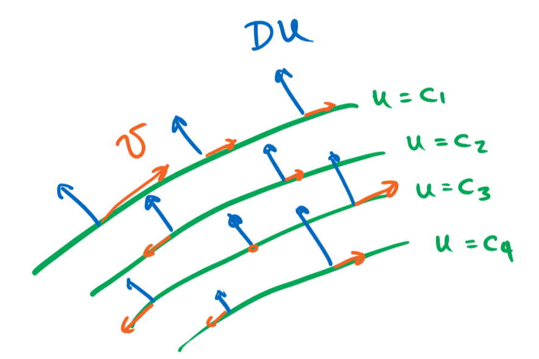

# (PART\*) Transporte y leyes de conservación {-}

# Cantidades conservadas

## Problemas homogéneos

Sea $v:\mathbb R^n\to \mathbb R^n$ un campo vectorial suave y acotado, como tal genera un flujo $\phi:\mathbb R^n\times\mathbb R\to \mathbb R^n$ definido por medio del problema de valores iniciales
$$
\begin{cases}
\partial_t\phi(x,t) = v(\phi(x,t)),\\
\phi(x,0)=x.
\end{cases}
$$

Una función $u:\mathbb R^n\to \mathbb R$ se dice que es una **cantidad conservada** de $v$, si $u$ permanece constante a lo largo del flujo $\phi$. Es decir
$$
u(\phi(x,t)) = u(x) \qquad \forall \, t\in\mathbb R.
$$
Si $u$ es además diferenciable esto equivale a la ecuación parcial lineal de primer orden
$$
v \cdot Du = 0.
(\#eq:eq1)
$$

Por un lado, conocer una cantidad conservada $u$ nos ayuda a resolver las EDOs $x'=v(x)$, dado que las trayectorias permanecen en los conjuntos de nivel de $u$. Por otro lado, la EDO asociada a la EDP \@ref(eq:eq1) se conoce como la **ecuación característica** y nos ayudan a calcular la solución de la EDP dado que $u$ debe permanecer constante a lo largo de estas trayectorias.

Geométricamente, la ecuación $v\cdot Du=0$ quiere decir que las curvas de nivel de $u$ deben ser perpendiculares al campo $v$ en todo punto. En otras palabras, $v$ es paralelo a los conjuntos de nivel de $u$.

{width=70%}

---

:::{.example}
Dado un vector constante $v = (v_1,\ldots,v_n)\in \mathbb R$, consideremos el problema
$$
v\cdot Du = 0.
$$
Este tiene asociada la ecuación característica $x'=v$ (es decir el sistema $x_i'=v_i$) cuya solución es $x(t)=x_0+tv$. Dada que cualquier solución de la EDP debe permanecer constante a lo largo de esta trayectoria tenemos que
$$
u(x_0+tv) = u(x_0).
$$
Si $u$ estuviese predeterminada en una región $F\subseteq \mathbb R^n$ dada como la función $u_0$, entonces es conveniente tomar la posición inicial $x_0$ en dicha región. Por ejemplo, si $F = \{x_1=0\}$ y $v=(v_1,\ldots,v_n)$ no es paralelo a $F$, es decir $v_1\neq0$, entonces podemos conectar cualquier punto $x=(x_1,\ldots,x_n)\in\mathbb R^n$ con algún punto $x_0=(0,x_{0,2},\ldots,x_{0,n})\in F$ tal que $x_0+tv = x$ y por lo tanto $u(x) = u_0(x_0)$. En este caso particular podemos simplemente calcular $x_0$ y $t$ y obtener una fórmula explícita para la solución
$$
\begin{aligned}
tv_1 = x_1 \qquad&\Rightarrow\qquad t=x_1/v_1,\\
x_{0,i} + tv_i = x_i \text{ si } i\geq 2 \qquad&\Rightarrow\qquad x_{0,i} = x_i - x_1v_i/v_1,\\ 
u(x) = u_0(x_0) \qquad&\Rightarrow\qquad u(x) = u_0(0,x_2 - x_1v_2/v_1,\ldots,x_n - x_1v_n/v_1)
\end{aligned}
$$
:::

---

:::{.exercise}
Calcula $u:\mathbb R^2\to \mathbb R$ tal que
$$
\begin{cases}
y\partial_x u = x\partial_y u \text{ en } \mathbb R^2\setminus\{y=0,x\geq 0\},\\
u = u_0 \text{ en } \{y=0,x\geq 0\}.
\end{cases}
$$
:::

Solución

**EDO característica**
$$
x'=y, \qquad y'=-x
$$

**Flujo característico**
$$
x(t) = x_0 \cos t + y_0 \sin t, \qquad y(t) = - x_0 \sin t + y_0\cos t
$$

**Condición de borde:** $t=0$, $y_0=0$, y $x_0>0$
$$
u(x_0 \cos t + y_0 \sin t,- x_0 \sin t + y_0\cos t) = u_0(x_0)
$$

**Invertimos:** $(x,y)=x_0 \cos t + y_0 \sin t,- x_0 \sin t + y_0\cos t$ tal que en $t=0$, $x_0 \cos t + y_0 \sin t,- x_0 \sin t + y_0\cos t = (x_0,0) \in \{y=0,x\geq 0\}$. Por lo tanto $x_0=\sqrt{x^2+y^2}$, $y_0=0$, y
$$
u(x,y) = u_0\left(\sqrt{x^2+y^2}\right)
$$

**Verificamos:** Para la condición de frontera es claro que 
$$
\partial_x u = u_0'\left(\sqrt{x^2+y^2}\right)\frac{x}{\sqrt{x^2+y^2}}, \qquad \partial_y u = u_0'\left(\sqrt{x^2+y^2}\right)\frac{y}{\sqrt{x^2+y^2}}.
$$
Por lo tanto,
$$
y\partial_x u - x\partial_y u = u_0'\left(\sqrt{x^2+y^2}\right)\frac{yx-xy}{\sqrt{x^2+y^2}}=0.
$$

---

:::{.exercise}
Explica como se podría extender la teoría al problema de Cauchy donde $u:\mathbb R^n\times[0,\infty)\to \mathbb R$ depende de una variable espacial $x\in\mathbb R^n$ y una temporal $t\in[0,\infty)$ y satisface en cambio el problema de valores iniciales
$$
\begin{cases}
\partial_t u + v\cdot Du = 0 \text{ en } \mathbb R^n,\\
u = u_0 \text{ en } \{t= 0\}
\end{cases}
$$
:::

Solución

Consideramos a $t=x_0$ como una variable adicional, es decir tomamos el espacio de fase extendido. Por lo tanto
$$
\partial_t u + v\cdot Du = (1,v)\cdot(\partial_t u,Du) = (1,v)D_{x_0,x_1,\ldots,x_n}u.
$$

---

En el caso evolutivo $u=u(x,t)$, dado un campo vectorial $v$, la derivada
$$
D_vu = \partial_tu+ v \cdot Du
$$
se conoce como la **derivada material** de $u$ y describe la tasa de cambio de $u$ a lo largo de las trayectorias generadas por $v$.

### Leyes de conservación en mecánica

:::{.example}
**Ley de conservación de la energía**

Un sistema mecánico se dice **conservativo** si la fuerza es menos el gradiente un potencial $U$
$$
mv' = -DU(x), \qquad v=x'.
$$
La energía del sistema es la suma de la cinética y potencial
$$
E(x,v) = \frac{1}{2}m|v|^2 + U(x).
$$
La **ley de la conservación de la energía** dice que la energía total es constante. Comprobémoslo calculando la derivada temporal de $E$.
$$
\frac{d}{dt}E(x(t),v(t)) = x'\partial_x E + v'\partial_v E=v\cdot DU + \frac{(-DU)}{m}\cdot m v = 0.
$$
Dicho de otra forma, la energía total satisface la ecuación $(v,-DU/m)\cdot DE=0$.
:::

---

:::{.exercise}
Considera el sistema mecánico de fuerzas centrales,
$$
mx'' = f(|x|)x.
$$
Demuestra que el **momento angular** $L_{ij} := x_ix_j'-x_jx_i'$ es una cantidad conservada del sistema.
:::

Solución

Sea $v_i=x_i'$. Tenemos así $L_{ij} = x_iv_j-x_jv_i$ y el sistema de primer orden
$$
x'=v, \qquad v'=\frac{1}{m}f(|x|)x.
$$
Basta ver entonces que la siguiente derivada se anula
$$
\begin{aligned}
(v,\frac{1}{m}f(|x|)x)\cdot (D_xL_{ij},D_vL_{ij}) &= \sum_{k=1}^n v_k\partial_{x_k}L_{ij}+\frac{1}{m}f_k(|x|)x_k\partial_{v_k}L_{ij},\\
&= v_iv_j-v_jv_i + \frac{1}{m}f_i(|x|)(x_ix_j-x_jx_i),\\
&= 0.
\end{aligned}
$$

### Ecuaciones exactas y conjugados armónicos

:::{.example}
Consideremos el sistema de ecuaciones
$$
x' = f(x,y),\qquad
y' = g(x,y).
$$
La trayectoria del sistema consiste del lugar geométrico trazado por la solución. La ecuación se dice **exacta** si las trayectorias son el conjunto de nivel de una función $u$, equivalentemente el campo $(f,g)$ debe ser perpendicular a $(\partial_xu,\partial_y u)$. Es decir que $u$ debe satisfacer la ecuación homogénea
$$
(f,g)\cdot Du=0.
$$
:::

---

:::{.example}
Un función $f = (u(x,y),v(x,y)):\mathbb{C}\to\mathbb{C}$ es **holomorfa** si satisface las **ecuaciones de Cauchy-Riemann**
$$
\partial_x u = \partial_y v, \qquad \partial_y u = - \partial_x v.
$$
Estas implican que $u$ y $v$ son funciones armónicas
$$
(\partial_x^2+\partial_y^2)u=(\partial_x^2+\partial_y^2)v=0,
$$
y adicionalmente sus conjuntos de nivel son ortogonales entre si. Sus gradientes son exactamente rotaciones de 90 grados uno del otro. Es decir que $v$ debe satisfacer la ecuación homogénea
$$
Du\cdot Dv=0.
$$
:::

---

En la siguiente sección veremos como encontrar soluciones para el problema de ecuaciones exactas y el problema del conjugado armónico resolviendo el problema de la prescripción del gradiente (un sistema de ecuaciones no-homogéneas). En el caso de las ecuaciones exactas este resulta en
$$
\partial_x u = -g, \qquad \partial_y u = f.
$$
En el caso del conjugado armónico el sistema es en cambio el dado por las ecuaciones de Cauchy-Riemann con $u$ dado y $v$ variable
$$
\partial_x v = -\partial_y u, \qquad \partial_y v = \partial_x u.
$$

### El teorema de Frobenius

Podemos también considerar sistemas de ecuaciones homogéneas de primer orden. Es decir, dados $k$ campos $v^{(1)},v^{(2)},\ldots,v^{(k)}:\mathbb R^n\to\mathbb R^n$, buscamos una función $u:\mathbb R^n$ que satisfaga simultáneamente
$$
\begin{cases}
v^{(1)}\cdot Du = 0,\\
v^{(2)}\cdot Du = 0,\\
\vdots\\
v^{(k)}\cdot Du = 0.
\end{cases}
$$
Es decir que cada uno de los vectores $v^{(j)}$ son tangentes a los conjuntos de nivel de $u$. Cuando los campos son linealmente independientes, tenemos que estos asocian en cada punto un sub-espacio de dimensión $k$ que estos generan, esto se conoce como una **distribución**. Geométricamente, el sistema de EDPs quiere decir que los planos tangentes de los conjuntos de nivel de $u$ contienen a la distribución dada por los campos $v^{(1)},\ldots,v^{(k)}$.

Si el sistema tiene solución entonces necesariamente se debe cumplir que
$$
[v^{(i)},v^{(j)}] := \sum_{l=1}^n (v^{(i)}\cdot Dv^{(j)}_l-v^{(j)}\cdot Dv^{(i)}_l)e_l \perp Du.
$$
Para justificar este hecho basta ver que
$$
[v^{(i)},v^{(j)}]\cdot Du = v^{(i)}\cdot D(v^{(j)}\cdot Du) - v^{(j)}\cdot D(v^{(i)}\cdot Du) = 0.
$$

---

:::{.exercise}
Verifica las identidades previas.
:::

Solución

$$
v^{(i)}\cdot D(v^{(j)}\cdot Du) = \sum_{a=1}^n v^{(i)}_a\partial_a\left(\sum_{b=1}^n v^{(j)}_b\partial_bu\right) = \sum_{a,b=1}^n v^{(i)}_a\partial_a v^{(j)}_b \partial_bu+ v^{(i)}_a v^{(j)}_b\partial_a\partial_bu.
$$
Por tanto
$$
v^{(i)}\cdot D(v^{(j)}\cdot Du) - v^{(j)}\cdot D(v^{(i)}\cdot Du) = \sum_{a,b=1}^n \left(v^{(i)}_a\partial_a v^{(j)}_b - v^{(j)}_a\partial_a v^{(i)}_b\right) \partial_bu = [v^{(i)},v^{(j)}]\cdot Du
$$
Asumiendo que $Du$ es perpendicular a los campos $v^{(i)}$ y $v^{(j)}$ obtenemos que $v^{(i)}\cdot Du=v^{(j)}\cdot Du=0$, por lo tanto también $[v^{(i)},v^{(j)}]\cdot Du=0$.

---

Esto implica en particular que (a menos de que $u$ sea constante, lo cual es la solución trivial), $\{v^{(i)}\}_{i=1}^k\cup\{[v^{(i)},v^{(j)}]\}_{i,j=1}^k$ genera a lo sumo un espacio de dimensión $n-1$. Esta es una restricción no trivial.

En general, el [Teorema de Frobenius](https://en.wikipedia.org/wiki/Frobenius_theorem_(differential_topology)) nos permite dar condiciones necesarias y suficientes para encontrar la solución general del sistema homogéneo.

## Problemas no-homogéneos

Puede darse también el caso de que la función $u$ no sea necesariamente constante a lo largo de las trayectorias de la EDO $x'=v(x)$, pero que sin embargo sus variaciones sean conocidas en función de la posición en la trayectoria.

---

:::{.example}
Si $u(x_0)$ denota el tiempo que tarda la trayectoria que parte de la posición inicial $x_0$ en llegar a un dado conjunto $F$, entonces a lo largo de una solución $z(t) := u(x(t))$ tiene derivada igual a $-1$. Es decir que satisface la ecuación no-homogénea
$$
v\cdot Du = -1.
$$
:::

---

En general podemos aplicar un razonamiento similar a la ecuación no-homogénea
$$
v\cdot Du = f(x).
(\#eq:eq2)
$$
La ecuación característica de \@ref(eq:eq2) sigue siendo $x'=v(x)$, sin embargo $z(t) = u(x(t))$ ahora no es constante a lo largo de una curva característica. En cambio $z$ satisface $z'=f(x)$. Podemos decir así que las ecuaciones características están dadas en verdad por un sistema débilmente acoplado
$$
\begin{cases}
x'= v(x),\\
z' = f(x).
\end{cases}
$$

Se dice que es débilmente acoplado porque por lo menos la ecuación $x'=v(x)$ es independiente de $z$. Para resolver el sistema uno puede comenzar resolviendo el problema para $x$ y luego substituir este resultado en la ecuación para $z$ la cual se puede resolver por medio de una integración
$$
z(t) = z_0 + \int_{0}^t f(x(s))ds.
$$

---

:::{.exercise}
Calcula el tiempo que se toma la curva $(x(t),y(t))$ que parte de $(x_0,y_0) \in \mathbb R^2\setminus F$ en llegar a $F:=\{y=0,x\geq0\}$ si esta se mueve según la ecuación diferencial
$$
x'=y, \qquad y'=-x.
$$
Usa esta información para encontrar una solución de
$$
y\partial_xu-x\partial_yu=1 \text{ en } \mathbb R^2\setminus F,\\
u=0 \text{ en } F
$$
¿Tiene sentido que $u$ sea discontinua en $F$? ¿Es la solución de este problema de frontera única?
:::

Solución

Las características se integran en
$$
x(t) = x_0\cos t + y_0 \sin t, \qquad y(t) = -x_0\sin t + y_0\cos t.
$$
Esta curva alcanza el semi-eje positivo de las $x$'s cuando $t=\theta$, el ángulo polar para el punto $(x_0,y_0)$, es decir
$$
t=\begin{cases}
\pi/2 - \arctan(x_0/y_0) \text{ si } y_0 > 0,\\
3\pi/2 - \arctan(x_0/y_0) \text{ si } y_0<0,\\
\pi \text{ si } x_0<0, y_0 = 0.
\end{cases}
$$
Sospechamos así que una solución de la EDP debe estar dada por
$$
u(x,y) = \begin{cases}
\arctan(x/y)-\pi/2 \text{ si } y > 0,\\
\arctan(x/y)-3\pi/2 \text{ si } y<0,\\
-\pi \text{ si } x<0, y = 0,\\
0 \text{ si } x>0, y = 0,\\
\end{cases}
$$
Claramente esta función es continua en todos lados con la excepción de $F$ donde tiene una discontinuidad de salto. Además satisface la condición de borde $u=0$ en $F$. Para verificar la ecuación diferencial consideramos tres escenarios:

Si $y>0$,
$$
\partial_x u = \frac{y}{x^2+y^2},\qquad \partial_y u = \frac{x}{x^2+y^2}
$$
Por lo tanto es inmediato ver que $y\partial_xu-x\partial_y u=1$. El cálculo para $y<0$ es similar y lo omitimos.

Si $y=0$ y $x<0$ es fácil ver que $u$ es continua y los gradientes que se calculan en las regiones $y\geq0$ y $y\leq0$ son en ambos casos $(0,1/x)$. En conclusión, también se cumple la EDP esperada.

La solución no es continua sobre $F$, los puntos que aproximan $F$ en el cuadrante positivo tardan poco tiempo en llegar a $F$, mientra que los puntos que aproximan $F$ por el cuarto cuadrante tardan aproximadamente $2\pi$ unidades de tiempo en alcanzar $F$.

Una forma de conseguir otra solución del problema de valores de frontera consiste en recorrer en cambio la característica en la dirección opuesta, con esto obtenemos que
$$
v(x,y) = \begin{cases}
\arctan(x/y)+3\pi/2 \text{ si } y > 0,\\
\arctan(x/y)+\pi/2 \text{ si } y<0,\\
\pi \text{ si } x<0, y = 0,\\
0 \text{ si } x>0, y = 0,\\
\end{cases}
$$
también satisface el problema de valores iniciales.

### Sistemas lineales no homogéneos

En esta sección ilustramos algunos ejemplos de sistemas lineales no-homogéneos. Es decir de la forma
$$
\begin{cases}
v^{(1)}\cdot Du = f_1,\\
v^{(2)}\cdot Du = f_2,\\
\vdots\\
v^{(k)}\cdot Du = f_k.
\end{cases}
$$
La teoría general pasa por entender los sistemas homogéneos (Teorema de Frobenius) y la posibilidad de encontrar una solución particular.

En el caso donde $k=n$ y $v^{(i)}=e_i$ (idénticamente la base canónica), tenemos que el problema a la mano es la prescripción del gradiente de $u$, es decir
$$
Du=f.
$$
El Lema de Poincaré^[Ver la [ley de ciclos](#ley-de-ciclos) en el caso discreto] dice que si planteamos esta ecuación en un dominio simplemente conexo $\Omega$ con $f \in C^1(\Omega)$, entonces esta tiene solución si y sólo si $f$ satisface la condición
$$
\partial_i f_j = \partial_j f_i.
$$
Es decir que la matriz Jacobiana $Df$ es simétrica, lo cual tiene sentido si esperamos que esta sea la Hessiana de la función $u$.

En el caso que se cumpla la condición anterior para la $f$, podemos calcular $u$ de la siguiente forma: Fijamos $x_0 \in \Omega$ y para $x\in \Omega$ arbitrario tomamos una curva $\gamma\in C^1([0,1]\to \Omega)$ que vaya de $\gamma(0)=x_0$ a $\gamma(1)=x$ y hacemos
$$
u(x) = \int_\gamma f = \int_0^1 f(\gamma(t))\cdot \gamma'(t)dt.
$$

---

:::{.example}
Recordemos que para el sistema de ecuaciones en el plano
$$
x' = f(x,y),\qquad
y' = g(x,y),
$$
las trayectorias se pueden calcular a partir de la siguiente ecuación diferencial (aunque no necesariamente la parametrización de la trayectoria, solo el lugar geométrico)
$$
gdx - fdy = 0.
$$
Esta es [exacta](#ecuaciones-exactas-y-conjugados-armónicos) si $\partial_y g = -\partial_x f$, es decir la misma condición que aparece en el Lema de Poincaré para que exista la función escalar $u$ tal que $Du = (g,-f)$.

Veamos que efectivamente $u$ es constante a lo largo de las trayectorias del sistema original
$$
\frac{d}{dt}u(x(t),y(t)) = x'\partial_xu + y'\partial_yu = f(x,y)g(x,y) - g(x,y)f(x,y) = 0.
$$
:::

Por ejemplo calculemos las trayectorias para el sistema Lotka-Volterra
$$
\begin{cases}
x'=\alpha x - \beta xy,\\
y'= \delta xy - \gamma y.
\end{cases}
$$
Para las trayectorias en el cuadrante estrictamente positivo tenemos que
$$
(\delta xy - \gamma y)dx-(\alpha x - \beta xy)dy=0 \qquad \Leftrightarrow \qquad \frac{\delta x - \gamma}{x}dx-\frac{\alpha - \beta y}{y}dy=0,
$$
siendo la segunda ecuación exacta. Buscamos así $u$ tal que
$$
\begin{cases}
\partial_x u = \frac{\delta x - \gamma}{x},\\
\partial_y u = \frac{\beta y - \alpha}{y}.
\end{cases}
$$
De la primera ecuación del sistema obtenemos
$$
u(x,y) = \int \frac{\delta x - \gamma}{x} dx = \delta x - \gamma\ln x + C(y).
$$
Tomando $\partial_y$ y usando la segunda ecuación del sistema obtenemos que
$$
C'(y) = \frac{\beta y - \alpha}{y} \qquad\Rightarrow\qquad C(y) = \beta y - \alpha \ln y + C.
$$
Es decir que podemos tomar finalmente
$$
u(x,y) = \delta x - \gamma\ln x + \beta y-\alpha \ln y.
$$
Los conjuntos de nivel de $u$ para ciertos valores de los parámetros $\alpha$, $\beta$, $\delta$ y $\gamma$ quedan ilustrados a continuación

<iframe src="https://www.geogebra.org/classic/nxw9djbq?embed" width="800" height="600" allowfullscreen style="border: 1px solid #e4e4e4;border-radius: 4px;" frameborder="0"></iframe>

---

:::{.example}
Dada una función $u \in C^2(\mathbb R^2)$, armónica ($\Delta u=0$), tenemos que la posibilidad de encontrar su conjugado armónico $v$ se reduce al sistema de ecuaciones de Cauchy-Riemann
$$
\begin{cases}
\partial_x v = -\partial_y u,\\
\partial_y v = \partial_x u.
\end{cases}
$$
La armonicidad de $u$ es justamente la condición en el Lema de Poincaré.

Por ejemplo, tomemos la función armónica $u(x,y) = x^2-y^2$. Debemos así resolver
$$
\begin{cases}
\partial_x v = 2y,\\
\partial_y v=2x.
\end{cases}
$$
De la primera ecuación obtenemos $v = 2xy+\varphi(y)$ y por lo tanto $2x=2x+C'(y)$ lo cual implica que $C$ es constante. Concluimos así que $v(x,y) = 2xy+C$ es conjugado armónico de $u$ para cualquier constante real $C$. Es decir que para $C=0$ tenemos la función holomorfa
$$
u(x,y) = (x^2-y^2) + 2ixy = (x+iy)^2.
$$
:::

---

:::{.exercise}
Calcula el conjugado armónico de las siguientes funciones:

- $u(x,y) = x^3-3xy^2$,

- $u(x,y) = e^{x}\cos y$,

- $u(x,y) = \ln(x^2+y^2)$.
:::

Solución

- $v(x,y) = 3x^2y-y^3+C$,

- $v(x,y) = e^x\sin y + C$,

- En este caso el conjugado está definido en una rama del logaritmo, por ejemplo en $\mathbb R^2\setminus \{y=0, x\leq 0\}$. Tenemos
$$
v(x,y) = \begin{cases}
\pi/2-\arctan(x/y)+C \text{ si } y>0,\\
3\pi/2 - \arctan(y/x)+C \text{ si } y<0,\\
C \text{ si } y=0, x>0.
\end{cases}
$$

## Problemas semi-lineales

Generalizando la idea de las ecuaciones no-homogéneas, puede darse el caso de que las variaciones de $z(t) = u(x(t))$ dependan de $x$ y también de la misma $z=u(x)$. Por ejemplo, la ecuación $z'=-cz$ aparece cuando $z$ representa una ganancia descontada con taza $c$ que se obtiene cuando la trayectoria llega a una dada región $F$.

Consideremos la ecuación
$$
v\cdot Du = f(u,x).
$$
Se dice que es **semi-lineal** dado que el operador asociado a las derivadas de orden mayor (en este caso uno) es lineal y solamente depende de $x$, sin embargo el problema puede presentar combinaciones no-lineales en $u$ dadas por $f$.

Las ecuaciones características vuelven a ser un sistema débilmente acoplado dado por
$$
\begin{cases}
x'= v(x),\\
z' = f(z,x).
\end{cases}
$$
En este caso, también se puede proceder resolviendo primero la ecuación para $x$ y sustituyendo el resultado en la ecuación para $z$. Sin embargo, el último paso requiere resolver una ecuación no-homogénea para $z$ y no simplemente calcular una integral.

---

:::{.exercise}
Dado el campo vectorial $v=(ax+by,cx+dy)$ en el plano, resuelve el problema de valores iniciales
$$
\begin{cases}
\partial_t u + \operatorname{div}(vu) =0 \text{ en }\mathbb R^2\times (0,\infty),\\
u=u_0 \text{ en } \{t=0\}
\end{cases}
$$
Demuestra que si $\int_{\mathbb R^2}u_0(x,y)dxdy<\infty$, entonces $m(t) := \int_{\mathbb R^2}u(x,y,t)dxdy$ permanece constante.
:::

Solución

Distribuyendo la divergencia
$$
\partial_t u + v\cdot Du = -\operatorname{div}(v)u = -(a+d)u.
$$
**Características:**
$$
\begin{pmatrix}
x\\
y
\end{pmatrix} = \exp\left(At\right)\begin{pmatrix}
x_0\\
y_0
\end{pmatrix}, \qquad A:= \begin{pmatrix}a&b\\c&d\end{pmatrix}, \qquad z=e^{-(a+d)t}z_0.
$$
Por lo tanto
$$
u(\exp(At)(x_0,y_0)^T) = e^{-(a+d)t}u_0(x_0,y_0).
$$
Devolviendo el cambio de variables
$$
u(x,y) = e^{-(a+d)t}u_0(\exp(-At)(x,y)^T).
$$

## Problemas cuasi-lineales

Finalmente consideramos el caso donde el campo $v$ también depende de $u$. Esto hace que la EDO y la EDP estén estrechamente acopladas.

---

:::{.example}
La ecuación de **Burgers** modela la ley de inercia de un fluído (incompresible y de densidad uniforme) con velocidad $u(x,t)$ en la posición $x \in \mathbb R$ y en tiempo $t \in \mathbb R$. Para decir que el momento es una cantidad conservada a lo largo del flujo usamos que
$$
\partial_t u + u \partial_x u =0.
$$
:::

---

En el caso general
$$
v(u,x)\cdot Du = f(u,x)
$$
decimos que la ecuación es **cuasi-lineal**. Esto quiere decir que el operador asociado a las derivadas de orden mayor es lineal, pero puede depender en este caso de $u$. Como es de esperarse la ecuación característica es ahora un sistema fuertemente acoplado
$$
\begin{cases}
x'= v(z,x),\\
z'=f(z,x).
\end{cases}
$$

---

:::{.exercise}
¿Qué relación guarda la ecuación de Burgers (EDP: $\partial_t u + u \partial_x u =f$) con la ley de Newton (EDO: $x'' = f$)?
:::

Solución

Las ecuaciones características para Burgers son
$$
x'=z, \qquad z'=f \qquad \Leftrightarrow\qquad x'' = f \quad \text{(Newton)}.
$$

---

En los casos de las ecuaciones semi-lineales encontramos que las curvas características que se corresponden a la ecuación $x'=v(x)$ fibran el dominio, es decir lo cubren de forma disjunta bajo hipótesis regularidad y crecimiento para el campo vectorial.

El caso de las ecuaciones características para problemas estrictamente cuasi-lineales, es decir de la forma
$$
\begin{cases}
x'= v(z,x),\\
z'=f(z,x),
\end{cases}
$$
es radicalmente distinto. El teorema de unicidad garantiza que las trayectorias son disjuntas, ***pero en el sistema de coordenadas $(x,z)$***, las proyecciones en el hiper-plano de las $x$'s ***puede tener intersecciones***. Esto implica que las soluciones de la EDP pasan a ser funciones multi-valuadas. En la práctica decimos que las soluciones están definidas hasta el primer momento en que ocurre una colisión en las características.

Para concluir esta sección daremos la demostración del teorema de las características en el caso más general que hemos visto hasta ahora.

:::{.theorem}
Sean $(v,f) \in C^1(\mathbb R\times\mathbb R^n\to \mathbb R^n\times \mathbb R)$. Sean $u \in C^1(\mathbb R^n)$ y $(x,z)\in C^1(\mathbb R\to \mathbb R^{n}\times \mathbb R)$ tales que por un lado $u$ satisface la EDP cuasi-lineal
$$
v(u,x)\cdot Du = f(u,x)
$$
mientras que $(x,z)$ satisface el sistema característico de EDOs
$$
\begin{cases}
x'=v(z,x),\\
z'= f(z,x).
\end{cases}
$$
Si además se cumplen la condiciónes inicial
$$
z(0) = u(x(0)),
$$
entonces necesariamente se cumple que para todo $t\in \mathbb R$
$$
z(t) = u(x(t)).
$$
:::

:::{.proof}
Sea $\bar x\in C^1(I\to \mathbb R^n)$ la solución del siguiente problema de valores iniciales en su correspondiente intervalo maximal $I$
$$
\begin{cases}
\bar x' = v(u(\bar x),\bar x),\\
\bar x(0) = x(0).
\end{cases}
$$
El teorema de existencia y unicidad local se aplica en este caso garantizando que $\bar x$ está bien definida. Veremos que $\bar x=x$ en el intervalo maximal $I$. Esto implicaría que $I=\mathbb R$. De hecho sabemos que $I$ es un intervalo abierto gracias al teorema de existencia y unicidad local. Por otro lado, y asumiendo que ya se demostró $\bar x = x$ en $I$, tendríamos que si $I=(a,b)$ con $b<\infty$, podemos entonces plantear el PVI a partir de $t=b$ con dato dado por $x(b)$,
$$
\begin{cases}
y' = v(u(y),y),\\
y(0) = x(b).
\end{cases}
$$
Esta solución se puede usar para extender a $\bar x$ más allá de $t=b$ lo cual contradice que $I$ haya sido el intervalo maximal, con $b<\infty$.

Sea $\bar z=u(\bar x)$ también definida sobre $I$ y de clase $C^1$. Veamos que $(x,z)$ y $(\bar x,\bar z)$ satisfacen el mismo problema de valores iniciales. Por el teorema de unicidad esto implicaría que son necesariamente iguales.

Para las condiciones iniciales tenemos que $\bar x(0)=x(0)$ por definición y $\bar z(0) = u(\bar x(0)) = u(x(0)) = z(0)$ por hipótesis del teorema.

:::

---

:::{.exercise}
(**Dificil, tomado del libro de V. I. Arnold de EDOs**) Encuentra el valor más grande posible para $T$ tal que el siguiente problema de valores iniciales tiene solución en el intervalo $[0,T)$
$$
\begin{cases}
\partial_tu + u\partial_x u = -\sin x \text{ en } \mathbb R\times(0,T)\\
u=0 \text{ en } \{t=0\}
\end{cases}
$$
:::

Solución

