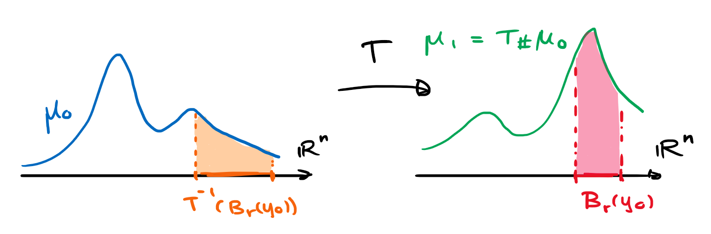

# Leyes de conservación

En la sección previa hablamos de cantidades conservadas, estas quieren decir funciones que permanecen constantes a lo largo de las trayectorias del sistema. Por **leyes de conservación** entendemos concepto distinto. En este caso la idea tiene que ver con el comportamiento colectivo de una EDO, es decir como el flujo que ella genera transporta densidades.

El flujo $\phi$ generado por el campo $v$ ayuda a entender la evolución puntual del sistema. Es decir, una posición inicial $x_0$ se traslada por la curva $t\mapsto \phi(x_0,t)$. Esto nos permite también describir la evolución de una colección finita de puntos. Cuando pasamos al continuo tenemos que considerar la evolución de una **distribución** $\mu:\mathbb R^n\times\mathbb R\to\mathbb R$. Nos referiremos a $\mu$ y sus integrales en dominios dados de $\mathbb R^n$ como la masa.

La mejor forma de entender la dinámica en este caso es apelando a la **ley de conservación de masa**. Fijemos una bola $B_r(x_0)$, la masa contenida en ella en un tiempo dado es
$$
m(t) = \int_{B_r(x_0)}\mu(x,t)dx.
$$
Dado que en nuestro modelo, $v$ mueve a la distribución $\mu$ conservando la masa tenemos que la variación de $m$ debe estar determinada por la cantidad neta que entra y sale por la esfera (Figura \@ref(fig:cons)). Esta cantidad está determinada por el flujo $f = \mu v$ (flux^[En inglés se distinguen dos nociones de *flujo*. *Flow* se traduce como el flujo $\phi$ dado por la familia de mapeos generados por el campo $v$. *Flux* también se traduce como flujo pero se refiere a la cantidad de masa que está atravesando una región en una dirección dada.])
$$
m'(t) = -\int_{\partial B_r(x_0)} \frac{x-x_0}{r}\cdot f(x,t) \, dx
$$
Es decir que
$$
\int_{B_r(x_0)}\partial_t\mu(x,t)dx + \int_{\partial B_r(x_0)} \frac{x-x_0}{r}\cdot f(x,t) \, dx = 0.
$$

{width=70%}

A partir de esta identidad podemos apelar al teorema de la divergencia o usar la expansión de Taylor para llegar al siguiente resultado cuando $r\to0^+$. Procedamos con la segunda estrategia, un poco más larga pero más elemental a su vez. Tenemos que
\begin{align*}
\int_{\partial B_r(x_0)} \frac{x-x_0}{r}\cdot f(x,t) \, dx &= \frac{1}{r}\int_{\partial B_r(x_0)} \sum_{i=1}^n (x-x_0)_i\left(f_i(x_0) +\sum_{j=1}^n \partial_j f_i(x_0)(x-x_0)_j + o(r)\right) dx,\\
&= \frac{1}{r}\sum_{i,j=1}^n \partial_jf_i(x_0) \int_{\partial B_r(x_0)} (x-x_0)_i(x-x_0)_j dx + o(r^{n}),\\
&= r^{n}\sum_{i,j=1}^n \partial_jf_i(x_0) \int_{\partial B_1} \theta_i\theta_jd\theta + o(r^{n})
\end{align*}
Hemos usado que la integral $\int_{\partial B_r(x_0)} (x-x_0)_idx = 0$ dada la simetría impar del integrando. Las integrales cuadráticas también tienen simetría impar cuando $i\neq j$ y por lo tanto vuelven a cancelarse. Para el caso $i=j$ en cambio tenemos que
$$
\int_{\partial B_1} \theta_1^2d\theta = \ldots = \int_{\partial B_1} \theta_n^2d\theta = \frac{1}{n}\int_{\partial B_1} (\theta_1^2 + \ldots+\theta_n^2)d\theta = \frac{|\partial B_1|}{n} = |B_1|.
$$
En conclusión
$$
\int_{\partial B_r(x_0)} \frac{x-x_0}{r}\cdot f(x,t) \, dx = |B_r|\operatorname{div} f(x_0) + o(r^{n}).
$$

Volviendo a la ley de conservación de masa obtenemos que dividiendo por $|B_r|$ y tomando el límite $r\to0^+$
$$
\partial_t\mu + \operatorname{div} f = \partial_t\mu + \operatorname{div}(\mu v) = 0.
$$

---

:::{.exercise}
Verifica que para $u:\mathbb R^n\to\mathbb R$ de clase $C^2$,
$$
\lim_{r\to0^+} \frac{1}{r^2|\partial B_r|}\int_{\partial B_r} (u(x)-u(0))dx = \frac{1}{2n}\Delta u(0).
$$
:::

Solución

## Teorema de transporte

Dicho de otra forma, la ley de conservación dicta que el flujo $\phi_t := \phi(\cdot,t)$ generado por $v$ empuja a la densidad inicial $\mu_0 := \mu(0) := \mu(\cdot,0)$ en la densidad $\mu_t := \mu(t) := \mu(\cdot,t)$.

Para ser precisos, definimos que un mapeo $T:\mathbb R^n\to\mathbb R^n$ **empuja**^[Push-foward] a $\mu_0$ en $\mu_1 =: T_\#\mu_0$ si preserva las medidas según la siguiente identidad (Figura \@ref(fig:push))
$$
\int_{T^{-1}(B_r(y_0))} \mu_0(x)dx = \int_{B_r(y_0)} \mu_1(y)dy \qquad\forall \, B_r(y_0)\subseteq\mathbb R^n.
$$
Equivalentemente, gracias a la fórmula de cambio de variables
$$
(\mu_1\circ T)\det DT = \mu_0.
$$

{width=70%}

\begin{center}
\colorbox[HTML]{FED6D6}{
\begin{minipage}[c]{450px}
**Margen de cálculo:** Fórmula de cambio de variables. Para un difeomorfismo $T:\W\subseteq\mathbb R^n\to T(\W)\subseteq \mathbb R^n$
$$
\int_{T(\W)}\nu(y)dy = \int_\W \nu(T(x))\det(DT(x))dx.
$$
En particular, si para todo $E\subseteq\W$ medible
$$
\nu(E) = \int_{E} \nu(y)dy = \int_{T^{-1}(E)} \mu(x)dx = T_\#\mu(E),
$$
entonces $(\nu\circ T)\det DT = \mu$.
\end{minipage}}
\end{center}

Nuestro objetivo en esta sección consiste así en demostrar que si $\mu$ satisface la ley de conservación $\mu_t$ y $\phi$ es el flujo generado por $v$, entonces
$$
\mu(\phi_t(x),t)\det(D\phi_t) = \mu(x,0).
$$

El escenario en una dimensión es una ilustrativa aplicación de la regla de la cadena en varias variables.

Sea $I=[a,b]$ un intervalo arbitrario. El flujo manda este intervalo a el intervalo $I_t = [a(t),b(t)]$ donde $a(t) = \phi(a,t)$ y $b(t) = \phi(b,t)$. Queremos verificar entonces que si $\mu$ satisface la ley de conservación, entonces
$$
\int_{a(t)}^{b(t)} \mu(x,t)dx = \int_{a}^{b} \mu(x,0)dx.
$$
Basta ver que el lado izquierdo es constante en $t$.

Cuando tomamos la derivada debemos tener cuidado en que la expresión debe involucrar tanto el teorema fundamental del cálculo como también la linealidad de la integral (es decir que podemos pasar la derivada dentro de la integral). Para ser precisos definimos
$$
\psi(\alpha,\beta,\gamma) := \int_{\alpha}^{\beta} \mu(x,\gamma)dx,
$$
por lo que la expresión que buscamos diferenciar es la composición $\psi(a(t),b(t),t)$. Por la regla de la cadena seguida del teorema fundamental del cálculo
\begin{align*}
    \frac{d}{dt}\int_{a(t)}^{b(t)} \mu(x,t)dx &= \partial_\alpha\psi \alpha'+\partial_\beta\psi \beta'+\partial_\gamma\psi \gamma',\\
    &= -\mu(x,a(t))v(a(t),t) + \mu(x,b(t))v(b(t),t) + \int_{a(t)}^{b(t)} \partial_t\mu(x,t)dx,\\
    &= -\mu(x,a(t))v(a(t),t) + \mu(x,b(t))v(b(t),t) - \int_{a(t)}^{b(t)} \partial_x(\mu(x,t)v(x,t))dx,\\
    &= 0.
\end{align*}
Esto demuestra así la propiedad geométrica anunciada.

---

:::{.exercise}
Verifica que para $f:\mathbb R\to\mathbb R$ continua,
$$
y(t) = \int_0^t f(s)\sin(t-s)ds
$$
es una solución particular de la ecuación $y'' + y = f$.
:::

Solución

---

En el caso de dimensión general procedemos a verificar que $(\mu_t\circ\phi_t)\det D\phi_t$ no depende de $t$. Derivamos así,
$$
\frac{d}{dt}[(\mu_t\circ\phi_t)\det D\phi_t] = (\partial_t\mu+v\cdot D\mu)\det D\phi_t + \mu \frac{d}{dt}\det D\phi_t
$$
Usando ahora la identidad para la derivada del determinante
$$
(\ln \det M(t))' = \operatorname{tr}(M(t)^{-1}M'(t)) 
$$
obtenemos que\footnote{$D\phi_t^{-1} D\partial_t\phi = D\phi_t^{-1} D\phi_t Dv = Dv$}
$$
\begin{aligned}
\frac{d}{dt}[(\mu_t\circ\phi_t)\det D\phi_t] &= (\partial_t\mu+v\cdot D\mu+\mu \operatorname{div} v)\det D\phi_t\\
&= (\partial_t\mu+\operatorname{div}(\mu v))\det D\phi_t\\
&= 0.
\end{aligned}
$$
Tenemos así que
$$
(\mu_t\circ\phi_t)\det D\phi_t=(\mu_0\circ\phi_0)\det D\phi_0=\mu_0,
$$
con lo cual concluimos $\mu_t = (\phi_t)_\#\mu_0$.

---

**Margen de cálculo**

La derivada logarítmica del determinante o el teorema de Liouville. El determinante es una función multilineal en las columnas, como tal satisface la regla del producto (misma demostración)
$$
\frac{d}{dt}\det (m_1(t),\ldots,m_n(t)) = \det (m_1'(t),\ldots,m_n(t)) +
 \ldots + \det (m_1(t),\ldots,m_n'(t))
$$

Si $M(t_0) = I$ entonces
$$
\left.\frac{d}{dt}\right|_{t=t_0}\det (m_1(t),\ldots,m_n(t)) = \operatorname{tr} M'(t_0).
$$
Para $M(t_0)=M_0$ invertible usamos que $M(t) = M_0 N(t)$ tal que
$$
\left.\frac{d}{dt}\right|_{t=t_0}\det (m_1(t),\ldots,m_n(t)) = \det(M_0) \operatorname{tr} N'(t_0) = \det(M_0) \operatorname{tr} (M_0^{-1}M'(t_0)).
$$

---

:::{.exercise}
Sea $\phi$ el flujo generado por $v$ y $E_t=\phi_t(E)$ donde $E\subseteq\mathbb R^n$ tiene frontera regular. Demuestra que para $f:\mathbb R^n\times\mathbb R\to\mathbb R$ de clase $C^1$
$$
\frac{d}{dt}\int_{E_t}f = \int_{E_t}\partial_t f + \int_{\partial E_t}f(v\cdot n_t),
$$
donde $n_t$ es el vector normal exterior de $E_t$
:::

Solución

---

:::{.exercise}
Grafica $\mu(\cdot,t)$ para $t\in \{0,0.2,0.4,0.6,0.8,1\}$ si
$$
\partial_t\mu + \partial_x(x^2\mu) = 0, \qquad \mu(x,0) = \exp(-(x-1)^2)+5\exp(-10(x+2)^2).
$$
:::

Solución

---

Un modelo razonable para el tráfico en una dimensión consiste en considerar que el flujo está dado por $f(\mu) = \mu v(\mu)$ y que la velocidad es una función con la siguiente características: Es no-negativa y decreciente. Es decir que los agentes se mueven de izquierda a derecha y que a mayor densidad, menor la velocidad y viceversa. Si $\mu$ toma valores en el intervalo $[0,\mu_{max}]$ tenemos por ejemplo el modelo logístico
$$
f(\mu) = v_m\mu(1-\mu/\mu_{max})
$$
donde $v_m>0$ es la velocidad máxima. La ley de conservación correspondiente se conoce como la **ecuación de tráfico**
$$
\partial_t \mu + v_m\partial_x(\mu(1-\mu/\mu_{max})) = 0 \text{ en } \mathbb R\times(0,\infty)
$$

Para los siguiente ejercicios consideramos el problema de tráfico con configuración inicial
$$
\mu(x,0) = \begin{cases}
\mu_{max} \text{ si } x<0\\
0 \text{ si } x\geq0
\end{cases}
$$
Esto modela el escenario donde los carros pueden estar detenidos inicialmente por un semáforo que luego cambia a tener luz verde.

---

:::{.exercise}
Calcula las soluciones de las ecuaciones características. Observa que existe una región de $\mathbb R\times(0,\infty)$ que no pareciera estar cubierta por las trayectorias. Calcula la cantidad de tiempo que debe esperar un agente inicialmente ubicado en $x_0<0$ para comenzar a moverse (es decir tener velocidad positiva) luego de que el semáforo ha cambiado a verde. 
:::

Solución

---

:::{.exercise}
Aproxima la condición inicial por $\mu_\varepsilon(x,0) = \mu_{max} (1/2-\arctan(x/\varepsilon)/\pi)$ (para $\varepsilon>0$) y observa que este caso el método de las características si permite definir una solución. ¿Qué sucede en el límite cuando $\varepsilon\to0^+$? 
:::

Solución

## Reacción y difusión

Los modelos con **reacciones** son extensiones a la ecuación de conservación, en este caso se considera una función $f$ que según el problema de interés se puede considerar como una fuente o sumidero para la densidad $\mu$
$$\partial_t \mu + \operatorname{div}(\mu v)=f$$

En su forma integral
$$
\frac{d}{dt} \int_E \mu=-\int_{\partial E}\mu v \cdot n+\int_E f.
$$

Nótese que esta forma integral no es más que un balance de masa en el conjunto de prueba $E$. El término $\int_E f$ indica la cantidad de materia que se produce o consume en $E$.

Las leyes de **Darcy**, **Fick** o **Fourier** proponen la misma hipótesis aunque en distintos contextos (fluídos, difusiones y calor respectivamente). Cada una de ellas prescribe que el flujo es proporcional al gradiente de la concentración, es decir
$$
\mu v=-kD \mu \hspace{1cm} (k > 0).
$$
Como tal describe el transporte de regiones de mayor a menos concentraciones de $\mu$. Junto con la ley de conservación esta describe la **ecuación de difusión o calor**
$$\partial_t \mu =k \Delta \mu$$

---

:::{.example}
Un modelo de quimiotaxis describe la evolución de una densidad de bacterias $\rho$ y una densidad química $\varphi$ que atrae dicha población. Esto puede ser representado por las siguientes ecuaciones
$$
\begin{aligned}
    &\partial_t \rho+\operatorname{div}(\alpha \rho D \varphi)=0,\\
    &\partial_t \varphi=\beta \rho-k \varphi.
\end{aligned}
$$

La población de bacterias busca moverse en la dirección donde $\varphi$ crece, es decir tiene un flujo proporcional a $D\varphi$, lo cual está reflejado en la primera ecuación. A su vez las bacterias son productoras de la misma sustancia $\varphi$ que además tiene un decaimiento exponencial, esto es lo que refleja la segunda ecuación del sistema.
:::

---

:::{.example}
Recordemos el modelo básico epidemiológico para dos tipos de poblaciones, suseptibles ($S$) e infectados ($I$)
$$
\begin{aligned}
S'&=-\beta IS\\
I'&= \beta IS-\gamma I.
\end{aligned}
$$

Una extensión a este modelo es considerar el efecto de las migraciones con flujos $v_S$ y $v_I$ respectivamente, es decir
$$
\begin{aligned}
\begin{cases}
\partial_t S +\operatorname{div}(Sv_s) = -\beta IS,\\
\partial_t I +\operatorname{div}(Iv_I) = \beta IS-\gamma I.
\end{cases}
\end{aligned}
$$
:::

## Mecánica de medios continuos

Consideremos las ecuaciones de Newton para un sistema de $N$ partículas en $\mathbb R^d$ cuyas masas y posiciones denotamos por $m=(m_1,\ldots,m_N) \in \mathbb R^N$ y $x=(x_1,\ldots,x_N) \in \mathbb R^{dN}$ respectivamente
$$
mx''=f(x).
$$
Equivalentemente presentamos al sistema como uno de primer orden cuando tomamos las velocidades $v\in \mathbb R^{dN}$ tales que
$$
\begin{cases}
x'=v,\\
mv'=f(x).
\end{cases}
$$
De forma alternativa, si tomamos $y:=(x,v)$, $F(y) := (v,a(x))$ y $a(x):= m^{-1}f(x)$ (aceleración), entonces $y'=F(y)$.

Cuando $N$ es muy grande es prácticamente imposible describir las trayectorias individuales del sistema. Sin embargo es posible comprender el comportamiento colectivo modelado por medio de una densidad $\rho=\rho(y,t) = \rho(x,v,t)$ en el espacio de configuraciones para las posiciones y velocidades. Tomaremos como hipótesis que $\rho$ además de ser una función suficientemente suave decae a cero suficientemente rápido cuando $|(x,v)|\to \infty$.

Consideraremos a su vez la distribución de partículas en espacio dada por la marginal de $\rho$ sobre las posiciones en $x\in\mathbb R^d$,
$$
\mu(x) = \int_{\mathbb R^d}\rho(x,v)dv.
$$
Sobre el conjunto donde $\mu>0$ consideramos la velocidad promedio
$$
u := \frac{1}{\mu} \int_{\mathbb R^d} v\rho dv.
$$
y su tensor de covarianza
$$
T := \frac{1}{\mu} \int_{\mathbb R^d} (v-u)\otimes(v-u) \rho dv = \frac{1}{\mu} \int_{\mathbb R^d} (v\otimes v) \rho dv - u\otimes u.
$$
Observemos que $\mu T$ tiene unidades de energía, este es el **tensor de tensión**.

### Ecuación de Liouville y conservación de masa

Asumamos que para una partícula en $x\in\mathbb R^d$ de masa unitaria, la aceleración queda determinada por $a=a(x,\mu)$, es decir una función que depende de la distribución de las demás partículas en espacio. 

Consideremos por un momento que $\mu = \int \rho dv$ ya está determinada, y por lo tanto la aceleración $a=a(x,\mu(\cdot,t))$, es una función conocida de $(x,t)$. Dado el campo vectorial $F(x,v,t) = (v,a)$, tenemos la siguiente ley de conservación para la distribución $\rho$
$$
\partial_t\rho + \operatorname{div}(\rho F) = 0
$$
Esta se simplifica en la **ecuación de Liouville** usando que $\operatorname{div} F = \operatorname{div}_x v + \operatorname{div}_v a = 0$,
$$
\partial_t\rho + v\cdot D_x\rho + a\cdot D_v\rho=0.
$$

Cuando integramos la ecuación de Liouville con respecto a $v$ obtenemos la ley de **conservación de masa**
$$
0=\partial_t \mu +  D_x\int_{\mathbb R^d}\rho vdv +a\cdot \int_{\mathbb R^d} D_v \rho dv = \partial_t \mu + \operatorname{div}(\mu u).
$$
Recordemos que $u$ es el promedio de las velocidades. El término de aceleración se cancela gracias al teorema de la divergencia
$$
\int_{\mathbb R^d} \partial_{v_j} \rho dv = \int_{\mathbb R^d} \operatorname{div}_v(\rho e_j) dv = 0.
$$

Cuando $\mu$ es constante decimos que el material en cuestión es **incompresible** y la ecuación de conservación de masa se reduce a
$$
\operatorname{div} u = 0.
$$

Retomando que la aceleración $a=a(x,\mu)$ depende de $\mu$ debemos considerar que la ecuación de Liouville viene acoplada a la ley de conservación de masa
$$
\begin{cases}
\partial_t\rho + v\cdot D_x\rho + a(\mu)\cdot D_v\rho=0,\\
\partial_t \mu + \operatorname{div}(\mu u) = 0,\\
u=\frac{1}{\mu}\int \rho vdv.
\end{cases}
$$

---

:::{.example}
Asumamos ahora que las partículas interactúan a pares por medio de una misma fuerza conservativa con potencial $U:\mathbb R^d\to \mathbb R$ de clase $C^1$. Es decir que la partícula en $y$ de masa unitaria ejerce una fuerza igual a $-DU(x-y)$ sobre una partícula en $x$, también de masa unitaria.\\

Dada la distribución $\mu$ de partículas, tenemos que por el principio de superposición la aceleración neta sobre la posición $x$ está dada según 
$$
a(x) = -\int DU(x-y)\mu(y)dy = -(DU\ast \mu)(x).
$$
El problema de Liouville en este caso se conoce como la **ecuación de Vlasov**
$$
\partial_t \rho + v\cdot D_x\rho = (DU\ast \mu)\cdot D_v\rho.
$$
:::

---

:::{.example}
Para $d=3$ y $U(x) = |x|^{-1}$ estamos modelando las fuerzas gravitatorias y $U$ se conoce como el **potencial de Newton**. En este caso la convolución $U_\mu := U\ast \mu$ es la solución de la ecuación de Poisson $\Delta u = -\mu$ en $\mathbb R^3$ con decaimiento en infinito. Tenemos así las **ecuaciones de Vlasov-Poisson** dadas por
$$
\begin{cases}
\partial_t \rho + v\cdot D_x\rho = D_x u \cdot D_v\rho,\\
\Delta u = -\int \rho dv.
\end{cases}
$$
:::

---

Bajo la perspectiva Hamiltoniana de la mecánica, las ecuaciones de Newton toman la siguiente forma
$$
x' = D_pH, \qquad p'= -D_xH, \qquad H(x,p) = \frac{1}{2m}|p|^2 + U(x).
$$
Es decir que el par $(x,p)$ evoluciona de acuerdo al gradiente de la energía $H$, pero modulado de la siguiente forma
$$
\frac{d}{dt}\begin{pmatrix}
x\\p
\end{pmatrix} = \begin{pmatrix}
0&I\\
-I&0
\end{pmatrix}DH.
$$
El lado derecho se conoce como el **gradiente simpléctico** de $H$.

Las ecuaciones de Liouville para $\rho=\rho(x,p)$^[Este caso es ligeramente distinto puesto que $\rho$ es la distribución de posiciones y momento, no velocidades.] pueden escribirse así en términos de $H$ por medio del **corchete de Poisson** como
$$
\partial_t \rho + \{H,\rho\} = 0, \qquad \{f,g\} := \begin{pmatrix}
0&I\\
-I&0
\end{pmatrix}Df \cdot Dg = D_xf \cdot D_p g - D_p f D_xg.
$$

---

:::{.example}
Cuando $\{H,\rho\}=0$ entonces $f$ es una **cantidad conservada del sistema mecánico** dado que el flujo simpléctico generado por $H$ deja a $\rho$ invariante. El **teorema de Noether** establece que esto ocurre si y solo si los flujos generados por los gradientes simplécticos de $H$ y $\rho$ conmutan. Al flujo simpléctico generado por $\rho$ se le conoce así como una **simetría del sistema mecánico**.
:::

---

:::{.exercise}
Verifica las siguiente propiedades del corchete de Poisson las cuales dan una estructura de álgebra de Lie al espacio de funciones en $\mathbb R^{2N}$:

- **Anti-simetría:** $\{f,g\}=-\{g,f\}$,

- **Jacobi (ley del producto):** $\{f,\{g,h\}\} = \{\{f,g\},h\}+\{g,\{f,h\}\}$
:::

Solución

---

:::{.exercise}
Verifica las siguientes funciones son cantidades conservadas con respecto de $H$ para $\phi$ y $\psi$ funciones reales de clase $C^1$ arbitrarias:

- $\rho=\phi(H)$,

- $\rho = \psi(|DH|^2)$.

Casos particulares de los ejercicios anteriores son el ensamble canónico y micro-canónico de la mecánica estadística.
:::

Solución

### Conservación del momento

Buscamos ahora obtener una ecuación que describa la dinámica de la velocidad $u$. Al igual que antes seguimos asumiendo que la aceleración es independiente de $v$.

Cuando multiplicamos la ecuación de Liouville por $v$ e integramos con respecto de $v$ obtenemos la **ley de conservación del momento**
$$
\begin{aligned}
0 &= \partial_t(\mu u) + \int_{\mathbb R^d} (v\cdot D_x\rho+a\cdot D_v\rho)vdv,\\
&= \partial_t(\mu u) + \operatorname{div} \int_{\mathbb R^d} (v\otimes v) \rho dv + \int_{\mathbb R^d}(v\otimes D_v\rho)adv,\\
&= \partial_t(\mu u) + \operatorname{div}(\mu(u\otimes u) + T) - \mu a.\\
\end{aligned}
$$
En la última igualdad hemos usado integración por partes para llegar a que $\int (v\otimes D_v\rho)dv=-\mu I$. Fijémonos que sucede con la $j$-ésima fila de dicha matriz
$$
\int_{\mathbb R^d}v_jD_v\rho dv = -\int_{\mathbb R^d} e_j\rho dv = -e_j\mu.
$$

Usando la ley de conservación de masa en el término $\partial_t(\mu u)$ obtenemos que
$$
\begin{aligned}
\partial_t(\mu u) &= \mu\partial_t u - \operatorname{div}(\mu u)u,\\
&= \mu(\partial_tu+ u\cdot Du) - \operatorname{div}(\mu(u\otimes u))
\end{aligned}
$$
Por lo tanto, la ecuación de Euler se escribe también como
$$
\mu(\partial_t u+u\cdot Du) = -\operatorname{div} T + f.
$$

En distintas aplicaciones se separa a $T$ como un múltiplo de la identidad y una matriz libre de traza. Definimos de esta forma la **presión** y el **tensor de estrés** (unidades de energía) respectivamente según
$$
p := \frac{\mu}{d} \operatorname{tr} T, \qquad \sigma := \mu T- p I.
$$
por lo que llegamos a la siguiente presentación de las ecuaciones de Euler
$$
\mu(\partial_t u+u\cdot Du) = -Dp - \operatorname{div}\sigma + f.
$$
Notemos que el lado izquierdo representa el transporte de la velocidad (multiplicado por la densidad $\mu$), mientras que en el lado derecho aparecen tres tipos de fuerzas, siendo las dos primeras internas al medio.

---

:::{.example}
Las **ecuaciones de Euler** resultan cuando complementamos las ecuaciones de conservación de momento con la ley constitutiva $\sigma=0$, sin forzamento externo. Resultando así el sistema
$$
\partial_t u+u\cdot Du = -Dp.
$$
:::

---

:::{.example}
Las **ecuaciones de Navier-Stokes** resultan cuando complementamos las ecuaciones de conservación de momento con la ley constitutiva $\sigma=\nu Du$ donde $\nu$ es un coeficiente de viscosidad, sin forzamento externo. Resulta así el sistema
$$
\partial_t u+u\cdot Du = -Dp + \nu\Delta u.
$$
:::

Tanto en el sistema de ecuaciones de Euler como de Navier Stokes contamos con $d$ ecuaciones y $d+1$ incógnitas ($u$ y $p$). Estas son usualmente complementadas de dos formas distintas:

- Para flujos incompresibles agregamos la ecuación $\operatorname{div} u=0$.

- Para flujos **barotrópicos** compresibles tenemos la ley de conservación de masa $\partial_t \mu+\operatorname{div}(\mu u) = 0$ y una ley de estado para la presión $p=g(\mu)$ de carácter termodinámico. La función $g$ es una función conocida que además es positiva, creciente y convexa.

---

:::{.exercise}
**Ley de Bernoulli:** Demuestra que si $u$ la ecuación de flujo estacionario
$$
u\cdot Du = -Dp
$$
entonces la energía total
$$
E = \frac{1}{2}|u|^2 + p
$$
es constante a lo largo de las curvas integrales de $u$, también conocidas como las líneas de corriente.
:::

Solución

---

:::{.exercise}
**Teorema de circulación de Kelvin:** Sea $u$ una solución de
$$
\partial_t u + u \cdot Du = -Dp,
$$
la familia de mapeos $\phi_t$ se corresponden con el flujo generado por $u$ y $\gamma_t=\phi_t(\gamma)$ donde $\gamma:[0,1]\to \mathbb R^n$ es una curva cerrada de clase $C^1$. Demuestra que la circulación de $u$ alrededor de $\gamma_t$ es constante, es decir
$$
\int_{\gamma_t} u(t) = \int_\gamma u(0).
$$
:::

Solución

### Teoría cinética

En el modelo propuesto por las **ecuaciones de Boltzmann** las partículas interactúan a pares por medio de colisiones y sin forzamento externo adicional
$$
\partial_t \rho + v\cdot D_x\rho = Q(\rho).
$$
El lado izquierdo representa el transporte inercial de la densidad de partículas $\rho=\rho(x,v,t)$. El lado derecho es un término de reacción y representa la producción neta de partículas que resultan a partir de las colisiones: Sea $k(v',v)\geq 0$ la frecuencia con la que ocurre una transformación de la velocidad $v'$ a la velocidad $v$ por una colisión. Es decir que
$$
Q(\rho)(v) = \int_{\mathbb R^d} k(v',v)\rho(v')dv' - \sigma(v)\rho(v), \qquad \sigma(v) = \int_{\mathbb R^d} k(v,v')dv'.
$$
Si asumimos que $k$ y $\sigma$ son independientes de $\rho$ conseguimos la **ecuación de Boltzmann lineal**.

---

:::{.example}
La hipótesis de **monocinética**, quiere decir que las velocidades tienen norma constante (digamos $c$). Bajo la condición de **dispersión isotrópica** tenemos que $k$ es constante y por lo tanto $\sigma=k|\partial B_c|$. Llegamos así a la ecuación
$$
\partial_t \rho + v\cdot D_x\rho = k\int_{\partial B_c} (\rho(v')-\rho(v))dv'.
$$
:::

---

Para la ecuación de Boltzmann no lineal modelamos las transiciones para pares de velocidades, es decir dos partículas con velocidades $(v',v_*')$ colisionan y como resultado de la interacción salen con velocidades $v$ y $v_*$.

Dicha interacción está naturalmente restringida por las leyes de conservación de momento y energía, es decir que
$$
v'+v_*'=v+v_*, \qquad |v'|^2+|v_*'|^2 = |v|^2+|v_*|^2.
$$
Equivalentemente
$$
r:= |v'- w| = |v-w|, \qquad 2w := v+v_* = v'+v_*'
$$
por lo que conseguimos parametrizar a las velocidades previas a la colisión $v'$ y $v_*'$, usando adicionalmente un vector unitario $\theta$ el cual caracteriza la **dispersión** de la colisión
$$
v' = w+r\theta, \qquad v_*'=w+r\theta.
$$

Las velocidades $v'$ y $v_*'$ aparecen con frecuencia proporcional a $\rho(v')\rho(v_*')$, es decir que modelamos la tasa en la que ocurren colisiones de la forma $(v',v_*') \mapsto (v,v_*)$ según
$$
\rho(w+r\theta)\rho(w-r\theta)B(r,\theta)
$$
Para algún núcleo $B\geq0$. En conclusión
$$
Q(\rho)(v) = \int_{\mathbb R^d}\int_{\partial B_1} (\rho(v')\rho(v_*')-\rho(v)\rho(v_*))B(w,\theta)d\theta dv_*.
$$
modela la tasa de producción de partículas con velocidad $v$ dada la distribución de velocidades dada por $\rho$.

---

:::{.example}
Colisiones elásticas...
:::

### La jerarquía de Bogoliubov-Born-Green-Kirkwood-Yvon

Consideremos un gas con $N\gg 1$ partículas idénticas. La densidad $\rho_1=\rho_1(x,v):\mathbb R^d\times\mathbb R^d\to \mathbb R$ es la fracción de las $N$ partículas que esperamos encontrar en la configuración $(x,v)$. Como tal asumimos que $\rho_1$ es una distribución de probabilidad sobre $\mathbb R^d\times\mathbb R^d$ ($\rho_1\geq0$ y $\int\rho_1dvdx=1$).

A partir de $j\geq 2$ tenemos $\binom{N}{j}$ formas distintas de escoger $j$ partículas de las $N$ posibles. Modelamos por medio de las densidades $\rho_j=\rho_j(x_1,\ldots,x_j,v_1,\ldots,v_j)$ la fracción de estas $\binom{N}{j}$ combinaciones que esperamos encontrar en la configuración $(x_1,\ldots,x_j,v_1,\ldots,v_j)$. Observemos que $\rho_j$ además de ser una distribución de probabilidad sobre $\mathbb R^{dj}\times\mathbb R^{dj}$ también debe satisfacer la siguiente relación de simetría: Para cualquier permutación $\sigma:\{1,\ldots,j\}\longleftrightarrow \{1,\ldots,j\}$
$$
\rho_j(x_{\sigma(1)},\ldots,x_{\sigma(j)},v_{\sigma(1)},\ldots,v_{\sigma(j)})=\rho_j(x_1,\ldots,x_j,v_1,\ldots,v_j).
$$

Una última relación de consistencia que debemos asumir en la colección de distribuciones es que para $j<k\leq N$ se tiene que
$$
\rho_j(x_1,\ldots,x_j,v_1,\ldots,v_j) = \int \rho_k(x_1,\ldots,x_k,v_1,\ldots,v_k)dv_{j+1}\ldots dv_kdx_{j+1}\ldots dx_k.
$$
En particular, cada una de las distribuciones se pueden definir a partir de marginales de $\rho_N$. Esta última distribución es la jerarquía más alta y describe la dinámica de todas las partículas.

Consideraremos que la dinámica de las $N$ partículas están dadas por dos tipos de fuerzas: Las externas que dependen solamente de la posición y las de interacciones que dependen de las posiciones relativas de las partículas
$$
mx_j'' = f_j(x) = f_{ext}(x_j) + \sum_{k\neq j}f_{int}(x_k-x_j)
$$
Tengamos en cuenta que $\rho_N$ satisface la ecuación de Liouville
$$
m\partial_t \rho_N + mv\cdot D_x\rho_N + f\cdot D_v\rho_N = 0.
$$
Pasaremos ahora a deducir las ecuaciones para $\rho_j$ tomando marginales de la ecuación anterior. Para esto usamos que
$$
\iint mv_k\cdot D_{x_k}\rho_N + f_k\cdot D_{v_k}\rho_N dv_kdx_k = \iint \operatorname{div}_{x_k,v_k} ((mv_k,f_k)\rho_N)dv_kdx_k = 0.
$$
Por lo tanto\footnote{Acá $v$ y $f$ son las proyecciones en $\mathbb R^{dj}$.}
$$
\begin{aligned}
    m\partial_t \rho_j + mv\cdot D_x\rho_j + f\cdot D_v\rho_j &= -\sum_{k=1}^j\sum_{l=j+1}^N \int  f_{int}(x_l-x_k) \cdot D_{v_k} \rho_Ndv_{j+1}\ldots dv_kdx_{j+1}\ldots dx_k,\\
    &= -(N-j) \int \sum_{k=1}^j f_{int}(y-x_k) D_{v_k} \cdot  \rho_{j+1}(x,y,v,w) dydw,
\end{aligned}
$$
donde $(x,y) = (x_1,\ldots,x_j,y) \in \mathbb R^{d(j+1)}$ y de forma similar para $(v,w)= (v_1,\ldots,v_j,w) \in \mathbb R^{d(j+1)}$.

En el caso particular $j=1$ se tiene la ecuación de transporte para una partícula bajo el forzamento externo, con un término de reacción que modela las interacciones entre pares de partículas modeladas por $\rho_2$
$$
m\partial_t \rho_1 + mv\cdot D_x\rho_1 + f_{ext} \cdot D_v\rho_1 = -(N-1)\int f_{int}(y-x) \cdot D_v \rho_2(x,y,v,w) dydw,
$$

## Ecuaciones de Maxwell

## Distancia de Wasserstein

Hemos visto que las leyes de conservación nos permiten extender dinámicas puntuales a modelos continuos. La noción de velocidad dada por $v=x'$ encuentra así su generalización en la ecuación $\partial_t\mu + \operatorname{div}(\mu v) = 0$. Para ser precisos, dado $\mu:\mathbb R^n\times (a,b)\to \mathbb R$ decimos que la familia de campos $v:\mathbb R^n\times(a,b)\to\mathbb R^n$ representa su velocidad si
$$
\partial_t \mu + \operatorname{div}(\mu v) = 0.
$$
Observemos que $v$ no está necesariamente definida de forma única, por ejemplo $v$ puede ser arbitraria fuera del soporte de $\mu$. En general, si $w$ satisface $\operatorname{div}(\mu w)=0$, entonces $(v+w)$ también es una velocidad para $\mu$. Otro ejemplo en tres dimensiones sucede si $w=D\times z$ donde el campo $z$ tiene soporte en una región de espacio tiempo donde $v$ es constante (en general podemos tomar el dual de la derivada exterior de una forma diferencial de co-dimensión dos).

Esto es consistente con la noción puntual que hemos aprendido en cálculo y EDOs si identificamos los puntos con distribuciones delta. Es decir que si $\mu(t) = \delta_{x(t)}$, entonces su velocidad está dada por cualquier familia de campos $v(t)$ tales que $v(x(t),t) = x'(t)$.

Dado el campo $v$, el flujo $\phi$ que este genera, y una densidad inicial $\mu_0$ obtenemos la curva de densidades $\mu_t = (\phi_t)_\#\mu_0$ para la cual $v$ es su velocidad.

---

:::{.example}
Si $T:\mathbb R^n\to\mathbb R^n$ es un mapeo y $v(x)=T(x)-x$ entonces $\phi_t(x) = (1-t)x+tT(x)$ y $\mu_t(x) = (\phi_t)_\#\mu_0$ puede verse como una interpolación horizontal entre $\mu_0$ y $\mu_1 = T_\#\mu_0$.
:::

---

:::{.exercise}
Calcula una velocidad de las siguientes curvas de Gaussianas en $\mathbb R^n$ en función de $m:\mathbb R\to\mathbb R^n$ y $\sigma:\mathbb R\to(0,\infty)$:

1. $\mu(x,t) := \exp(-|x-m(t)|^2)$.

1. $\mu(x,t) := \sigma(t)^{-n}\exp(-|x|^2/\sigma(t)^2)$.

1. $\mu(x,t) := \sigma(t)^{-n}\exp(-(|x-m(t)|^2/\sigma(t)^2)$.
:::

Solución

---

Así como tenemos una noción de velocidad, podemos ahora definir la energía cinética para una curva de distribuciones. Es decir que para $\mu:\mathbb R^n\times [0,1]\to \mathbb R$
$$
K[\mu] = \frac{1}{2}\int_0^1 \int_{\mathbb R^n} \mu|v|^2 dx dt
$$

---

:::{.exercise}
Calcula la energía cinética para cada una de las Gaussianas en el ejercicio anterior, en el intervalo $[0,1]$.
:::

Solución

---

A partir de la energía cinética podemos definir las curvas geodésicas a partir de un problema de minimización. Dadas dos distribuciones $\mu_0$ y $\mu_1$ tales que $\int_{\mathbb R^n}\mu_0dx=\int_{\mathbb R^n}\mu_1dx<\infty$, la idea es dar con una curva que minimice la energía cinética con las restricciones $\mu(0)=\mu_0$ y $\mu(1)=\mu_1$. La condición en las integrales es necesaria puesto que la ley de conservación preserva la masa.

A partir de esta construcción definimos la **métrica de Wasserstein**
$$
\mathcal W^2(\mu_0,\mu_1) := \inf\left\{ \int_0^1 \int_{\mathbb R^n} \mu|v|^2dxdt \ | \ \mu(0)=\mu_0, \mu(1)=\mu_1, \partial_t\mu+\operatorname{div}(\mu v) = 0\right\}. 
$$

---

:::{.exercise}
Sea $\mu:\mathbb R^n\times[0,1]\to\mathbb R$ una curva de distribuciones, $\phi:\mathbb R^n\times[0,1]\to\mathbb R^n$ un flujo generado por la velocidad $v$ para $\mu$, y sea $\bar\phi_t(x) := (1-t)x+t\phi_1(x)$. Demuestra que para $\bar\mu := (\bar\phi_t)_\#\mu_0$, cuya velocidad es $\bar v(x) := \phi_1(x)-x$ se tiene que
$$
\int_0^1\int_{\mathbb R^n} \mu|v|^2dxdt \geq \int_0^1\int_{\mathbb R^n} \bar\mu|\bar v|^2dxdt = \int_{\mathbb R^n} |\phi_1(x)-x|^2dx
$$
:::

Solución

---

El ejercicio anterior es el análogo a decir que los segmentos rectos recorridos de forma uniforme disminuyen la energía cinética (Figura \@ref(fig:seg).

{width=70%}

El problema que consiste en minimizar el costo cuadrático $\int_{\mathbb R^n} |T(x)-x|^2dx$, sobre todas los mapeos $T$ que mandan a $\mu_0$ en $\mu_1$ se conoce como el problema de **transporte óptimo cuadrático**.

Es conocido que que bajo ciertas hipótesis $T=Du$ para una función convexa $u$ que satisface la ecuación de Monge-Ampère
$$
\det D^2u = \frac{\mu_0}{\mu_1\circ T}
$$

---

:::{.exercise}
Calcula $\mathcal W^2(\mu_0,\mu_1)$ para las siguientes distribuciones en $\mathbb R^2$
$$
\mu_0=\delta_{(0,0)}+\delta_{(0,1)}, \qquad \mu_1=\delta_{(1,0)}+\delta_{(1,1)}.
$$
¿Puedes generalizar este resultado para un número arbitrario de puntos?
:::

Solución

---

:::{.exercise}
Calcula $\mathcal W^2(\mu_0,\mu_1)$ para las siguientes distribuciones en $\mathbb R$
$$
\mu_0=\chi_{(0,2)}, \qquad \mu_1=\chi_{(1,3)}.
$$
¿Puedes generalizar este resultado para distribuciones arbitrarias en $\mathbb R$?
:::

Solución

---

:::{.exercise}
Calcula $\mathcal W^2(\mu_0,\mu_1)$ para las siguientes distribuciones en $\mathbb R^n$

1. $\mu_0(x) = \exp(-|x-m_0|^2)$, $\mu_1(x) = \exp(-|x-m_1|^2)$.

1. $\mu_0(x) = \sigma_0^{-n}\exp(-|x|^2/\sigma_0^2)$, $\mu_1(x) = \sigma_1^{-n}\exp(-|x|^2/\sigma_1^2)$.

1. $\mu_0(x) = \sigma_0^{-n}\exp(-|x-m_0|^2/\sigma_0^2)$, $\mu_1(x) = \sigma_1^{-n}\exp(-|x-m_1|^2/\sigma_1^2)$.
:::

Solución

