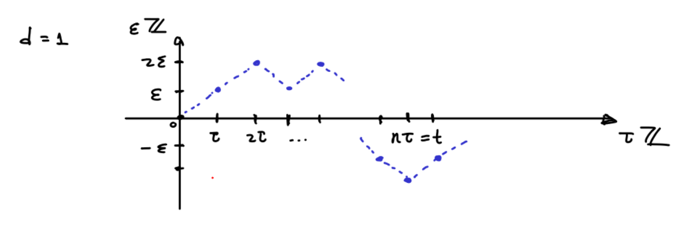

# Modelos estocásticos

Las ecuaciones diferenciales estocásticas son una extensión de las ecuaciones diferenciales ordinarias. Desde el punto de vista de la modelación de fenómenos naturales estas son inevitables dado los distintos grados de incertidumbre en los modelos y mediciones.

Sin ir a profundidad en el análisis de estas ecuaciones quisiéramos dar una breve muestra de la interacción de estas con las ecuaciones de transporte y difusión. En ejemplo fundamental a tener el mente es el **movimiento Browniano en $\mathbb R^n$**, el cual podemos describir como la familia aleatoria de curvas continuas que se pueden obtener como un cierto límite de caminatas aleatorias.

## El movimiento Browniano

Buscamos entender el comportamiento asintótico de una caminata aleatoria en la retícula $\varepsilon \mathbb Z^d$ la cual avanza en instantes de duración $\tau>0$. Esperamos así construir el movimiento Browniano bajo ciertas condiciones para $\varepsilon$ y $\tau$ cuando estos parámetros tienden a cero.

Dada una sucesión de variables aleatorias $\{X_n\}$ independientes  y uniformemente distribuidas en las $2d$ direcciones canónicas $\{\pm e_j\}$ definimos la caminata aleatoria
$$
t \in \tau\mathbb Z \mapsto S_t^{\varepsilon ,\tau} := \varepsilon \sum_{j=1}^{t/\tau} X_j \in \varepsilon  \mathbb Z^d.
$$
Cuando $\varepsilon =\tau=1$ denotamos $S_n = S_n^{1,1}$.

{width=70%}

Tengamos en cuenta que $\mathbb E(S_n) = 0$ y $\mathbb E(S_n^2) = n\mathbb E(X_1^2) = n$. Gracias al [**teorema del límite central**](https://en.wikipedia.org/wiki/Central_limit_theorem) tenemos que cuando $n\to\infty$
$$
\mathbb P(S_n/\sqrt{n} \in \Omega) \to \frac{1}{(2\pi)^{d/2}}\int_\Omega e^{-|x|^2/2}dx
$$
Equivalentemente, tenemos que para $f:\mathbb R^d\to \mathbb R$
$$
\mathbb E(f(S_n/\sqrt{n})) \to \frac{1}{(2\pi)^{d/2}}\int f(x)e^{-|x|^2/2}dx.
$$

Como consecuencia obtenemos que para cualquier $t>0$, si tomamos $\tau = t/n$ y $\varepsilon =\sqrt{\tau}$, entonces gracias a un cambio de variables
$$
\begin{aligned}
\mathbb P(S_t^{\varepsilon ,\tau} \in \Omega) &= \mathbb P(n^{-1/2}S_{n} \in t^{-1/2}\Omega)\\
&\to \frac{1}{(2\pi)^{d/2}}\int_{t^{-1/2}\Omega} e^{-|x|^2/2}dx\\ &\overset{y = t^{1/2}x}{=} \frac{1}{(2\pi t)^{d/2}}\int_{\Omega} e^{-|y|^2/(2t)}dy.
\end{aligned}
$$

### Deducción via la aproximación de Stirling

Presentaremos una alternativa analítica al cálculo de la distribución anterior en $d=1$.

En este caso tenemos que una caminata que comienza en $S_0=0$ luego de $2n$ pasos debe pertenecer al conjunto de números pares entre $-2n$ y $2n$. Para cualquier $i \in [-n,n]$, existen $\binom{2n}{n+i}$ caminos de $0$ a $2i$. Estos los podemos contar teniendo en cuenta que de las $2n$ direcciones que deben ser fijadas, exactamente $n+i$ deben ser en la dirección de $0$ a $i$. En conclusión
$$
\mathbb P(S_{2n} = 2i) = 2^{-2n}\binom{2n}{n+i}.
$$

---

:::{.exercise}
Verifica y da una interpretación combinatoria/probabilista de la identidad\footnote{$\binom{a}{b}=0$ si $b<0$ o bien $b>a$.}
$$
\sum_{j\in\mathbb Z} \binom{2m}{m+j}\binom{2n}{n+i-j} = \binom{2(m+n)}{m+n+i}.
$$
:::

**Solucion**

Los caminos de $0$ a $2i$ de tamaño $2(m+n)$ se pueden contar como los caminos de $0$ a $2i$ de tamaño $2m$ deguido de los caminos de $2i$ a $2(i+j)$ de tamaño $2n$, siendo estos últimos equivalentes a los caminos de $0$ a $2j$ de tamaño $2n$.

---

La idea a partir de ahora consiste en obtener una aproximación asintótica de $n!$. Comenzamos transformado al producto en suma aplicando el logaritmo. Esto nos permite aproximar usando integrales de la siguiente forma

{width=70%}

Por la monotonía y concavidad del logaritmo podemos comparar la integral con la suma de Riemann que resulta de la ley del trapecio
$$
n\ln n - n+1 = \int_1^n\ln xdx \geq \sum_{i=1}^{n-1}\frac{\ln(i+1)+\ln i}{2} = \ln n! -\frac{\ln n}{2}
$$
es decir que tomando exponenciales de ambos lados nos queda que
$$
n^{n+1/2}e^{1-n} \geq n!.
$$

**Margen de cálculo**

Podemos calcular la integral del logaritmo a partir de la integral de la exponencial como en la siguiente figura (a.k.a. integración por partes):

{width=70%}

Para calcular una cota por abajo para $n!$ debemos acotar por arriba los errores que se van acumulando de la aproximación poligonal de la integral. Definimos así
$$
E_i = \int_i^{i+1} \ln xdx - \frac{\ln(i+1)+\ln i}{2}
$$
Es decir que
$$
n! = n^{n+1/2}e^{1-n-\sum_{i=1}^{n-1}E_i}.
$$

Para estimar $E_i$ usamos la concavidad, sobrestimando así al logaritmo por la recta tangente en $(i,\ln i)$

{width=70%}

Por lo que usando la propiedad telescópica de la suma
$$
2\sum_{i=1}^{n-1} E_i \leq \sum_{i=1}^n \frac{1}{i} - \ln n
$$
Finalmente comparamos el lado derecho a partir de la integral de $1/x$, la cual define al logaritmo.

{width=70%}

Por lo tanto $\sum_{i=1}^n E_i \leq \tfrac{1}{2}$\footnote{De hecho el límite de $\sum_{i=1}^n\frac{1}{i}-\ln n$ define la constante de Euler-Mascheroni $\gamma\sim 0.577$.} y
$$
\frac{n!}{n^{n+1/2}e^{-n}} \in [1,e] \qquad \Rightarrow \qquad n! \sim n^{n+1/2}e^{-n}
$$
Más adelante veremos que de hecho $n!/(n^{n+1/2}e^{-n})$ converge a $\sqrt{2\pi}$ cuando $n\to\infty$, también conocida como la **fórmula de Stirling**.

---

:::{.exercise}
Estima el número de dígitos de $100!$.
:::

**Solución**

$$
\log_{10}100! \in \log_{10}(100^{100.5}e^{-100}) + (0,\log_{10}e) = 201 - \log_{10}e(100,99) = (157,159).
$$
Por lo tanto debe tener exactamente 158 dígitos.

---

Retomemos el objetivo de aproximar la distribución de la caminata aleatoria en $\mathbb Z$
$$
\begin{aligned}
&\mathbb P(S_{2n}/\sqrt{2n} \in [a,b]) = 2^{-2n}\sum_{\{i\in\mathbb Z \ | \ 2i/\sqrt{2n} \in [a,b]\}}\binom{2n}{n+i}
\end{aligned}
$$
En las siguientes manipulaciones asuremos la fórmula de Stirling y otras aproximaciones conocidas de la exponencial. El argumento puede hacerse de manera rigurosa si tomamos cuidado en ver que distintos límites son uniformes, lo cual no será la prioridad en esta presentación y dejamos como ejercicio para aquellos estudiantes que ya hayan llevado el curso de análisis.

Tomando $x = \delta i \in \delta\mathbb Z \cap [a,b]$ con $\delta=2/\sqrt{2n}$ obtenemos la siguiente suma de Riemann a partir de la fórmula de Stirling
$$
\begin{aligned}
&\sim \sum_{x \in \delta\mathbb Z \cap [a,b]}\left(1-\frac{x^2/2}{n}\right)^{-n}\left(\left(1+\frac{x}{\sqrt{2n}}\right)^{\sqrt{2n}}\right)^{-x/2}\left(\left(1-\frac{x}{\sqrt{2n}}\right)^{\sqrt{2n}}\right)^{x/2}\delta
\end{aligned}
$$
Usando que $(1+x/m)^m \to e^x$ cuando $m\to\infty$
$$
\lim_{n\to \infty} \mathbb P(S_{2n}/\sqrt{2n} \in [a,b]) \sim \int_a^b e^{-x^2/2}dx
$$
En particular, usando que $\int_{-\infty}^\infty e^{-x^2/2}dx = \sqrt{2\pi}$ podemos conjeturar que si el límite de $\frac{n!}{n^{n+1/2}e^{-n}}$ existe cuando $n\to\infty$, entonces debe ser igual a $\sqrt{2\pi}$.

**Margen de cálculo**

$I = \int_{-\infty}^\infty e^{-x^2}dx$ puede ser calculado llevando la integral a dos dimensiones y usando coordenadas polares
$$
I^2 = \int_{\mathbb R^2} e^{-x^2-y^2}dxdy = 2\pi\int_0^\infty e^{-r^2}rdr = -\pi e^{-r^2}|_0^{\infty} = \pi
$$

#### Fórmula de Stirling (más fina)

Vamos a demostrar que $\frac{n!}{n^{n+1/2}e^{-n}} \to \sqrt{2\pi}$ cuando $n\to\infty$. Comenzamos con la siguiente identidad para el factorial que puede ser demostrada por un argumento inductivo usando integración por partes
$$
n! = \int_0^\infty x^ne^{-x}dx = \int_0^\infty \exp(n\ln x-x)dx.
$$
Centrando la integral alrededor del punto donde el integrando se maximiza $x_{max} = n$
$$
\frac{n!}{n^ne^{-n}} = \int_{-n}^\infty \exp(n\ln(1+x/n)-x)dx.
$$
Tomando el cambio de variables $x=\sqrt{n}y$ obtenemos el factor $\sqrt{n}$ que nos hace falta en el denominador del lado izquierdo
$$
\frac{n!}{n^{n+1/2}e^{-n}} = \int_{-\sqrt n}^\infty \exp(n\ln(1+y/\sqrt{n})-\sqrt{n}y)dy.
$$
Considerando la aproximación de Taylor alrededor de $y=0$ en el exponente
$$
n\ln(1+y/\sqrt{n})-\sqrt{n}y = -y^2/2+ n\int_0^y \frac{(y-t)^2}{(\sqrt{n}+t)^3}dt = -y^2/2 + O(n^{-1/2})
$$
es decir que, de poder intercambiar el límite con la integral nos quedaría que
$$
\lim_{n\to\infty}\frac{n!}{n^{n+1/2}e^{-n}} = \int_{-\infty}^\infty \exp(-y^2/2)dy = \sqrt{2\pi}.
$$

Para justificar este último paso basta con mayorizar el integrando por una función integrable. Dado que
$$
n\ln(1+y/\sqrt{n})-\sqrt{n}y = -\int_0^y \frac{y-t}{(1+t/\sqrt{n})^2}dt
$$
Si $y \in [-\sqrt n,0]$ se tiene que
$$
-\int_0^y \frac{y-t}{(1+t/\sqrt{n})^2}dt = -\int_y^0 \frac{t-y}{(1+t/\sqrt{n})^2}dt \leq -\int_y^0 (t-y) dt = -y^2/2
$$
Si en cambio $y\geq 1$ entonces
$$
-\int_0^y \frac{y-t}{(1+t/\sqrt{n})^2}dt \leq -y/2\int_0^{1/2} \frac{dt}{(1+t)^2} = -cy
$$
Es decir que el integrando queda mayorizado por
$$
\exp(n\ln(1+y/\sqrt{n})-\sqrt{n}y) \leq M(y) = \begin{cases}
e^{-y^2/2} \text{ si } y\leq 0\\
1 \text{ si } y \in (0,1)\\
e^{-cy} \text{ si } y \geq 1
\end{cases}
$$
en cuyo caso es fácil verificar que $\int_{-\infty}^\infty M(y)dy <\infty$ partiendo la integral en tres partes.

**Margen de análisis**

Para la integral de Riemann usualmente debemos demostrar que una sucesión de funciones converge uniformemente para poder intercambiar el límite y la integral. Es decir que el error global
$$
\max_{x\in\mathbb R} |f_n(x)-f(x)| \to 0 \text{ cuando } n\to\infty.
$$
La integral de Lebesgue, la cual extiende la integral de Riemann, es más flexible en este sentido. En particular podemos intercambiar el límite y la integral si tenemos convergencia puntual ($f_n(x)\to f(x)$ para cada $x$) y adicionalmente controlamos las colas horizontales (comportamiento asintótico cuando $|x|\to\infty$) y verticales (asíntotas verticales). Este control podemos ejercerlo por medio de una función integrable que mayorice la sucesión. Para ser precisos tenemos el siguiente teorema

:::{.theorem name="Convergencia dominada"}
Sea $f_n:\mathbb R\to\mathbb R$ una sucesión de funciones que converge puntualmente a $f(x)$. Si existe $M:\mathbb R\to[0,\infty)$ tal que $\int_\mathbb R M(x)dx<\infty$ y $|f_n(x)|\leq M(x)$ entonces
$$
\lim_{n\to\infty}\int_\mathbb R f_n(x)dx = \int_\mathbb R f(x)dx. 
$$
:::

---

:::{.exercise}
Demuestra que para $n\geq 1$
$$
1 < \frac{n!}{n^{n+1/2}e^n\sqrt{2\pi}} < e^{-n/12}.
$$
:::

Solución

---

### Propiedades del movimiento Browniano

Ya hemos visto que la distribución de la caminata aleatoria tiene el siguiente comportamiento asintótico. Para $t>0$ fijo y dado $\tau=t\varepsilon ^2\to 0$
$$
\mathbb P(S^{\varepsilon ,\tau}_t \in \Omega) \xrightarrow[\varepsilon \searrow0]{} \frac{1}{(2\pi t)^{d/2}}\int_\Omega e^{-|x|^2/(2t)}dx
$$
Es posible demostrar que existe un proceso estocástico con trayectorias continua que hereda las características principales de la caminata aleatoria.

:::{.definition}
Decimos que el proceso estocástico $B_t \in \mathbb R^d$ es un **movimiento Browniano** si:

- **Continuidad:** La curva $t\mapsto B_t$ es continua casi seguramente.

- **Distribución:** Para $t>t_0$
$$
\mathbb P(B_t \in dx \ | \ B_{t_0}\sim \mu) = \frac{1}{(2\pi (t-t_0))^{d/2}}\int_{\mathbb R^d} e^{-|x-y|^2/(2(t-t_0))}\mu(y)dy
$$

- **Independencia:** Dados $t_0<t_1<t_2<t_3$. Los incrementos $(B_{t_1}-B_{t_0})$ y $(B_{t_3}-B_{t_2})$ son independientes.
:::

Definimos el **núcleo del calor** como
$$
H_t(x) := \frac{1}{(2\pi t)^{d/2}}\int_{\mathbb R^d} e^{-|x|^2/(2t)}.
$$

**Margen de cálculo**

Siendo una distribución de probabilidad tenemos que $\int_{\mathbb R^d}H_tdx = 1$. Verifiquemos una vez más esta identidad analíticamente usando la fórmula de Fubini y un cambio de variables
$$
\int_{\mathbb R^d} e^{-|x|^2/(2t)}dx = \left(\sqrt{2t}\int_{-\infty}^\infty e^{-u^2}du\right)^d = (2\pi t)^{d/2}.
$$

---

:::{.exercise}
Verifica y da una interpretación probabilista de la siguiente identidad para $0<t_1<t_2$
$$
H_{t_2} =  H_{t_2-t_1}\ast H_{t_1}.
$$
:::

Solución

## Martingalas

Iremos progresivamente revelando las analogías y enfatizando las diferencias entre conceptos deterministas y aleatorios. Comencemos por la noción de dinámica. En el sentido determinista esta está dictada por la ley de evolución impuesta por el campo vectorial, en cada instante hemos determinado hacia donde se dirige el proceso. En el sentido estocástico buscamos dar una noción rigurosa de cuando la evolución aleatoria de un proceso depende exclusivamente de su configuración presente.

:::{.definition}
Sea $(\Omega,\mathcal F,\mathbb P)$ un espacio de probabilidad.

Una **filtración** $\{\mathcal F_t\}$ es una familia creciente de $\sigma$-álgebras de $\mathcal F$.

Sea $(S,\mathcal S)$ un espacio de medida (posibles estados). Un proceso estocástico $X(t):\Omega\to S$ **adaptado** a $\{\mathcal F_t\}$ es una colección de variables aleatorias tal que para cada $t$, $X(t)$ es $\mathcal F_t$-medible.
:::

**Margen de probabilidad**

Una $\sigma$-álgebra de $\Omega$ es una familia de sub-conjuntos $\mathcal F$ de $\Omega$ tales que

- $\emptyset \in \mathcal F$.

- Si $E\in \mathcal F$ entonces $\Omega\setminus E\in \mathcal F$.

- Si $E_1, E_2,\ldots \in \mathcal F$ entonces $E_1\cup E_2\cup\ldots \in \mathcal F$.

Una función $X:\Omega\to S$ es $\mathcal F$-medible si para cualquier medible en $E\in \mathcal S$ ($\sigma$-álgebra para $S$) se tiene que $X^{-1}(E) \in \mathcal F$.

La función $\mathbb P:\mathcal F\to [0,1]$ es una medida de probabilidad si además de ser medible es aditiva, es decir que si $E_1, E_2,\ldots \in\mathcal F$ son disjuntos, entonces
$$
\mathbb P(E_1\cup E_2\cup\ldots ) = \mathbb P(E_1)+ \mathbb P(E_2)+\ldots 
$$

La filtración juega el rol de la información recolectada hasta un dado tiempo. El hecho de que $X(t)$ sea $\mathcal F_t$-medible informalmente quiere decir que para todo $s\leq t$, el valor de $X(s)$ es conocido o revelado en tiempo $t$.

:::{.definition}
El proceso $X(t):\Omega\to S$ adaptado a $\{\mathcal F_t\}$ satisface la **propiedad de Markov** si para $t_0\leq t$ y $E\subseteq\mathcal S$
$$
\mathbb P[X(t)\in E \ | \ \mathcal{F}_{t_0}] = \mathbb P[X(t)\in E \ | \ X(t_0)].
$$
:::

La identidad en la definición anterior representa la **probabilidad de transición**, es decir, dado que el proceso ha sido revelado hasta tiempo $t_0$, cuál es la probabilidad de que $X(t)\in E$. La propiedad de Markov dice así que esto depende solamente del estado del proceso en tiempo $t_0$, cualquier otra información es irrelevante. Enfatizamos que esta idea substituye la caracterización de un sistema dinámico determinista donde la evolución está dada por un campo vectorial en cada instante y no de la trayectoria pasada.

---

:::{.example}
La independencia de los incrementos en un movimiento Browniano implica la propiedad de Markov.
:::

---

Recordemos que una función $\rho:\mathbb R^d\times \mathbb R\to\mathbb R$ se dice que es una cantidad conservada con respecto al campo $v:\mathbb R^d\to\mathbb R^d$ si permanece constante a lo largo del flujo que este genera, es deir que si $x=x(t)$ satisface $x'= v(x)$ entonces 
$$
z(t):= \rho(x(t),t) \text{ es constante}.
$$
Equivalentemente si $\rho$ es de clase $C^1$ entonces satisface la ecuación de transporte
$$
\partial_t \rho + v\cdot D\rho = 0.
$$

Cuando la dinámica está dada en términos de un proceso aleatorio, pedir que $z(t)$ sea constante es muy restrictivo. En cambio requerimos que esta cantidad sea *condicionalmente constante*.

:::{.definition}
El proceso $z(t):\Omega\to \mathbb R$ adaptado a $\mathcal F_t$ se dice una **martingala** si es integrable y para $t_0\leq t$
$$
\mathbb E[z(t) \ | \ \mathcal{F}_{t_0}] = z(t_0).
$$
:::

Esta última identidad indica que una vez revelada la información hasta un cierto tiempo $t_0$, cualquier predicción futura permanece centrada en (el valor conocido) $z(t_0)$.

**Margen de probabilidad**

Dada una variable aleatoria $X$ integrable y una $\sigma$-álgebra $\mathcal G \subseteq\mathcal F$, definimos la **esperanza condicional** $\mathbb E[X \ | \ \mathcal G]$ como una variable aleatoria adaptada a $\mathcal G$ tal que para todo $E\in \mathcal G$
$$
\mathbb P(\mathbb E[X \ | \ \mathcal G] \in E) = \mathbb P(X \in E).
$$
Cuando $\mathcal G$ es la $\sigma$-álgebra generada por una variable aleatoria $Y$^[Es decir la $\sigma$-ágebra más pequeña que contiene $\{Y\in E\}$ para todo $E$ medible en el rango de $Y$.] escribimos $\mathbb E[X\ | \ Y] = \mathbb E[X \ | \ \mathcal G]$.

La existencia de la esperanza condicional (bajo ciertas hipótesis sobre el espacio de probabilidad) es una consecuencia del [**teorema de Radon-Nikodym**](https://en.wikipedia.org/wiki/Radon%E2%80%93Nikodym_theorem).

---

:::{.example}
Sea $z$ una variable aleatoria integrable y $\{\mathcal F_t\}$ una filtración. La esperanza condicional $z(t) = \mathbb E[z\ | \ \mathcal F_t]$ es una martingala que modela un proceso donde se va revelando progresivamente información de la variable $z$.
:::

---

:::{.example}
Sean $z'(t)\in \mathbb R^d$ variables aleatorias independientes, adaptadas a la filtración $\{\mathcal F_t\}$, integrables, con trayectorias integrables y centradas en cero (i.e. $\mathbb E[z'(t)]=0$). Entonces
$$
z(t) := \int_0^t z'(s)ds \text{ es una martingala.}
$$
:::

---

Las martingalas tienen por definición la propiedad de Markov ($\mathbb E[z(t)\ | \ \mathcal F_{t_0}] = z(t_0) = \mathbb E[z(t)\ | \ z(t_0)]$). Una diferencia que salta a la vista entre ambas definiciones fue haber tomado variables en espacios de estados generales para la propiedad de Markov y los reales para las martingalas. Aún si estos espacios de llegada coinciden en las definiciones estas no son equivalentes.

La propiedad de Markov debe pensarse en términos de que la dinámica aleatoria está determinada en cada instante (análoga a tener una EDO en el caso determinista). La propiedad de martingala es una versión relajada de una cantidad conservada. Mientras que la martingala preserva la esperanza, un proceso que satisface la propiedad de Markov puede variar su esperanza (puede tener deriva no trivial).

El siguiente resultado apunta a establecer un análogo del método de las características para el movimiento Browniano.

:::{.theorem}
Sea $B_t$ un movimiento Browniano en $\mathbb R^d$ adaptado a $\mathcal F_t$ y $u:\mathbb R^d\to\mathbb R$ suave y con soporte compacto. La composición $u(B_t)$ es una martingala si y solo si $u$ es armónica.
:::

:::{.proof}
Asumamos primero que la composición es una martingala. Dado $0<dt\ll 1$ y $x=B_t$
$$
\begin{aligned}
0&=\mathbb E[z(t+dt)-z(t)\ | \ \mathcal F_{t}]\\
&= \frac{1}{(2\pi dt)^{d/2}}\int_{\mathbb R^d} (u(y)-u(x))e^{-|y-x|^2/(2dt)}dy\\
&= \frac{1}{(2\pi)^{d/2}}\int_{\mathbb R^d} (u(x+\sqrt{dt}\xi)-u(x))e^{-|\xi|^2/2}d\xi,\\
&= \frac{dt}{2(2\pi)^{d/2}}\int_{\mathbb R^d} \frac{u(x+\sqrt{dt}\xi)-2u(x)+u(x-\sqrt{dt}\xi)}{dt}e^{-|\xi|^2/2}d\xi
\end{aligned}
$$
Dado que el integrando converge puntualmente a $D^2u(x)\xi\cdot \xi e^{-|\xi|^2/2}$ y $u$ es de soporte compacto, deducimos en el límite cuando $dt\to0$ que
$$
0 = \sum_{i,j=1}^d \partial_{ij}u(x)\int_{\mathbb R^d} \xi_i\xi_je^{-|\xi|^2/2}d\xi = \Delta u(x) \frac{|\partial B_1|}{d}\int_0^\infty r^{d+1}e^{-r^2/2}dr.
$$
Por lo que se deduce que $u$ es necesariamente armónica.

En la otra dirección usamos que $u$ satisface la propiedad del valor medio
$$
\frac{d}{dr} \int_{\partial B_1} u(x+r\theta)d\theta = \int_{\partial B_1} \theta \cdot Du(x+r\theta)d\theta = \int_{B_1} \Delta u(x+r\theta)d\theta = 0.
$$
Por lo tanto el promedio de $u$ sobre $\partial B_r(x)$ es constante en $r$ y necesariamente igual a $u(x)$. Esto implica que también
$$
\frac{1}{(2\pi dt)^{d/2}}\int_{\mathbb R^d} (u(y)-u(x))e^{-|y-x|^2/(2dt)}dy = 0
$$
lo cual ya hemos visto es equivalente a la identidad de martingala para $u(B_t)$.
:::

---

:::{.exercise}
Sea $B_t$ un movimiento Browniano en $\mathbb R^d$ adaptado a $\mathcal F_t$ y $u:\mathbb R^d\times \mathbb R\to\mathbb R$ suave. Justifica que bajo una hipótesis de crecimiento como en el ejemplo anterior y uniforme en tiempo, la composición $u(B_t,t)$ es una martingala si y solo si u satisface la ecuación de calor (backwards)
$$
\partial_t u + \frac{1}{2}\Delta u=0.
$$
:::

Solución

---

Para el problema de valores finales con $u(\cdot,T) = g$ dado, tenemos que potencialmente la siguiente fórmula de representación da la solución buscada
$$
\begin{aligned}
u(x,t) &= \mathbb E[g(B_T)\ | \ B_t=x]\\
&= (H_{T-t}\ast g)(x),\\
&= \frac{1}{(2\pi (T-t))^{d/2}}\int_{\mathbb R^d} g(y)e^{-|y-x|^2/(2(T-t))}dy.
\end{aligned}
$$
Para verificar esto solamente hace falta corroborar el siguiente resultado.

:::{.theorem}
Si $g \in C_b(\mathbb R^d)$ (continua y acotada) entonces
$$
\frac{1}{(2\pi \tau)^{d/2}}\int_{\mathbb R^d} g(y)e^{-|y-x|^2/(2\tau)}dy \xrightarrow[\tau\searrow0]{} g(x)
$$
:::

:::{.proof}
Dado que las distribuciones integran a uno y usando la desigualdad triangular
$$
\left|\frac{1}{(2\pi \tau)^{d/2}}\int_{\mathbb R^d} g(y)e^{-|y-x|^2/(2\tau)}dy - g(x)\right| \leq \int_{\mathbb R^d} |g(y)-g(x)|\frac{e^{-|y-x|^2/(2\tau)}}{(2\pi \tau)^{d/2}}dy
$$
De modo que basta con demostrar que el lado derecho tiende a cero. Nótese que el integrando tiende puntualmente a cero, sin embargo no es directo cual función lo mayoriza para poder aplicar el teorema de convergencia dominada. Identificamos de cualquier forma que la región más delicada ocurre alrededor de $y=x$.

Alrededor de $x$ usamos la continuidad de $g$. Dado $\varepsilon >0$ existe $\delta\in(0,1)$ tal que para $y\in B_\delta(x)$
$$
|g(y)-g(x)|\leq \varepsilon 
$$
Por lo tanto
$$
\begin{aligned}
\int_{\mathbb R^d} |g(y)-g(x)|\frac{e^{-|y-x|^2/(2\tau)}}{(2\pi \tau)^{d/2}}dy &= \int_{B_\delta(x)} +  \int_{\mathbb R^d\setminus B_\delta(x)}\leq \varepsilon  + 2\|g\|_\infty\int_{\mathbb R^d\setminus B_\delta(x)}
\end{aligned}
$$
Finalmente para el segundo término tenemos que
$$
\int_{\mathbb R^d\setminus B_\delta(x)}\frac{e^{-|y-x|^2/(2\tau)}}{(2\pi \tau)^{d/2}}dy = \int_{\mathbb R^d} 1_{\mathbb R^d\setminus B_{\delta/\sqrt{\tau}}}(z)\frac{e^{-|z|^2/2}}{(2\pi)^{d/2}}dz \to 0
$$
gracias al teorema de convergencia dominada puesto que podemos mayorizar por $\frac{e^{-|z|^2/2}}{(2\pi)^{d/2}}$.
:::

---

:::{.exercise}
Verifica que\footnote{Pista: $u(x,t) = e^{-t}\sin(\sqrt{2}x)$ satisface una ecuación.}
$$
\int_{-\infty}^\infty \sin(y)e^{-(x-y)^2/2}dy = \frac{\sqrt{2\pi}}{e}\sin(\sqrt{2}x)
$$
:::

Solución

---

:::{.exercise}
Verifica que
$$
\int_{\mathbb R^d}|y|^2e^{-|y|^2/2}dy = d(2\pi)^{d/2}
$$
:::

Solución

---

**Margen de cálculo**

Se define la función **Gamma** para $x>0$ como
$$
\Gamma(x) = \int_0^\infty t^{x-1}e^{-t}dt
$$
En particular $\Gamma(n) = (n-1)!$ para $n\in \N$.

Esta función encuentra aplicaciones por ejemplo en la fórmula general para el **volumen de la bola en $d$ dimensiones**
$$
|B_1| = \frac{\pi^{d/2}}{\Gamma(d/2+1)}\sim \frac{1}{\sqrt{d\pi}}\left(\frac{2\pi e}{d}\right)^{d/2}, \qquad |\partial B_1|= d|B_1| = \frac{2\pi^{d/2}}{\Gamma(d/2)}\sim \sqrt{\frac{d}{2\pi e}}(\pi d)^{1/(2d)}.
$$
Hay muchas formas de demostrar estas fórmulas, por ejemplo en 
\href{https://en.wikipedia.org/wiki/Volume_of_an_n-ball}{Wikipedia}. El resultado previo también nos da una forma alternativa dado que
$$
\begin{aligned}
d(2\pi)^{d/2} &= \int_{\mathbb R^d}|z|^2 e^{-|z|^2/2}dz,\\
&= |\partial B_1|\int_0^\infty r^de^{-r^2/2}rdr,\\
&= 2^{d/2}|\partial B_1|\int_0^\infty u^{d/2}e^{-u}du,\\
&= 2^{d/2}|\partial B_1|\Gamma(d/2+1)
\end{aligned}
$$
Por lo que
$$
\Gamma(d/2+1) = \frac{d\pi^{d/2}}{|\p B_1|} = \frac{\pi^{d/2}}{|B_1|}.
$$
Un dato curioso es que $d\mapsto |B_1^d|$ es una función que alcanza su máximo en dimensión $d=5$ para luego tener un decaimiento más rápido que exponencial.

El siguiente resultado es natural cuando el proceso $X(t)$ tiene una derivada bien definida, sin embargo para procesos aleatorios estas trayectorias están muy lejos de ser diferenciables. De hecho el movimiento Browniano no es diferenciable en un conjunto de medida total. El cálculo de Itô fue diseñado con el objetivo de dar un sentido riguroso al siguiente teorema.

:::{.theorem name="Fórmula de Dynkin"}
Supongamos que $B_t$ es un movimiento Browniano, $f:\mathbb R^d\times \mathbb R\to\mathbb R$ es continua y $u$ satisface
$$
\partial_tu +\frac{1}{2}\Delta u= f.
$$
Entonces
$$
z(t) := u(B_t,t)-\int_{t_0}^t f(B_s,s)ds \text{ es una martingala}.
$$
:::

En particular, dado $u(\cdot,T) = g$, obtenemos a partir de $\mathbb E(z(T)) = \mathbb E(z(t))$ la fórmula de representación para $t_0=t<T$
$$
\begin{aligned}
    u(x,t) &= \mathbb E\left(g(B_T) - \int_t^T f(B_s,s)ds\ | \ B_t=x\right),\\
    &= (H_{T-t}\ast g)(x) - \int_t^T (H_{s-t}\ast f(s,\cdot))(x)ds\\
    &= \frac{1}{(2\pi (T-t))^{d/2}}\int_{\mathbb R^d} g(y)e^{-|y-x|^2/(2(T-t))}dy\\
    &- \int_t^T\frac{1}{(2\pi (s-t))^{d/2}}\int_{\mathbb R^d} f(y,s)e^{-|y-x|^2/(2(s-t))}dyds.
\end{aligned}
$$

**Margen de ecuaciones diferenciales ordinarias**

El hecho de que la solución particular, reflejada en el segundo término, se calcule a su vez tomando una convolución con el núcleo del calor se conoce como la **fórmula de Duhamel**. La fórmula que hemos presentado generaliza la fórmula de representación de soluciones a sistemas lineales con coeficientes constantes
$$
\begin{cases}
y'= Ay+f,\\
y(t_0) =y_0
\end{cases}\qquad\Leftrightarrow\qquad y(t) =e^{A(t-t_0)}y_0+\int_{t_0}^t e^{A(t-s)}f(s)ds
$$
En el caso de la ecuación de calor $A \sim -\frac{1}{2}\Delta$ y $e^{At} \sim H_{T-t}\ast $.

### Problemas de frontera y tiempo de salida

Dado un dominio $\Omega\subseteq\mathbb R^d$ abierto y acotado con $\partial\Omega$ Lipschitz definimos el tiempo de salida de un Browniano que comienza en $x$ como
$$
\tau_\Omega := \inf\{t > 0 \ | \ B_t \in \mathbb R^d\setminus \Omega\}.
$$

:::{.theorem}
Sea $\Omega$ abierto, acotado, con $\partial\Omega$ Lipschitz y $g\in C(\partial\Omega)$. Entonces
$$
u(x) = \mathbb E[g(B_{\tau_\Omega})\ | \ B_0=x]
$$
es la solución del problema de Dirichlet
$$
\begin{cases}
\Delta u =0 \text{ en } \Omega,\\
u=g \text{ en } \partial\Omega.
\end{cases}
$$
:::

El mapeo $g\in C(\partial\Omega)\to \mathbb E[g(X(\tau_\Omega)) \ | \ B_0=x]$ es lineal y por el teorema de Riesz define una medida en $\partial\Omega$ para cada $x\in \Omega$. Estas se conocen como las **medidas armónicas**. Para $\partial\Omega$ Lipschitz estas medidas son absolutamente continuas con respecto de la medida de Hausdorff y su correspondiente densidad $P_\Omega(x,y)$ se conoce como el **núcleo de Poisson**. Es decir que la fórmula de representación se escribe como la siguiente generalización de la fórmula del valor medio
$$
u(x) = \int_{\partial\Omega} g(y)P_\Omega(x,y)dy.
$$

En términos probabilistas, $P_\Omega(x,y)$ es la densidad de la probabilidad de que el movimiento Browniano que parte de $x$ salga de $\partial\Omega$ por $y$.

:::{.example}
Para $\Omega=[0,1]\subseteq\mathbb R$ tenemos que $P_\Omega(1,y)$ se calcula resolviendo la ecuación $u''=0$ con datos $u(0)=0$ y $u(1)=1$. A partir de acá obtenemos $y=u(y)=P_\Omega(1,y)$.
:::

---

:::{.exercise}
Calcula $P_\Omega(0,y)$ para $\Omega=[0,1]\subseteq\mathbb R$.
:::

Solución

---

En los siguientes tres ejercicios proponemos algunos cálculos en relación al núcleo de Poisson de la bola. La deducción de esta identidad usando el método de las imágenes se encuentra por ejemplo en el  libro de Evans \cite{}.

:::{.exercise}
Cuando $\Omega = B_r$ es la bola de radio $r$ se tiene que
$$
P_\Omega(x,y) = c\frac{r^2-|x|^2}{|x-y|^d}.
$$
Demuestra que $c=r/|\partial B_r|$.
:::

Solución

---

:::{.exercise}
Demuestra que para cualquier $x \in B_1$
$$
\int_{\partial B_1}\frac{dy}{|x-y|^d} = \frac{|\partial B_1|}{1-|x|^2}.
$$
:::

Solución

---

:::{.exercise}
Demuestra que para cualquier $g \in C(\partial B_1)$ y $x_0\in\partial B_1$
$$
\lim_{x\in B_1\to x_0}\frac{1-|x|^2}{|\partial B_1|}\int_{\partial B_1}\frac{g(y)}{|x-y|^d}dy = g(x_0).
$$
:::

Solución

---

:::{.exercise}
Sea $g\in C_0(\Omega)$. Argumenta por qué para $t<T$
$$
u(x,t) = \mathbb E[g(B_{\min(\tau_\Omega,T)}) \ | \ B_t=x]
$$
debe ser la solución de
$$
\begin{cases}
\partial_t u + \frac{1}{2}\Delta u =0 \text{ en } \Omega\times (-\infty,T),\\
u=0 \text{ en } \partial\Omega\times  (-\infty,T),\\
u=g \text{ en } \Omega\times\{T\}.
\end{cases}
$$
:::

Solución

---

El ejercicio anterior define para cada $x\in \Omega$ y $t<T$ el funcional lineal $g\mapsto u(x,t)$ y con él una medida. Esta es una vez más absolutamente continua con respecto a la medida de Lebesgue y su densidad $H_{\Omega,T}(x,\cdot,t)$ se conoce como el núcleo del calor en $\Omega$. Tenemos así una fórmula de representación
$$
u(x,t) = \int_{\Omega} g(y)H_{\Omega,T}(x,y,t)dy
$$
para la solución del problema de Dirichlet.

---

:::{.exercise}
Justifica por qué $H_{\Omega,T}(x,y,t) = H_{\Omega,0}(x,y,t-T)$.
:::

Solución

---

De ahora en adelante denotamos $H_\Omega = H_{\Omega,0}$.

:::{.exercise}
Justifica por qué para $t<0$ y $\Omega'\subseteq\Omega$,
$$
\int_{\Omega'} H_{\Omega}(x,y,t)dy = \mathbb P(B_0 \in \Omega' \text{ y }\tau_\Omega>0 \ | \ B_t=x).
$$
:::

Solución

---

:::{.exercise}
Justifica por qué $H_{\Omega,T}(x,y,t) = H_{\Omega,T}(y,x,t)$.
:::

Solución

---

:::{.exercise}
Justifica por qué
$$
H_{\Omega,T}(x,y,t)  \leq \frac{1}{(2\pi (T-t))^{d/2}}e^{-|y-x|^2/(2(T-t))}.
$$
:::

Solución

---

:::{.theorem}
Sea $\Omega$ abierto, acotado y con $\partial\Omega$ Lipschitz. Entonces
$$
u(x) = \frac{1}{2}\mathbb E\left(\int_0^\tau f(B_s)ds \ | \ B_0=x\right)
$$
satisface el problema de Dirchlet
$$
\begin{cases}
-\Delta u = f \text{ en }\Omega,\\
u=0 \text{ en } \partial\Omega.
\end{cases}
$$
:::

Una vez más, para cada $x\in\Omega$ el funcional lineal $f\mapsto u(x)$ define una función $G_\Omega(x,\cdot)$ con soporte en la clausura de $\Omega$ conocida como la **función de Green**. Cuando $f = \mathbbm 1_{\Omega'}$ con $\Omega'\subseteq\Omega$ interpretamos a $\int_{\Omega'}G_\Omega(x,y)dy$ como (la mitad de) el tiempo que ocupa un movimiento Browniano en $\Omega'$ antes de salir de $\Omega$ y dado que comienza $x$.

---

:::{.example}
Para $\Omega=[0,1]\subseteq\mathbb R$ y $f\in C((0,1))$ tenemos que las soluciones de $-u''=f$ con dato inicial $u(0)=0$ toman la forma
$$
u(x) = ax-\int_0^x f(y)(x-y)dy.
$$
Para garantizar $u(1)=0$ tomamos
$$
a=\int_0^1 f(y)(1-y)dy \qquad\Rightarrow\qquad u(x) = \int_0^1 f(y)(x(1-y)-(x-y)_+)dy
$$
Por lo tanto
$$
G_\Omega(x,y) = x(1-y)-(x-y)_+ = \min(x,y) - xy.
$$
:::

---

:::{.exercise}
Justifica por qué ha debería ser cierto que en general $G_\Omega(x,y) = G_\Omega(y,x)$.
:::

Solución

---

:::{.exercise}
Sea $\Omega=B_r$, la bola de radio $r$, y $\tau$ el tiempo de salida del Browniano. Justifica por qué
$$
\mathbb E[\tau \ | \ B_0=x] = \frac{1}{d}(r^2-|x|^2)_+.
$$
:::

Solución

---

:::{.exercise}
Demuestra que si $\Omega\subseteq B_r$ y $u \in C^2(\Omega)\cap C_0(\Omega)$ entonces se tiene la siguiente estimación (conocida como el principio del máximo)
$$
\|u\|_{L^\infty(\Omega)} \leq \frac{r^2}{2d}\|\Delta u\|_{L^\infty(\Omega)}.
$$
:::

Solución

---

:::{.exercise}
Calcula $G_\Omega(0,y)$ para $\Omega=B_r$ y analiza el comportamiento cuando $r\to\infty$.
:::

Solución

