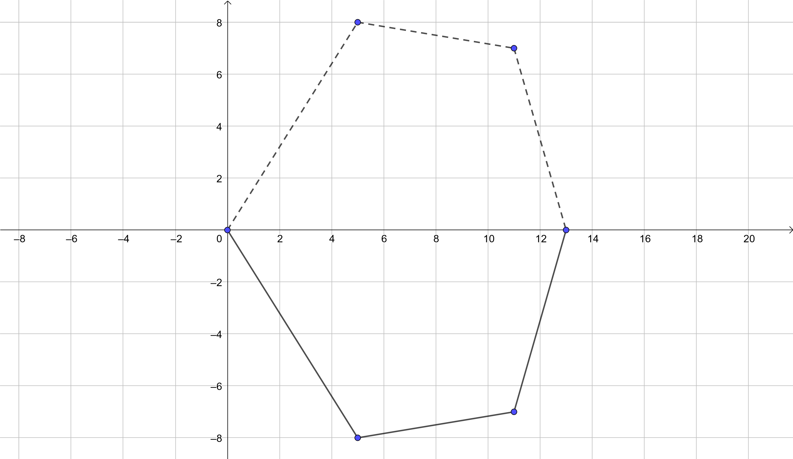
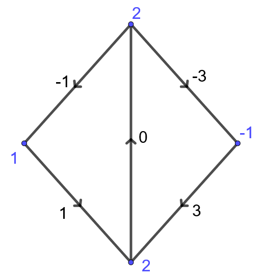
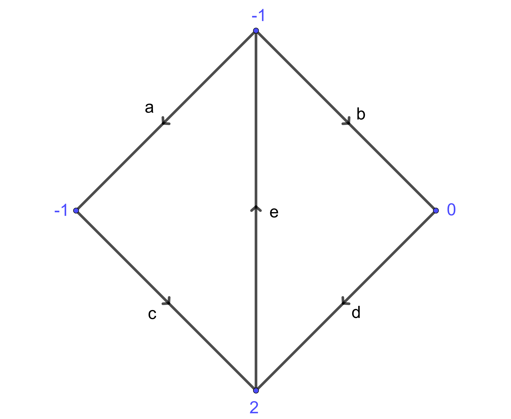
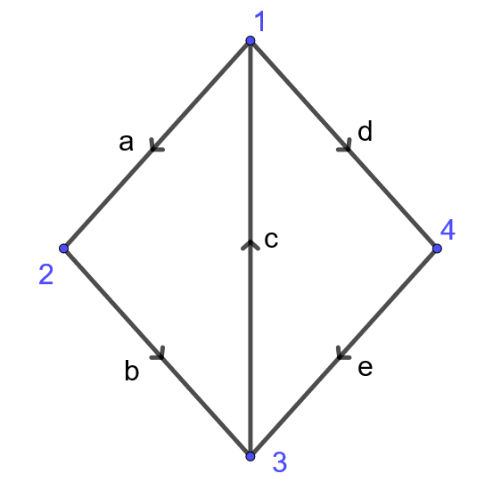
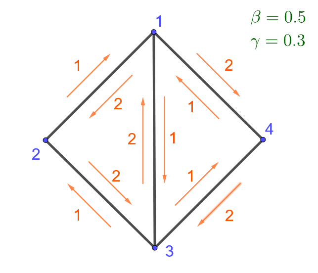
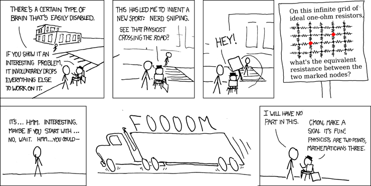

--- 
title: "Métodos de matemáticas aplicadas"
author: "Héctor Andrés Chang-Lara"
date: "`r Sys.Date()`"
site: bookdown::bookdown_site
documentclass: book
bibliography: [book.bib, packages.bib]
# url: your book url like https://bookdown.org/yihui/bookdown
# cover-image: path to the social sharing image like images/cover.jpg
description: |
  This is a minimal example of using the bookdown package to write a book.
  The HTML output format for this example is bookdown::gitbook,
  set in the _output.yml file.
link-citations: yes
github-repo: rstudio/bookdown-demo
---

# Prefacio {-}

Hola

<!--chapter:end:index.Rmd-->

# Entramados

La siguiente figura ilustra cuatro puntos masivos unidos por tres barras de longitudes conocidas $\ell_{01}, \ell_{12}, \ell_{23}$, y masas despreciables. Los extremos etiquetados por $0$ y $3$ tienen posiciones fijas y los nodos intermedios de masas $m_1$ y $m_2$ ocupan posiciones de equilibrio. ¿A partir de cuales ecuaciones se podrían determinar las posiciones $q_i=(x_i,y_i)$ de estos nodos?

<iframe src="https://www.geogebra.org/classic/psru5cr9?embed" width="800" height="600" allowfullscreen style="border: 1px solid #e4e4e4;border-radius: 4px;" frameborder="0"></iframe>

<!--
```{python, echo=FALSE}

import matplotlib.pyplot as plt

plt.plot([0,1,3,4], [0,-2,-3,0],[0,1,3,4], [0,-2,-3,0],'ro')

ts = 14

plt.text(0.1,-0.1,'0',fontsize=ts)
plt.text(1.05,-1.9,'1',fontsize=ts)
plt.text(3.1,-3,'2',fontsize=ts)
plt.text(3.8,-0.1,'3',fontsize=ts)


plt.text(0.6,-1,'$\ell_{01}$',fontsize=ts)
plt.text(1.7,-2.6,'$\ell_{12}$',fontsize=ts)
plt.text(3.55,-1.7,'$\ell_{23}$',fontsize=ts)

plt.show()
```
-->

Antes de proceder a plantear el sistema de ecuaciones recordemos que por lo general el número de ecuaciones e incógnitas deben ser iguales para que este esté bien planteado, es decir que existan soluciones y que sean únicas (al menos localmente). En nuestro caso tenemos cuatro incógnitas, los dos pares de coordenadas de cada nodo libre. Además debemos considerar las restricciones impuestas por las distancias entre los nodos, es decir tres ecuaciones. Hasta el momento el sistema es indeterminado, tiene más incógnitas (4) que ecuaciones (3), sin embargo aún nos falta incorporar la información del fenómeno de equilibrio.

$$
\begin{cases}
(x_1-0)^2 + (y_1-0)^2 = \ell_{01}^2\\
(x_1-x_2)^2 + (y_1-y_2)^2 = \ell_{12}^2\\
(x_2-3)^2 + (y_2-0)^2 = \ell_{23}^2
\end{cases}
$$

En cada nodo libre actúan tres fuerzas: dos tensiones y la gravedad $(= -m_ige_y)$. Por ejemplo, la tensión $T_{12}$ sobre el nodo 1 y que se produce sobre el segmento que une los nodos 1 y 2 es proporcional al vector $q_2-q_1$, es decir $T_{12} = \lambda_{12} (q_2-q_1)$ para un cierto escalar $\lambda_{12}$. Similarmente podemos razonar sobre las demás interacciones, introduciendo así cuatro nuevas variables $\lambda_{10}, \lambda_{12}, \lambda_{21}$, y $\lambda_{23}$. Para que el sistema se encuentre en equilibrio, la suma de las fuerzas sobre cada nodo debe anularse, lo cual nos da igualmente cuatro ecuaciones:

$$
\begin{cases}
\lambda_{10}(x_{0}-x_{1})+\lambda_{12}(x_{2}-x_{1}) = 0\\
\lambda_{10}(y_{0}-y_{1})+\lambda_{12}(y_{2}-y_{1}) = m_{1}g\\
\lambda_{23}(x_{3}-x_{2})+\lambda_{21}(x_{1}-x_{2}) = 0\\
\lambda_{23}(y_{3}-y_{2})+\lambda_{21}(y_{1}-y_{2}) = m_{2}g
\end{cases}
$$

Pareciera que no hemos logrado mucho en términos del sistema que sigue siendo indeterminado con ocho incógnitas (2 $x$'s, 2 $y$'s y 4 $\lambda$'s) y siete ecuaciones (3 distancias y 4 balances de fuerzas). Sin embargo, la tercera ley de Newton nos dice que las interacciones entre pares de nodos guarda una simetría: toda acción produce una reacción opuesta de la misma magnitud. En nuestro modelo esto se refleja en $T_{12} = -T_{21}$, de donde obtenemos la última ecuación

$$
\lambda_{12}=\lambda_{21}.
$$

De hecho es más sencillo eliminar una de las incógnitas ($\lambda_{21}$) que añadir otra ecuación. En conclusión obtenemos el siguiente sistema con siete ecuaciones e incógnitas

$$
\begin{cases}
\lambda_{10}(x_{0}-x_{1})+\lambda_{12}(x_{2}-x_{1}) = 0\\
\lambda_{10}(y_{0}-y_{1})+\lambda_{12}(y_{2}-y_{1}) = m_{1}g\\
\lambda_{23}(x_{3}-x_{2})+\lambda_{12}(x_{1}-x_{2}) = 0\\
\lambda_{23}(y_{3}-y_{2})+\lambda_{12}(y_{1}-y_{2}) = m_{2}g\\
(x_1-0)^2 + (y_1-0)^2 = \ell_{01}^2\\
(x_1-x_2)^2 + (y_1-y_2)^2 = \ell_{12}^2\\
(x_2-3)^2 + (y_2-0)^2 = \ell_{23}^2
\end{cases}
$$

Una forma de obtener solución a este sistema es el método de Newton. Por ejemplo, para los valores $\ell_{01}=\sqrt{5}, \ell_{12}=\sqrt{5}, \ell_{23}=\sqrt{10}, m_1=1, m_2=2, q_0=(0,0), q_3=(4,0)$ la siguiente implementación ilustra como obtener la solución usando Python^[**Advertencia:** El código es sensible a las condiciones iniciales para la iteración y no siempre converge.].

```{python}
#Librerías

import matplotlib.pyplot as plt
import numpy as np
from scipy.optimize import fsolve

#Parámetros

l01=np.sqrt(5)
l12=np.sqrt(5)
l23=np.sqrt(10)
x3,y3=4,0
m1=1
m2=2

#Sistema de ecuaciones y gráfica

def f(x):
  x1,y1,x2,y2,lambda01,lambda12,lambda23 = x
  f=np.zeros(7)
  f[0] = x1**2+y1**2-l01**2
  f[1] = (x2-x1)**2+(y2-y1)**2-l12**2
  f[2] = (x3-x2)**2+(y3-y2)**2-l23**2
  f[3] = -lambda01*x1+lambda12*(x2-x1)
  f[4] = -lambda01*y1+lambda12*(y2-y1)-m1
  f[5] = lambda12*(x1-x2)+lambda23*(x3-x2)
  f[6] = lambda12*(y1-y2)+lambda23*(y3-y2)-m2
  return f

r = fsolve(f,[1,-1,3,-2,0,0,0])

x1,y1=r[0],r[1]
x2,y2=r[2],r[3]

fig, ax = plt.subplots()
ax.plot([0,r[0],r[2],x3], [0,r[1],r[3],y3])
ax.plot(0,0,color='tab:blue', marker='o', label='$q_0=(0,0)$')
ax.plot(x1,y1,color='tab:orange', marker='o', label="$q_1=({:.4f},{:.4f})$".format(x1, y1))
ax.plot(x2,y2,color='tab:green', marker='o', label="$q_1=({:.4f},{:.4f})$".format(x2, y2))
ax.plot(x3,y3,color='tab:red', marker='o', label="$q_1=({},{})$".format(x3, y3))
leg = ax.legend();

plt.show()
```

Estas ideas son fácilmente generalizables a configuraciones lineales con más nodos. En el límite se obtiene el *problema de la catenaria*. También podemos considerar estructuras más complejas, por ejemplo un pañuelo sujeto por las esquinas. Para poder dar una generalización de estos modelos presentamos en la siguiente sección algunas nociones básicas de teoría de grafos. Una referencia entretenida con aplicaciones en arquitectura está en el siguiente enlace:


](./0.jpg){width=70%}

---

::: {.exercise}
Calcula $m_2$ para que el entramado esté en equilibrio dado que los nodos en $(0,0)$ y $(13,0)$ están fijos

{width=70%}
:::

<details>
  <summary>Solución</summary>
Las fuerzas en el nodo $1$ están dadas por
$$
\begin{cases}
5\lambda_{01}=6\lambda_{12},\\
8\lambda_{01}+\lambda_{12}=g
\end{cases} \qquad\Rightarrow\qquad \lambda_{01}=\frac{6g}{53}, \lambda_{12}=\frac{5g}{53}
$$
Las fuerzas en el nodo $2$ están dadas por
$$
\begin{cases}
6\lambda_{12}=2\lambda_{23},\\
-\lambda_{12}+7\lambda_{23}=m_2g
\end{cases} \qquad\Rightarrow\qquad \lambda_{23}=\frac{15g}{53}, m_2=\frac{100}{53}.
$$
</details>

---

::: {.exercise}
Demuestra que si un dado entramado como en la figura, y con extremos en el eje horizontal, está en equilibro, entonces su correspondiente reflexión en el eje horizontal también está en equilibrio. ¿Será posible generalizar este principio a un entramado general?

{width=70%} 
:::

<details>
  <summary>Solución</summary>
Denotamos por $\lambda_i=\lambda_{i,i-1} = -\lambda_{i-1,i}$.

En cada nodo del entramado original se tiene el balance de fuerzas está dado por
$$
\begin{cases}
(x_i-x_{i-1})\lambda_i=(x_{i+1}-x_{i})\lambda_{i+1},\\
(y_{i-1}-y_{i})\lambda_i+(y_{i+1}-y_{i})\lambda_{i+1}=m_ig
\end{cases}
$$
Al tomar la reflexión en el eje horizontal las coordenadas de los nodos pasan a ser $(x_i,y_i)\mapsto (x_i',y_i') = (x_i,-y_i)$. Gracias a las relaciones previas, se observa que estas coordenadas satisfacen igualmente las ecuaciones de balance de fuerzas cuando igualmente reemplazamos $\lambda_i\mapsto \lambda_i' =-\lambda_i$
$$
\begin{cases}
(x_i'-x_{i-1}')\lambda_i'=(x_{i+1}'-x_{i}')\lambda_{i+1}',\\
(y_{i-1}'-y_{i}')\lambda_i'+(y_{i+1}'-y_{i}')\lambda_{i+1}'=m_ig.
\end{cases}
$$
Este principio se generaliza a un entramado general con una notación adecuada.
</details>

<!--chapter:end:01-entramado.Rmd-->

# Cálculo discreto

Una grafo dirigido $G = (V,E)$ consiste de un conjunto de vértices $V$, también llamados nodos, y un conjunto de aristas $E \subseteq V^2$, es decir pares ordenados de $V$.

Dado $e = (a,b)\in E$, denotamos por $e_-=a$ y $e_+=b$ los nodos de partida y llegada de $e$ respectivamente y decimos que $e$ está orientado del nodo de salida $a$ al nodo de llegada $b$.

En general trabajaremos con grafos con aristas simples, es decir que a lo sumo existe una arista que conecta dos vértices en cualquier orientación. Sin embargo, cuando $e=(a,b)\in E$ podríamos hacer referencia a la arista $-e:=(b,a)$ como la arista $e$ pero con el sentido opuesto. Denotaremos $-E = \{-e \in V^2:e\in E\}$.

Finalmente, podemos considerar también conjuntos de aristas no orientadas en cuyo caso decimos que el grafo es no dirigido.

---

::: {.exercise}
Dibuja el grafo $G=(V,E)$ para
$$
V = \{1,2,3,a,b,c\}, \qquad E = \{(1,a),(1,b),(1,c),(2,a),(2,b),(2,c),(3,a),(3,b),(3,c)\}.
$$
:::

<details>
  <summary>Solución</summary>

<iframe src="https://www.geogebra.org/classic/xtjh7atb?embed" width="800" height="600" allowfullscreen style="border: 1px solid #e4e4e4;border-radius: 4px;" frameborder="0"></iframe>
</details>

---

Las redes eléctricas son uno de los modelos más conocidos que se pueden formular en términos de grafos. Sobre el grafo podemos caracterizar por ejemplo el potencial o voltaje como una función $u:V\to \mathbb R$ y la corriente como una función $i:E\to \mathbb R$. Siguiendo un poco la nomenclatura que sugiere este modelo, distinguimos dos tipos de funciones en $G$:

1. **Potencial:** Es una función sobre el conjunto de vértices $u: V \to \mathbb R$.
1. **Flujo:** Es una función sobre el conjunto de aristas $f: E \to \mathbb R$.

En algunos casos también podríamos considerar que dichas funciones tomen valores en $\mathbb C$, $\mathbb R^n$ ó $\mathbb C^n$.

También denominamos como flujos a funciones que están definidas en $E\cup -E$, es decir que consideran ambas orientaciones de las aristas. Decimos que $f:E\cup -E\to\mathbb R$ es **par** cuando no depende de la orientación $f(-e) = f(e)$, y decimos que **impar** si en cambio $f(-e) = -f(e)$. Una función $f:E\to\mathbb R$ en un grafo no dirigido es equivalente a una función par en el mismo grafo y con cualquier orientación sobre las aristas.
 
---

:::{.example}
En el modelo de [entramados](#entramados) en la sección anterior, el grafo no dirigido $G=(V,E)$ con $V = \{0,1,2,3\}$ y $E=\{\{0,1\},\{1,2\},\{2,3\}\}$ nos proporciona la información sobre cuales nodos están conectados entre si. Las posiciones de los nodos se caracterizan por $q:V\to \mathbb R^2$ y las longitudes de los enlaces están determinadas por $\ell:E\to\mathbb R$.

{width=70%}

Para modelar las tensiones es conveniente considerar el grafo dirigido $G=(V,E')$ de alguna forma arbitraria, quizás $E'=\{(0,1),(1,2),(2,3)\}$. De esta forma contamos con la función par $\lambda:E'\to\mathbb R$ y la función impar $T: E' \to \mathbb R^2$ tales que
$$
T(e) = \lambda(e)(q(e_+)-q(e_-))
$$
es la tensión sobre el nodo $e_-$ a lo largo de $e$. A su vez y gracias a la ley de acción y reacción, $T(-e) = -T(e)$ es la tensión sobre el nodo $e_+$ a lo largo de $e$ pero en la orientación opuesta, es decir $-e$.
:::

---

:::{.example}
Un potencial $u:V\to\mathbb R$ sobre una red de resistencia genera una corriente $i:E\to \mathbb R$ que modelamos usando la ley de Ohm para una dada resistencia $R:E\to (0,\infty)$ (función par). Esto quiere decir que la corriente $i(e)$ que atraviesa una arista $e = (e_-,e_+)$ es proporcional a la diferencia de los potenciales en los extremos de la arista
$$
i(e) = \frac{u(e_+) - u(e_-)}{R(e)}, \qquad R(e) >0: \text{ Resistencia.}
$$
:::

---

## Gradiente

Tanto en la construcción de las tensiones $T$, como en la de la corriente eléctrica $i$, estamos considerando la variación de una dada función (las posiciones $q$ ó el potencial $u$) a lo largo de una arista dada. Esto es una versión discreta de la derivada direccional. En este caso requerimos que el grafo sea orientado.

:::{.definition}
Dado potencial $u:V\to\mathbb R$ sobre un grafo dirigido $G=(V,E)$, definimos el gradiente $Du: E\cup -E \to \mathbb R$ tal que
$$
Du(e) = u(e_{+})-u(e_{-}).
$$
:::

En particular, el gradiente es una función impar.

---

:::{.exercise}
Calcula el gradiente de la función dada en los vértices del siguiente grafo


{width=70%}
:::

<details>
  <summary>Solución</summary>
{width=70%}
</details>

---

:::{.exercise}
Verifica que el gradiente satisface la identidad de Leibniz
$$
D(u_1u_2) = u_1^+ Du_2 + u_2^-Du_1
$$
donde $u^\pm:E\to\mathbb R$ se define a partir de $u:V\to\mathbb R$ como $u^\pm(e) = u(e_\pm)$.
:::

<details>
  <summary>Solución</summary>
  $$
  \begin{aligned}
  D(u_1u_2)(e) &= u_1(e_+)u_2(e_+) - u_1(e_-)u_2(e_-),\\
               &= u_1(e_+)u_2(e_+) - u_1(e_+)u_2(e_-) + u_1(e_+)u_2(e_-) - u_1(e_-)u_2(e_-),\\
               &= u_1(e_+)(u_2(e_+)-u_2(e_-)) + u_2(e_-)(u_1(e_+)-u_1(e_-)),\\
               &= u_1(e_+)Du_2(e) + u_2(e_-)Du_1(e),\\
               &= (u_1^+Du_2 + u_2^-Du_1)(e).
  \end{aligned}
  $$
</details>
---

### Ley de ciclos

No toda función (impar) $f:E\cup -E \to \mathbb R$ es necesariamente un gradiente. Una condición necesaria y suficiente es la **ley de ciclos**. Para poder enunciar esta ley es conveniente dar algunas definiciones previas para un dado grafo dirigido $G=(V,E)$.

:::{.definition}
Un **camino no orientado** es una sucesión de vértices $x_0,x_1, \dots, x_n \in V$ tal que $(x_j,x_{j+1}) \in E\cup -E$ para todo $j\in\{0,1,\ldots,(n-1)\}$. Se dice que el camino es un **ciclo** si además $x_n=x_0$.
:::

:::{.definition}
Una **componente conexa** de $G$ es un subconjunto $V'\subseteq V$ tal que:
  
- Todos los vértices en $V'$ están conectados entre si por algún camino.
    
- Ningún vértice de $V'$ está conectado con ningún vértice de $V\setminus V'$.

Decimos que $G$ es **conexo** si tiene una única componente conexa.
:::

:::{.theorem name="Ley de ciclos"}
Sea $G=(V,E)$ un grafo dirigido finito. Una función impar $f:E\cup -E\to\mathbb R$ es igual al gradiente de una función $u:V\to \mathbb R$ si y solo si para todo ciclo $x_0,x_1, \dots, x_n=x_0$ se tiene que
$$
\sum_{j=0}^{n-1} f(x_j,x_{j+1}) = 0.
$$
:::

:::{.proof}
Por un lado es fácil verificar la identidad para flujos gradientes usando la propiedad telescópica. Dado un ciclo $x_0,x_1, \dots, x_n=x_0$
$$
\sum_{j=0}^{n-1} Du(x_j,x_{j+1}) = \sum_{j=0}^{n-1} (u(x_{j+1})-u(x_j)) = u(x_n)-u(x_0)=0.
$$

Podemos construir $u:V'\to \mathbb R$ sobre cada una de las componentes conexas de $G$ de la siguiente forma: Fijemos $x_0 \in V'$ y definimos
$$
u(x) := \sum_{j=0}^{n-1} f(x_j,x_{j+1})
$$
donde $x_0,x_1, \dots, x_n=x$ es un camino no orientado que conecta $x_0$ con $x\in V'$.

La hipótesis dada por la ley de ciclos garantiza que esta construcción no depende del camino escogido, es decir que está bien definida sin posible ambigüedad: Dados dos caminos $x_0,\ldots,x_n=x$ y $y_0=x_0,\ldots,y_m=x$ se tiene que $z_0=x_0,\ldots,z_n=x_n,z_{n+1}=y_{m-1},\ldots,z_{n+m}=y_0$ es un ciclo y por lo tanto
$$
0 = \sum_{j=0}^{n+m-1} f(z_j,z_{j+1}) = \sum_{j=0}^{n-1} f(x_j,x_{j+1}) - \sum_{j=0}^{m-1} f(y_j,y_{j+1}).
$$

Veamos finalmente que $Du = f$. Dado $e\in E$ con $e_\pm$ en la misma componente que $x_0$, tomamos un camino $x_0,x_1,\ldots, x_n=e_-$ de $x_0$ a $e_-$ y luego añadimos $x_{n+1}=e_+$ para formar un camino de $x_0$ a $e_+$. Por lo tanto
$$
Du(e) = u(e_+)-u(e_-) = \sum_{j=0}^{n} f(x_j,x_{j+1})-\sum_{j=0}^{n-1} f(x_j,x_{j+1}) = f(e),
$$
con lo cual concluímos la demostración.
:::

Este argumento nos permite apreciar que $u$ está únicamente determinado salvo potenciales constantes en cada componente conexa de $G$. Las constantes son los valores arbitrarios que daríamos a $u$ sobre el nodo $x_0$, que en nuestra demostración fue cero. En otras palabras, la nulidad del gradiente captura el número de compnentes conexas del grafo.

---

:::{.exercise}
Calcula los potenciales que generan el flujo dado en la siguiente figura

{width=70%}
:::

<details>
  <summary>Solución</summary>
  
  El flujo satisface la ley de ciclos. Por ejemplo en el triángulo de la izquierda la suma correspondiente es $-3+1+2=0$ y de igual forma podemos verificar en el triángulo de la derecha ($2+(-1)+(-1)=0$) o en el cuadrado exterior ($(-3)+1-(-1)-(-1)=0$). Si tomamos $u(A)=0$ sin pérdida de generalidad tenemos que
  $$
  \begin{cases}
  u(B) = 1 + u(A) = 1,\\
  u(C) = 3 + u(A) = 3,\\
  u(D) = -1 + u(C) = 2.
  \end{cases}
  $$
  Verificamos además que con estos valores se obtiene el gradiente prescrito
  $$
  \begin{cases}
  Du(AB) = u(B)-u(A) = 1-0 = 1,\\
  Du(BC) = u(C)-u(B) = 3-1 = 2,\\
  Du(CA) = u(A)-u(C) = 0-3 = -3,\\
  Du(CD) = u(D)-u(C) = 2-3 = -1,\\
  Du(DB) = u(B)-u(D) = 1-2 = -1.
  \end{cases}
  $$
  En general, $u$ tiene el gradiente prescrito si y solo si
  $$
  u(A) = C, \qquad u(B) = 1+C, \qquad u(C) = 3+C, \qquad u(D)=2+C.
  $$
</details>

---

<details>
  <summary>**Margen de cálculo:** El lema de Poincaré</summary>
Como ya el lector habrá notado, estas construcciones y propiedades encuentran paralelos en cálculo multivariable, y de hecho las demostraciones reproducen las mismas ideas: Los caminos son curvas, los ciclos son lazos o curvas cerradas y la expresión $\sum_{j=0}^{n-1} f(x_j,x_{j+1})$ es análoga a la integral de línea o el trabajo de un campo vectorial sobre una curva.

El resultado que acabamos de enunciar se conoce como el **Lema de Poincaré global**. Recordemos su enunciado junto con el resultado local.

**Lema de Poincaré (global):** Un campo vectorial $f \in C(\Omega\subseteq\mathbb R^n\to\mathbb R^n)$ es el gradiente de algún potencial $u\in C^1(\Omega\to\mathbb R)$ si y sólo si para cualquier curva cerrada $\gamma \in C^1([a,b]\to\Omega)$ (i.e. $\gamma(b)=\gamma(a)$) se tiene que el trabajo que ejerce $f$ sobre la curva $\gamma$ se anula
$$
\int_\gamma f = \int_a^b f(\gamma(t))\cdot \gamma'(t)dt = 0.
$$

**Lema de Poincaré (local):** Si $\Omega\subseteq\mathbb R^n$ es simplemente conexo^[es decir que cualquier ciclo puede ser deformado continuamente a un punto. Por ejemplo, si $n=2$ dice que $\Omega$ no tiene hoyos.] entonces $f \in C^1(\Omega\to\mathbb R^n)$ es un gradiente si y solo si $\partial_if_j = \partial_jf_i$.
</details>

## Divergencia

Otro operador diferencial que tiene su análogo en grafos es la divergencia. Heurísticamente, la divergencia de un campo vectorial mide cuando es positiva la cantidad de flujo que sale o diverge del nodo dado, mientras que cuando es negativa mide la cantidad de flujo que recibe o converge en el nodo.

:::{.definition}
Dado $f: E \to \mathbb R$ denotamos por $\operatorname{div} f:V\to \mathbb R$ a la divergencia de $f$ donde
$$
\operatorname{div} f(v) = \sum_{e_-=v}f(e)-\sum_{e_+=v}f(e)
$$
:::

---

:::{.example}
En la siguiente figura se calculó la divergencia de la función dada en las aristas

{width=70%}
:::

---

:::{.example}
Las ecuaciones de balance para un entramado se escriben en términos de la divergencia de las tensiones sobre los nodos libres como
$$
\operatorname{div} T = -mge_y
$$
:::

---

:::{.example}
La ley de Kirchhoff dice que en en un nodo que no está conectado a la batería, la corriente que entra y sale de este son iguales. En términos de la divergencia quiere decir que
$$
\operatorname{div} i = 0
$$
:::

---

### Fórmula de la divergencia

Al igual que antes, podríamos preguntarnos si todo potencial es la divergencia de algún campo. Esto no es necesariamente cierto, la divergencia satisface la **ley de conservación**, análoga al teorema de la divergencia. Un caso particular ilustrativo de esta ley postula que la suma de la divergencia sobre un grafo finito es igual a cero
$$
\sum_{v\in V} \operatorname{div} f(v) = 0.
$$
Una vez más la justificación se basa en una propiedad telescópica para la suma: Cada arista aparece dos veces en la suma con signos opuestos dependiendo si se considera su vértice origen o de llegada.

Para dar una versión discreta del teorema de la divergencia consideramos el campo normal exterior $n_\Omega:E\to \mathbb R$ tal que
$$
n_\Omega(e) = \begin{cases}
+1 \text{ si $e_-\in \Omega$ y $e_+\in V\setminus \Omega$},\\
-1 \text{ si $e_-\in V\setminus \Omega$ y $e_+\in \Omega$},\\
0 \text{ en cualquier otro caso}
\end{cases}
$$
en este caso el signo de $n_\Omega(e)$ indica cuando la arista orientada conecta a $\Omega$ con su complemento o viceversa.

---

:::{.exercise}
El campo normal es el gradiente de una dada función ¿Cuál?.
:::

<details>
  <summary>Solución</summary>
  $n_\Omega = D1_{V\setminus \Omega}$ donde
  $$
  1_{V\setminus \Omega}(x) = \begin{cases}
  1 \text{ si } x\in V\setminus \Omega,\\
  0 \text{ en cualquier otro caso}.
  \end{cases}
  $$
</details>

---

:::{.theorem name="Fórmula de la divergencia"}
Sea $G=(V,E)$ un grafo dirigido finito. La divergencia de $f:E\to \mathbb R$ verifica
\begin{equation}
\sum_{v\in \Omega} \operatorname{div} f(v) = \sum_{e\in E} f(e)n_\Omega(e)
(\#eq:div)
\end{equation}
:::

De hecho la suma en el lado derecho ocurre en realidad sobre un subconjunto de aristas que podemos definir como el borde de $\partial\Omega$
$$
\partial \Omega := \{e\in E\ | \ \{e_+,e_-\} \cap \Omega \neq \emptyset \text{ y } \{e_+,e_-\} \cap E\setminus \Omega \neq \emptyset\}
$$
es decir las aristas que conectan $\Omega$ con su complemento en cualquier orientación.

La cantidad $f(e)n_\Omega(e)$ es positiva cuando $e_-\in \Omega$, $e_+\in V\setminus \Omega$ y $f(e)>0$; o bien cuando $e_-\in V\setminus \Omega$, $e_+\in \Omega$ y $f(e)<0$. En cualquier caso, $f(e)n_\Omega(e)$ se interpreta como la cantidad de masa que escapa de $\Omega$ por medio de $e$. Un razonamiento similar se dá cuando $f(e)n_\Omega(e)$ es negativo para la masa que entra. El balance total nos dice que la masa que se produce o absorbe en $\Omega$ se puede medir de dos formas, sumando las divergencias en $\Omega$ u observando las contribuciones que escapan o entran por las aristas que conectan a $\Omega$ con su complemento $V\setminus \Omega$ en cualquier orientación.

:::{.proof}
Sean $1_\pm:V\times E\to \mathbb R$ definidas según
$$
1_\pm(v,e) := \begin{cases}
1 \text{ si } e_\pm = v,\\
0 \text{ en cualquier otro caso}.
\end{cases}
$$
En particular usaremos que
$$
\sum_{v\in \Omega} 1_\pm(v,e) = \begin{cases}
1 \text{ si } e_\pm \in \Omega,\\
0 \text{ encualquier otro caso}
\end{cases}
$$

Tenemos así que
$$
\begin{aligned}
\sum_{v\in \Omega} \operatorname{div} f(v) &= \sum_{v\in \Omega} \sum_{e_-=v} f(e) - \sum_{v\in \Omega} \sum_{e_+=v} f(e),\\
&= \sum_{v\in \Omega} \sum_{e \in E} f(e)1_-(v,e) - \sum_{v\in \Omega} \sum_{e \in E} f(e)1_+(v,e),\\
&= \sum_{e \in E} \sum_{v\in \Omega}f(e)1_-(v,e) - \sum_{e \in E} \sum_{v\in \Omega}f(e)1_+(v,e),\\
&= \sum_{e_-\in \Omega} f(e) -\sum_{e_+\in \Omega} f(e),\\
&= \sum_{\substack{e_-\in \Omega\\e_+\in V\setminus \Omega}} f(e) + \sum_{e_-, e_+\in \Omega} f(e) - \sum_{\substack{e_+\in \Omega\\e_-\in V\setminus \Omega}} f(e) - \sum_{e_-, e_+\in \Omega} f(e),\\
&= \sum_{\substack{e_-\in \Omega\\e_+\in V\setminus \Omega}} f(e) - \sum_{\substack{e_+\in \Omega\\e_-\in V\setminus \Omega}} f(e)
\end{aligned}
$$

Esta última expresión es por definición de $n_\Omega$ igual a
$$
\sum_{e\in E} f(e)n_\Omega(e),
$$
con lo cual se concluye la demostración.
:::

<details>
  <summary>**Margen de cálculo:** El teorema de la divergencia</summary>
  El teorema de la divergencia nos dice que dado un subconjunto $\Omega \subset\mathbb R^n$ con frontera localmente de clase $C^1$ a trozos, y campo $v\in C^1(\overline{\Omega}\to\mathbb R^n)$, entonces
$$
\int_\Omega \operatorname{div} v = \int_{\partial \Omega} v\cdot n
$$
donde $n$ es el vector normal exterior a $\Omega$.

El lado derecho integra el flujo que escapa o entra en $\Omega$ a través de su borde. En concreto, si en un punto dado del borde  $v\cdot n >0$ entonces $v$ apunta en la dirección de $n$ y el flujo escapa con una tasa igual a $v\cdot n$,  si en cambio  $v\cdot n < 0$ el flujo estaría entrando, y si $v\cdot n=0$ se tiene que $v$ es tangente y el flujo apenas roza la superficie. El lado izquierdo de la expresión es una integral sobre $\Omega$ que representa la producción/absorción de flujo por el campo $v$.
</details>

### Lema de Poincaré para la divergencia

:::{.theorem}
Sea $G=(V,E)$ un grafo dirigido finito y conexo. Para cualquier $\mu:V\to\mathbb R$ tal que
$$
\sum_{x\in V}\mu(x)=0
$$
existe por lo menos una solución $f:E\to\mathbb R$ de
$$
\operatorname{div} f = \mu.
$$
:::

:::{.proof}
Tomemos un nodo arbitrario $x_0\in V$ y consideremos inductivamente caminos no orientados que vayan conectando a $x_0$ con cada uno de los nodos restantes y de tal forma que nunca se formen ciclos en esta construcción. Es decir, estamos proponiendo un **árbol generador** del grafo con raíz en el nodo $x_0$, en otras palabras un sub-grafo $T_0 := (V_0=V,E_0\subseteq E)$ libre de ciclos y conexo. Fijamos $f=0$ en las aristas de $E\setminus E_0$ y en los demás ajustaremos $f$ para que satisfaga la ecuación dada.

En la siguiente construcción estaremos definiendo a $f:E\cup-E\to \mathbb R$ como una función impar.

La idea consiste en ir podando las ramas del árbol a medida que asignamos $f$ convenientemente. Si $|V_0|=1$ el problema sería trivial, asumamos así que $|V_0|>1$. En el primer paso tomamos una hoja de $T_0$, es decir un $x\in V_0$ con un único nodo $y \sim_{T_0} x$. Declaramos así $f(x,y) = \mu(x)$ de modo que se tiene que $\operatorname{div}f(x) = \mu(x)$ ($f$ es distinto de cero en a lo sumo una arista en esta suma). Una vez declarado $f$ en la arista $e=(x,y)$ procedemos a considerar el árbol $T_1 = (V_0\setminus \{x\},E_1:=E_0\setminus \{(x,y),(y,x)\})$.

Asumamos de forma inductiva que luego de $k$ pasos contamos con los árboles
$$
T_k = (V_k,E_k) \subset T_{k-1} := (V_{k-1},E_{k-1}) \subset \ldots \subset T_0
$$
tales que $f$ ha sido definida en $E\setminus E_k$ tal que $\operatorname{div}f=\mu$ se satisface sobre $V\setminus V_k$. Para el siguiente paso tomamos una hoja $x \in V_k$ y fijamos $f$ sobre la (única) arista $(x,y) \in E_k\cup-E_k$ de modo que la ecuación ahora se satisfaga sobre el nodo $x$. Para el siguiente paso podamos a $x$ de $T_k$, es decir que
$$
T_{k+1}:= (V_{k+1}=V_k\setminus\{x\},E_{k+1}:=E_k\setminus\{(x,y),(y,x)\}).
$$
Claramente esta construcción garantiza que las hipótesis inductivas se siguen cumpliendo en el siguiente paso.

Una vez terminado este algoritmo garantizamos que $\operatorname{div} f=\mu$ se cumple en $V\setminus \{x_0\}$ (la raíz del árbol). Como última observación tenemos que la ecuación también debe cumplirse en $x_0$ gracias a que $\sum_{x\in V} \operatorname{div} f(x)=\sum_{x\in V} \mu(x)=0$.
:::

Notemos que si $x_0,\ldots,x_k=x_0$ es un dado ciclo del grafo, entonces si tomamos $f=1$ en las aristas del ciclo y cero por fuera de estas, obtenemos una solución de $\operatorname{div} f=0$. De hecho, todas las soluciones homogéneas se obtienen por superposiciones de este ejemplo. El núcleo de la divergencia es un espacio vectorial generado por los ciclos independientes del grafo y su dimensión es un importante invariante topológico conocido como el **primer número de Betti**.

:::{.exercise}
Calcula los flujos $f:E\to \mathbb R$ tal que $\operatorname{div} f=\mu$ para la función $\mu$ dada sobre los nodos del siguiente grafo.

{width=70%}
:::

<details>
  <summary>Solución</summary>
  Verificamos primero que la suma de los valores en los nodos se anula.
  
  Para calcular una solución particular tomamos el árbol generador con aristas $a$, $b$, $-e$ y definimos así
  $$
  f(c)=f(d)=0, \qquad f(a)=1, \qquad f(e)=2, \qquad f(b)=0
  $$
  el cual verifica fácilmente la ecuación de divergencia esperada en todos los nodos.
  
  Cualquier otra solución se obtiene como la superposición de la solución previa con las del sistema homogéneo
  $$
  \begin{cases}
  f(a)+f(b)-f(e)=0,\\
  -f(a)+f(c)=0,\\
  -f(b)+f(d)=0,\\
  -f(c)-f(d)+f(e)=0.
  \end{cases}
  $$
  Dos soluciones linealmente independientes se obtienen por ejemplo de los ciclos $a,c,e$ y $b,d,e$ respectivamente
  $$
  \begin{aligned}
  &f(a)=f(c)=f(e)=1,\qquad f(b)=f(d)=0,\\
  &f(a)=f(c)=0, \qquad f(b)=f(d)=f(e)=1.
  \end{aligned}
  $$
  Si usamos la reducción de Gauss-Jordan podemos verificar que esta es además una base de las soluciones homogéneas.
</details>

---

## Integración por partes

En esta sección identificamos a las funciones $u:V\to \mathbb R$ con vectores de $\mathbb R^{|V|}$. Igualmente identificamos a las funciones $f:E\to \mathbb R$ con vectores de $\mathbb R^{|E|}$. Eventualmente también podríamos considerar funciones complejas.

El gradiente $D:\mathbb R^{|V|}\to\mathbb R^{|E|}$ se representa así por la matriz $(D_{e,x}) \in \mathbb R^{|E|\times |V|}$ tal que
$$
D_{e,x} = \begin{cases}
1 \text{ si } x=e_+,\\
-1 \text{ si } x=e_-,\\
0 \text{ en cualquier otro caso}.
\end{cases}
$$
Mientras que la divergencia $\operatorname{div}:\mathbb R^{|E|}\to\mathbb R^{|V|}$ se representa por la matriz $(\operatorname{div}_{x,e}) \in \mathbb R^{M\times N}$ tal que
$$
\operatorname{div}_{x,e} = \begin{cases}
-1 \text{ si } e_+=x,\\
1 \text{ si } e_-=x,\\
0 \text{ en cualquier otro caso}.
\end{cases}
$$
Descubrimos de esta forma que $D^T = -\operatorname{div}$ o equivalentemente la fórmula de **integración por partes**
$$
\sum_{e\in E} (fDu)(e) = f\cdot Du = -u\cdot \operatorname{div} f = -\sum_{x\in V} (u\operatorname{div} f)(x).
$$

---

:::{.exercise}

Calcula las matrices asociadas con el gradiente y la divergencia para el siguiente grafo

{width=70%}
:::

<details>
  <summary>Solución</summary>
  $$
  D = \begin{pmatrix}
  -1 &  1 &  0 &  0\\
   0 & -1 &  1 &  0\\
   1 &  0 & -1 &  0\\
  -1 &  0 &  0 &  1\\
   0 &  0 &  1 & -1
  \end{pmatrix} \qquad \operatorname{div} = -D^T = \begin{pmatrix}
  1 & 0 & -1 & 1 & 0\\
  -1 & 1 & 0 & 0 & 0\\
  0 & -1 & 1 & 0 & -1\\
  0 & 0 & 0 & -1 & 1
  \end{pmatrix}.
  $$
</details>

---

:::{.exercise}
Demuestra la fórmula de integración por partes sobre un dominio $\Omega \subseteq V$
\begin{equation}
\sum_{\Omega} u\operatorname{div}f = \sum_{E} u^-fn_\Omega - \sum_{e_+\in \Omega} fDu.
(\#eq:ipv)
\end{equation}
En particular, si $u=1$ recuperamos la fórmula de la divergencia \@ref(eq:div).
:::

<details>
  <summary>Solución</summary>
  Basta con usar que $Dv\cdot f = - v\cdot \operatorname{div} f$ para $v := u 1_{\Omega}$.
</details>

---

<details>
  <summary>**Margen de cálculo:** Integración por partes</summary>
La fórmula de integración por partes nos dice que dado un subconjunto $\Omega \subset\mathbb R^n$ con frontera localmente de clase $C^1$ a trozos, un campo *vectorial* $v\in C^1(\overline{\Omega}\to\mathbb R^n)$, y un campo *escalar* $u\in C^1(\overline{\Omega}\to\mathbb R^n)$ entonces
$$
\int_\Omega u \operatorname{div} v = \int_{\partial \Omega} u v\cdot n - \int_\Omega Du\cdot v
$$
donde $n$ es el vector normal exterior a $\Omega$.
</details>

### Descomposición de Helmholtz

La relación $D^T=-\operatorname{div}$ nos permite dar la descomposición ortogonal
$$
\mathbb R^{|E|} = D(\mathbb R^{|V|}) + \ker(\operatorname{div}).
$$
también conocida como la **descomposición de Helmholtz**. Es decir que cualquier $f:E\to\mathbb R$ puede escribirse de forma *única*^[Dado $f:E\to \mathbb R$, el potencial $u$ no es único pero su gradiente $Du$ sí.] como
$$
f = Du + g
$$
tal que
$$
\operatorname{div} g = 0,
$$
y como corolario $Du \perp g$.

En términos físicos, cualquier flujo se descompone en una parte que preserva la masa ($g$) y en un flujo gradiente ($Du$).

<details>
  <summary>**Margen de álgebra lineal:** El teorema fundamental de álgebra lineal</summary>
Dado $A:\mathbb R^M\to \mathbb R^{N}$ se tiene que
$$
A(\mathbb R^{M})^\perp = \ker(A^T).
$$
Si $x \perp A(\mathbb R^M)$ entonces $0 = x\cdot AA^Tx = \|A^T x\|^2$, lo cual implica $A^Tx=0$. Por otro lado si $A^Tx=0$ entonces para $y\in \mathbb R^M$ arbitrario $x\cdot Ay = A^Tx\cdot y=0$.
</details>

---

:::{.exercise}

Calcula la descomposición de Helmholtz para el siguiente flujo

{width=70%}
:::

<details>
  <summary>Solución</summary>
Sea $f:E\to \mathbb R$ los valores que se muestran en la gráfica. Buscamos calcular $u:V\to \mathbb R$ y $g:E\to \mathbb R$ tales que $f=Du+g$ y $\operatorname{div}g=0$. Si tomamos así la divergencia en la expresión $f=Du+g$ encontramos que $u$ satisface
$$
\begin{cases}
-2u(A)+u(B)+u(C)=3,\\
u(A)-3u(B)+u(C)+u(D)=4,\\
u(A)+u(B)-3u(C)+u(D)=-7,\\
u(B)+u(C)-2u(D)=0.
\end{cases}
$$
Las soluciones homogéneas del sistema son los potenciales constantes^[Esto puede verificarse de la reducción de Gauss-Jordan en este caso, y además será demostrado con mayor generalidad.]. Ajustando esta constante de forma que $u(A)=0$ obtenemos un sistema que podemos resolver numéricamente
```{python}
import numpy as np

A = np.array([[ 1, 1, 0],
              [-3, 1, 1],
              [ 1,-3, 1]])
B = np.array([3, 4, -7])
X = np.linalg.inv(A).dot(B)

Du = [X[0],X[1]-X[0],-X[1],X[2]-X[1],X[0]-X[2]]
f = np.array([1,5,-2,0,0])
g = f-Du

print("[Du(AB), Du(BC), Du(CA), Du(CD), Du(DB)] = {}.".format(Du))
print("[g(AB), g(BC), g(CA), g(CD), g(DB)] = {}.".format(g))
```
</details>

## Laplaciano

El Laplaciano es un operador diferencial que se construye aplicando sucesivamente el gradiente y la divergencia. Es decir que mide la producción de masa del gradiente. Además, luego de una manipulación algebraica, observamos que es proporcional a la diferencia entre el promedio en los vértices adyacentes y el valor en el centro.

:::{.definition}
Dado $u: V \to \mathbb R$, el Laplaciano $\Delta u: V \to \mathbb R$ se define tal que
$$
\Delta u(v) = \operatorname{div}(D u)(v) = \sum_{w \sim v} (u(w)-u(v)).
$$
donde $w \sim v$ si existe una arista que une a $v$ y $w$ en cualquier orientación.
:::

A pesar de que tanto el gradiente como la divergencia requieren que el grafo tenga una orientación, **el Laplaciano está bien definido en grafos no dirigidos**.

Cuando $u: V \to \mathbb R$ es un potencial tal que $\Delta u=0$ en $\Omega \subseteq V$, decimos que $u$ es una función **armónica** sobre $\Omega$.

---

:::{.example}
Considera una red eléctrica con resistencias de un Ohm ($R(e)=1$) la cual modelamos como una grafo dirigido de forma arbitraria. Una batería de un voltio entre dos nodos $v_+,v_-\in V$ genera un potencial eléctrico $u:V\to \mathbb R$ que se puede determinar a partir de la ley de Ohm y la ley de Kirchhoff.

Según la ley de Ohm tenemos que la corriente se calcula según
$$
i=Du.
$$

Según la ley de Kirchhoff tenemos que fuera de los nodos donde se conecta la bateria, la corriente se conserva, es decir
$$
0=\operatorname{div}i = \Delta u \text{ en } V\setminus\{v_\pm\}
$$

Junto con las condiciones de borde en los nodos donde se conecta la batería
$$
\qquad u(v_+) = 1, \qquad u(v_-) = 0,
$$
obtenemos un sistema de ecuaciones lineales con igual número de ecuaciones que de incógnitas.
:::

---

:::{.exercise}
Calcula el potencial eléctrico que se genera en un cubo de resistencias de un Ohm, cuando se conecta una batería de un voltio entre dos nodos opuestos del cubo

{with=70%}
:::

<details>
  <summary>Solución</summary>
  Asumamos sin pérdida de generalidad que se conecta la bateria de los nodos $A$ a $D$ tal que $v(A)=1$ y $v(D)=0$. Tenemos un sistema de ecuaciones lineales de dimensiones 6 por 6. De existir una única solución^[Una vez más, esto puede chequearse a mano o con una herramienta numérica.] observamos que por simetría se debe cumplir que $v(B)=v(F)=v(H)=\alpha$ (los nodos adyacentes a $A$) y $v(C)=v(E)=v(G)=\beta$ (los nodos adyacentes a $E$). Esto reduce el sistema a uno de 2 por 2
  $$
  \begin{cases}
  -9\alpha+6\beta = -3,\\
  6\alpha -9\beta = 0
  \end{cases} \qquad\Rightarrow\qquad \alpha = \frac{3}{5}, \qquad \beta = \frac{2}{5}.
  $$
</details>

---

:::{.exercise}
Calcula la matriz asociada al Laplaciano para el grafo a continuación

{width=70%}
:::

<details>
  <summary>Solución</summary>
  $$
  \Delta = \operatorname{div} D = \begin{pmatrix}
  1 & 0 & -1 & 1 & 0\\
  -1 & 1 & 0 & 0 & 0\\
  0 & -1 & 1 & 0 & -1\\
  0 & 0 & 0 & -1 & 1
  \end{pmatrix}\begin{pmatrix}
  -1 &  1 &  0 &  0\\
   0 & -1 &  1 &  0\\
   1 &  0 & -1 &  0\\
  -1 &  0 &  0 &  1\\
   0 &  0 &  1 & -1
  \end{pmatrix} = \begin{pmatrix}
  -3 & 1 & 1 & 1\\
  1 & -2 & 1 & 0\\
  1 & 1& -3 & 1\\
  1 & 0 & 1 & -2
  \end{pmatrix}
  $$
</details>

---

:::{.exercise}
Da un análogo discreto para la fórmula de Green
$$
\int_\Omega (u_1\Delta u_2 - u_2\Delta u_1) = \int_{\partial\Omega} (u_1Du_2 - u_2 Du_1)\cdot n
$$
:::

<details>
  <summary>Solución</summary>
De la fórmula de integración por partes \@ref(eq:ipv)
$$
\sum_\Omega u_i \Delta u_j = \sum_{E} u_i^- Du_j n_\Omega - \sum_{e_+\in \Omega} Du_iDu_j
$$
Por lo tanto al tomar la resta se cancelan el segundo término a la deracha quedando así
$$
\sum_\Omega (u_1 \Delta u_2-u_2 \Delta u_1) = \sum_{E} (u_1^- Du_2 - u_2^- Du_1)n_\Omega.
$$
</details>

---

En general podemos añadir una operación intermedia entre el gradiente y la divergencia. Esto genera operadores con características similares al Laplaciano.

---

:::{.example}
Considera ahora una red eléctrica con resistencias variables. La ley de Ohm consiste en tomar el gradiente del potencial y luego dividir por las resistencias para obtener la corriente. Al recíproco de la resistencia también se le conoce como la capacitancia y puede ser más conveniente de usar en este ejemplo. En este caso las ecuaciones de balance para el potencial eléctrico tienen la forma
$$
\operatorname{div} (CDu) = 0 \qquad C = 1/R : \text{Capacitancia}
$$
(fuera de los nodos donde se conecta la batería).

En el caso particular de las resistencias dadas en la siguiente gráfica,

{width=70%}

obtenemos el operador lineal asociado a la siguiente matriz
```{python}
import numpy as np

# Gradiente
D = np.array([[-1, 1, 0, 0],
              [0, -1, 1, 0],
              [1, 0, -1, 0],
              [-1, 0, 0, 1],
              [0, 0, 1, -1]])
              
# Capacitancia (C=1/R)
C = np.array([[1, 0, 0, 0, 0],
              [0, 1/4, 0, 0, 0],
              [0, 0, 1/2, 0, 0],
              [0, 0, 0, 1/5, 0],
              [0, 0, 0, 0, 1/3]])

# Operador L = div(CD)
L = -np.matmul(D.T,np.matmul(C,D))

print(L)
```
:::

---

:::{.example}
Las ecuaciones de balance en los [entramados](#entramados) se implementan en tres pasos:

1. Se toman las posiciones relativas entre nodos adyacentes, es decir el gradiente de las posiciones $q:V\to\mathbb R^2$.

1. Se forman las tensiones a partir de las posiciones relativas y los multiplicadores $\lambda:E\to \mathbb R$.

1. Se propone el balance de fuerzas en términos de la divergencia de la tensión.

En síntesis se obtiene que en los nodos libres
$$
\operatorname{div} (\lambda D q) = mge_2
$$
A diferencia de los problemas de redes eléctricas, tanto $q$ como $\lambda$ son variables por ser determinadas lo cual hace que el problema sea no-lineal en dichas incógnitas. 
:::

<!--chapter:end:02-calculo.Rmd-->

# Dinámica

<!--  
```{python}
import numpy as np
import matplotlib.pyplot as plt
from matplotlib import animation
from matplotlib.animation import PillowWriter

def f(x,t):
  return np.exp(-(x-5*t)**2)*np.sin(10*x-5*t)

x = np.linspace(0,10*np.pi,1000)

fig, ax = plt.subplots(1,1,figsize=(8,4))
ln, = plt.plot([],[])
ax.set_xlim(0,10*np.pi);
ax.set_ylim(-1.5,1.5);

def animate(i):
  ln.set_data(x,f(x,i/50))

ani = animation.FuncAnimation(fig, animate, frames=240, interval = 50)
ani.save('anim.gif',writer='pillow',fps=50,dpi=100)
plt.clf()
```


-->

## Transporte

Consideremos un grafo dirigido $G=(V,E)$ y una familia de densidades $u(x,t)$ que toma valores reales para cada vértice $x\in V$ en tiempo $t\in\mathbb R$. Decimos que un flujo $f(e,t)$ transporta a $u$ si en cada instante salen $f(e,t)$ unidades de masa de $e_-$ hacia $e_+$ por la arista $e$. Es decir que sobre cada $x\in V$ se tiene que
$$
\partial_t u(x,t) = \sum_{e_+=x} f(e,t) - \sum_{e_-=x} f(e,t) = -\operatorname{div} f(x,t).
$$

Observamos que si en un dado nodo $x\in V$ se tiene que $\operatorname{div} f(x)>0$ entonces $u$ es decreciente. Esto quiere decir que el flujo hace que la densidad se esparza o diverja sobre  dicho nodo. De igual forma, si $\operatorname{div} f(x)<0$, $u$ es creciente y el flujo hace que la densidad en cambio converga en dicho nodo.

---

:::{.example}
Consideremos una densidad $u:V\times \mathbb R\to \mathbb R$ transportada por un flujo $f := \mu u^-$ donde $\mu:E\to \mathbb R$ son tazas de movilidad dadas sobre las aristas en el grafo a continuación y recordemos que $u^-(e)=u(e_-)$


Comenzando de la distribución de densidades
$$
u(0) = (1,0,0,0)
$$
integramos numericamente las cuatro ecuaciones dadas por
$$
\partial_t u = -\operatorname{div}(\mu u^-) \qquad\Leftrightarrow \qquad \begin{cases}
u(1)' = -3u(1)+3u(3),\\
u(2)' = u(1) - u(2),\\
u(3)' = u(2) - 3u(3) + 2u(4),\\
u(4)' = 2u(1)-2u(4).
\end{cases}
$$
y obtenemos lo siguiente:

```{python}
import numpy as np
import matplotlib.pyplot as plt
import scipy as sp
from scipy.integrate import odeint

A = np.array([[-3, 0, 3, 0],
              [1, -1, 0, 0],
              [0, 1, -3, 2],
              [2, 0, 0, -2]])

def dudt(u,t):
  return np.matmul(A,u)

u0 = np.array([1,0,0,0])

t = np.linspace(0,2,1000)
sol = odeint(dudt,u0,t)

plt.plot(t,sol[:,0], label='1')
plt.plot(t,sol[:,1], label='2')
plt.plot(t,sol[:,2], label='3')
plt.plot(t,sol[:,3], label='4')
plt.legend()
plt.show()
```
:::

---

Adicionalmente podemos considerar modelos donde además del fenómeno de transporte, una o más densidades tienen distintas reacciones en cada uno de los nodos.

---

:::{.example}
Las funciones $S,I:V\to \mathbb R$ representan poblaciones de individuos susceptibles e infectados para una dada epidemia modelada geográficamente sobre un grafo dirigido $G=(V,E)$. Cada una de estas poblaciones se mueve sobre las aristas por flujos dados por
$$
f_S := \mu_S S^-, \qquad f_I := \mu_I I^-.
$$
donde $\mu_S,\mu_I: E\to \mathbb R$ son tazas de movilidad sobre las aristas.

La dinámica de la epidemia en cada nodo está dada por las tazas de transmisión ($\beta$) y recuperación ($\gamma$). En específico planteamos el modelo de $2|V|$ ecuaciones de primer orden no-lineales
$$
\partial_t S = -\beta SI + \operatorname{div}(\mu_S S^-), \qquad \partial_t I = \beta SI - \gamma I + \operatorname{div}(\mu_I I^-),\\
$$
:::

---

:::{.exercise}
Demuestra que el total de la población susceptible o infectada es una función decreciente. 
:::

<details>
  <summary>Solución</summary>
  $$
  \partial_t \sum_{V} (S+I) = \sum_{V} (-\gamma I + \operatorname{div} f_S+\operatorname{div}f_I) = - \gamma \sum_{V} I \leq 0.
  $$
</details>

---

:::{.exercise}
Considera una epidemia dada en la siguiente red con los parámetros dados. En las aristas se muestran ciertas tasas de movilidad, para los susceptibles estas deben multiplicarse por $10^{-2}$ y para los infectados por $10^{-4}$. Implementa numéricamente y grafica las soluciones en el intervalo $[0,160]$ con condiciones iniciales
$$
S(0) = (1,1,1,1), \qquad I(0) = (0, 10^{-6},0,0).
$$

{width=70%}
:::

<details>
  <summary>Solución</summary>
```{python}
import numpy as np
import matplotlib.pyplot as plt
import scipy as sp
from scipy.integrate import odeint

beta = 0.5
gamma = 0.3

L = np.array([[-5, 1, 2, 1],
              [2, -3, 1, 0],
              [1, 2, -4, 2],
              [2, 0, 1, -3]])


def dSIdt(SI,t):
  S = SI[:4]
  I = SI[4:]
  dS = -beta*S*I + 0.01*np.matmul(L,S)
  dI = beta*S*I - gamma*I + 0.0001*np.matmul(L,I)
  return np.concatenate((dS,dI))

S0 = np.array([1,1,1,1])
I0 = np.array([0,0.00000001,0,0])
SI0 = np.concatenate((S0,I0))

t = np.linspace(0,160,1000)
sol = odeint(dSIdt,SI0,t)

fig, ax = plt.subplots(2,2,figsize=(10,5))

ax[0,0].plot(t,sol[:,0], label='S1')
ax[0,0].plot(t,sol[:,4], label='I1')
ax[0,0].legend()

ax[1,0].plot(t,sol[:,1], label='S2')
ax[1,0].plot(t,sol[:,5], label='I2')
ax[1,0].legend()

ax[0,1].plot(t,sol[:,2], label='S3')
ax[0,1].plot(t,sol[:,6], label='I3')
ax[0,1].legend()

ax[1,1].plot(t,sol[:,3], label='S4')
ax[1,1].plot(t,sol[:,7], label='I4')
ax[1,1].legend()
```
</details>

## Difusión

Así como vimos en los ejemplos anteriores donde el flujo era proporcional a $u^-$, en general puede darse el caso de que $f$ esté determinada por alguna otra función de $u$, esto se conoce como una **ley constitutiva**. Un caso muy común es que $f$ sea proporcional a $-Du$, en el cual obtenemos un modelo de **difusión**.

---

:::{.example}
Sea $G=(V,E)$ un grafo que modela una red de habitaciones en renta y $u:V\times \mathbb R\to\mathbb R$ la población que vive en dicha red. Asumiendo la ley de oferta y demanda, el precio de renta $p=p(x,t)$ de una habitación $x$ en el instante $t$ debe ser proporcional a la demanda, la cual podemos considerar en nuestro caso proporcional a la población que habita dicho nodo, digamos por ejemplo que $p = k_1u$. La población busca moverse entre nodos adyacentes si percibe que el precio le es favorable, por ejemplo $f=-k_2Dp$. Llegamos así a la ecuación
$$
\partial_t u = -\operatorname{div} f = \operatorname{div}(k_2Dp) = \operatorname{div}(aDu), \qquad a := k_1k_2.
$$
:::

---

El problema $\partial_t u = \operatorname{div}(aDu)$, también conocido como la **ecuación de calor** o **difusión**, representa un sistema de EDOs lineales y de primer orden con tantas ecuaciones e incógnitas como la cardinalidad de $V$.

---

:::{.exercise}
Considera una difusión de la forma $\partial_t u = \Delta u$ sobre el siguiente grafo. Calcula $u$ para todo tiempo dadas las condiciones iniciales ilustradas en la figura. ¿Converge la solución a algún punto fijo?

{width=70%}
:::

<details>
  <summary>Solución</summary>
  El sistema de 4 EDOs se presenta como
  $$
  \frac{d}{dt}\begin{pmatrix}
  u(a)\\
  u(b)\\
  u(c)\\
  u(d)
  \end{pmatrix} = \begin{pmatrix}
  -3 & 1 & 1 & 1\\
  1 & -2 & 1 & 0\\
  1 & 1 & -3 & 1\\
  1 & 0 & 1 & -2
  \end{pmatrix}\begin{pmatrix}
  u(a)\\
  u(b)\\
  u(c)\\
  u(d)
  \end{pmatrix}
  $$
  Dada que la condición inicial es $(1,0,0,0)^T$ buscamos la primera columna de la matriz exponencial. El siguiente resultado se obtuvo con la ayuda de [sympy](https://live.sympy.org/), una librería de cálculo simbólico de python
  
```{python, results='asis'}
from sympy import *
  
t = Symbol('t')
mt = Matrix([[-3, 1, 1, 1],
             [1, -2, 1, 0],
             [1, 1, -3, 1],
             [1, 0, 1, -2]]) * t
mexp = mt.exp()
print('$$' + latex(mexp) + '$$')
```

Observamos que cuando $t\to\infty$ la solución converge exponencialemente al vector $(1/4,1/4,1/4,1/4)^T$. De hecho **esto sucede para cualquier condición incial**.
</details>

---

:::{.exercise}
Sea $G=(V,E)$ un grafo lineal con 100 vértices
$$
V=\{1,2,\ldots,100\}, \qquad E = \{(1,2),(2,3),\ldots,(99,100)\}.
$$
Sea $u$ solución de la ecuación de calor $\partial_t u=\Delta u$ en $G$ con condición inicial
$$
u(0) = e_{50} = (0,\ldots,0,1,0,\ldots,0).
$$
Calcula el primer $t>0$ tal que $u(50,t)\leq 0.1$. 
:::

<details>
  <summary>Solución</summary>
  En este caso la dificultad está en cómo implementar el Laplaciano y encontrar el primer índice donde la solución baje de $0.1$.
```{python}
import numpy as np
import matplotlib.pyplot as plt
from scipy.integrate import odeint

Delta = -2*np.eye(100)+np.eye(100,k=1)+np.eye(100,k=-1)
Delta[0,0] = -1
Delta[99,99] = -1

def dudt(u,t):
  return np.matmul(Delta,u)

u0 = np.zeros(100)
u0[49] = 1

t = np.linspace(0,20,1000)

sol = odeint(dudt,u0,t)
index = np.where(sol[:,49]<0.1)[0][0]
plt.plot(t,sol[:,49])
plt.plot(t[index],sol[index,49],'ro',label="({:.2f},{:.2f})".format(t[index],sol[index,49]))
plt.legend()
plt.title("u(50,t)")
plt.show()
```
</details>


## Oscilación

El sistema de EDOs lineales y de segundo orden dado por
$$
\partial_t^2 u = \operatorname{div}(aDu)
$$
también es común en distintos modelos. Esta se conoce como la **ecuación de onda**.

---

:::{.example}
Un grafo $G=(V,E)$ modela las conexiones en un sistema de masas $m:V\to (0,\infty)$ unidas por resortes con constantes $k:E\to[0,\infty)$. Sea $q:V\to \mathbb R^n$ los desplazamientos de las masas a partir de una configuración dada de equilibrio. A partir de la ley de Hooke planteamos el sistema $n\times|V|$ ecuaciones e incógnitas,
$$
m\partial_t^2 q = \operatorname{div}(kDq).
$$
:::

Recordemos que cualquier sistema de segundo orden puede ser llevado a un sistema de primer orden tomando a las velocidades como incógnitas del sistema. Por ejemplo,
$$
\partial_t^2 u = \operatorname{div}(aDu) \qquad \Leftrightarrow\qquad \begin{cases}
\partial_t u = v,\\
\partial_t v = \operatorname{div}(aDu).
\end{cases}
$$

---

:::{.example}
El grafo $G=(V,E)$ vuelve a modelar una red de habitaciones en renta, $u:V\times \mathbb R\to\mathbb R$ la población que vive en dicha red y $p:V\times \mathbb R\to\mathbb R$ los precios. Una vez más asumimos que la población se mueve según el flujo $f = -Dp$. Por otro lado los precios se modifican gradualmente dependiendo de la demanda en relación a los nodos adyacentes.

Esto último puede ser reflejado por ejemplo en la ecuación $\partial_t p = -\Delta u$, es decir que el precio disminuye si el promedio de la población vecina es mayor la población en el nodo en consideración, con la intención de atraerla.

En resumen obtenemos el sistema de ecuaciones
$$
\partial_t u = \Delta p, \qquad \partial_t p = -\Delta u.
$$
Estas implican las ecuaciones de onda desacopladas para el bilaplaciano
$$
\partial_t^2 u = -\Delta^2 u, \qquad \partial_t^2 p = -\Delta^2p.
$$
:::

---

:::{.exercise}
Considera una oscilación de la forma $\partial_t^2 u = -\Delta^2 u$ sobre el siguiente grafo. Calcula $u$ para todo tiempo dadas las condiciones iniciales ilustradas en la figura, partiendo del reposo. Grafica la solución en el intervalo $[0,6]$.

{width=70%}
:::

<details>
  <summary>Solución</summary>
  El sistema de 4 EDOs se presenta como
  $$
  \frac{d}{dt}\begin{pmatrix}
  u(a)\\
  u(b)\\
  u(c)\\
  u(d)\\
  u'(a)\\
  u'(b)\\
  u'(c)\\
  u'(d)
  \end{pmatrix} = \begin{pmatrix}
  0_4 & I_4\\
  -\Delta^2 & 0_4
  \end{pmatrix}\begin{pmatrix}
  u(a)\\
  u(b)\\
  u(c)\\
  u(d)\\
  u'(a)\\
  u'(b)\\
  u'(c)\\
  u'(d)
  \end{pmatrix}, \qquad \Delta = \begin{pmatrix}
  -3 & 1 & 1 & 1\\
  1 & -2 & 1 & 0\\
  1 & 1 & -3 & 1\\
  1 & 0 & 1 & -2
  \end{pmatrix}
  $$
  
  Para calcular la solución analítica usamos el paquete simbólico de python.
  
```{python, results='asis'}
import numpy as np
import matplotlib.pyplot as plt
import sympy as smp
from sympy.plotting import plot

Delta = smp.Matrix([[-3,1,1,1],
              [1,-2,1,0],
              [1,1,-3,1],
              [1,0,1,-2]])

t = smp.symbols('t',real='True')

B = smp.Matrix(smp.BlockMatrix([[smp.ZeroMatrix(4,4),smp.Identity(4)],
            [-Delta*Delta,smp.ZeroMatrix(4,4)]]))*t
eB = smp.re(B.exp())
y0 = smp.Matrix([0,1,2,3,0,0,0,0])
y_s = eB*y0
print('$$' + smp.latex(y_s[:4]) + '$$')
```

Las gráficas están dadas por

```{python}
eB_f = smp.lambdify(t,eB)

t = np.linspace(0,6,600)
y0 = np.array([0,1,2,3,0,0,0,0])
y = np.einsum('ijk,j->ik',eB_f(t),y0)
plt.plot(t,y[0,:],label='a')
plt.plot(t,y[1,:],label='b')
plt.plot(t,y[2,:],label='c')
plt.plot(t,y[3,:],label='d')
plt.legend(loc='lower right')
```
</details>
<!--


\begin{center}
\colorbox[HTML]{E5F3CC}{
\begin{minipage}[c]{450px}
\begin{ejemplo}
Demuestra que la población total, la suma de los precios, y $\sum(u^2+p^2)$ permanecen constantes.
\end{ejemplo}
\end{minipage}}
\end{center}
-->

<!--chapter:end:03-dinamica.Rmd-->

# Implementación del entramado

En esta sección veremos como poner en práctica los conceptos aprendidos para modelar una red cuadrada sujetada por sus cuatro esquinas. Recordemos que a pesar de que podemos dar una forma explícita de las ecuaciones que se deben resolver, el método de Newton parece ser muy sensible a las condiciones iniciales, por lo que hay que ingeniarse una forma alternativa.

La idea que tenemos en mente es proponer que las conexiones entre nodos elásticas. Con esto proponemos un modelo elástico que gracias a un término de viscosidad podemos llevar al reposo. Con estas configuraciones terminales podemos luego ir haciendo la dureza (stiffness) de los resortes cada vez más y más grande, aproximando así la configuración de equilibrio cuando las barras son rígidas.

## Librerías y datos

Para fijar ideas proponemos una red con $N$ por $N$ nodos de masa $m>0$ como la ilustrada a continuación. La esquinas serán colgadas en los puntos $(0,0,0)$, $(1,0,0)$, $(1,1,0)$, y $(0,1,0)$.

{width=70%}

Entre cada par de nodos adyacentes se ubica un resorte cuya longitud natural es $l > 1/(N-1)$, dureza $k\gg 1$, y amortiguación $\gamma > 0$. Es decir que si dos nodos adyacentes están a distancia $d$, la magnitud de la fuerza que ejerce el resorte entre ellos es $k|d-l|$. Esta fuerza es paralela a la línea que contiene a estos nodos y la dirección (o el signo) dependen de como se compare $d$ respecto de $l$: Para $d>l$ el resorte atrae a los nodos entre si, y para $d<l$ el resorte los repele.

```{python}
import numpy as np
from numpy import linalg as la
import matplotlib.pyplot as plt
import scipy as sp
import scipy.sparse as sps
from scipy.integrate import odeint

N = 10        # Longitud de la red
m = 0.1       # Masa de los nodos
gamma = 1     # Coeficiente de amortiguación
k = 100       # Coeficiente de dureza
l = 1.1/(N-1) # Longitud natural del resorte

fijos = [0, N-1, N**2-N, N**2-1] # Esquinas fijas

# Listas para enumerar las aristas de la red

# Aristas verticales

ini_v = list(range(N**2-N))
fin_v = list(range(N,N**2))

# Aristas horizontales

ini_h = list(range(N**2))
del ini_h[slice(N-1,N**2,N)]
fin_h = list(range(1,N**2+1))
del fin_h[slice(N-1,N**2,N)]

ini = ini_h + ini_v     # Nodos de salida
fin = fin_h + fin_v     # Nodos de llegada
Ne = len(ini)           # Número de aristas
```

## Ecuación diferencial

La ecuación diferencial que buscamos modelar para la posición $p=(x,y,z)$ de cada nodo está dada por las leyes de Newton:
$$
mp'' = \text{gravedad} + \text{tensión} + \text{amortiguación}
$$

De estos tres tréminos la gravedad y la tensión son fáciles de calcular. Respectivamente son $-mge_z$ y $-\gamma p'$. Asumiendo el sistema internacional de unidades tomamos $g = 9.8$. La dificultad reside ahora en implementar el cálculo de las tensiones.

Recordemos además que para poder resolver nuestra EDO usando la librería de integración numérica de Scipy (odeint) debemos transformar el sistema a uno de primer orden. Esto significa que las velocidades pasan a ser parte de las incógnitas. Codificamos en la curva $s=s(t)$ las configuraciones de nuestro sistema de la siguiente forma
$$
s = (pos,vel) = ((x,y,z),(vx,vy,vz)) \in (\mathbb R^{N^2}\times\mathbb R^{N^2}\times\mathbb R^{N^2})\times(\mathbb R^{N^2}\times\mathbb R^{N^2}\times\mathbb R^{N^2})
$$
Dadas las posiciones $p_{ini}$ y $p_{fin}$ de dos nodos extremos sobre una arista dada tenemos que la tensión sobre dicha arista se calcula por
$$
T := k(d-l)\theta, \qquad d := |p_{fin}-p_{ini}|, \qquad \theta := \frac{p_{fin}-p_{ini}}{d}
$$
Esta es justamente la tensión que se ejerce sobre el nodo inicial de la arista, siendo la fuerza opuesta en el otro nodo gracias a la tercera ley de Newton. Un paso técnico a partir de acá consiste en transferir está informaición dada sobre las aristas a los nodos.

Estas consideraciones teóricas quedan reflejadas en la siguiente función:

```{python}
def dsdt(s,t):
  pos = np.reshape(s[:3*N**2],(3,N**2)).T
  vel = np.reshape(s[3*N**2:],(3,N**2)).T

  pos_rel = pos[fin] - pos[ini]
  lon_rel = np.tile(la.norm(pos_rel,axis=1),(3,1)).T   # d
  dir_rel = pos_rel/lon_rel                            # theta
  ten_esc = k*(lon_rel-l*np.ones((Ne,3)))              # Magnitud de la tensión (signada)
  ten_ari = ten_esc*dir_rel                            # Tensión sobre el nodo inicial
  
  # Tensión total sobre cada nodo. Usamos una estructura de matrices ralas (sparse) para codificarlas eficientemente.
  
  data = np.concatenate((ten_ari.T.reshape(-1),-ten_ari.T.reshape(-1)))
  fila = 3*ini+3*fin
  colu = 2*(Ne*[0]+Ne*[1]+Ne*[2])
  ten_nod = sps.coo_matrix((data, (fila, colu))).toarray()
  
  # Fuerzas y aceleración
  
  fue_gra = -9.8*m*np.tile(np.array([0,0,1]),(N**2,1)) # Gravedad
  visc = -gamma*vel                                     # Amortiguación
  acel = (ten_nod + fue_gra + visc)/m                   # Aceleración

  acel[fijos,:] = [0,0,0]                               # Esquinas fijas
  
  return np.concatenate((s[3*N**2:],acel.T.reshape(-1)))
```

## Integración y graficación

Una vez modelada la ecuación diferencial ya podemos proceder a integrarla usando por ejemplo el comando odeint de la librería Scipy. Para ello necesitamos dar adicionalmente un intervalo de tiempo discreto y una condición inicial.

```{python}
px, py = np.meshgrid(np.linspace(0,1,N),np.linspace(0,1,N))
s0 = np.concatenate((px.reshape(-1), py.reshape(-1),np.zeros(N**2),np.zeros(3*N**2)))
t = np.linspace(0,10,2000)

sol = odeint(dsdt,s0,t)
```

Visualización del último instante

```{python}
fig = plt.figure()
ax = plt.axes(projection='3d')
ax.axes.set_xlim3d(left=0, right=1);
ax.axes.set_ylim3d(bottom=0, top=1);
ax.axes.set_zlim3d(bottom=-1, top=0);
ax.view_init(60, 80);

sol_fin = sol[-1,:]
pos = np.reshape(sol_fin[:3*N**2],(3,N**2)).T
for i in range(N):
  ax.plot3D(pos[i*N:(i+1)*N,0], pos[i*N:(i+1)*N:,1], pos[i*N:(i+1)*N,2],'bo-')
  ax.plot3D(pos[i:N**2:N,0], pos[i:N**2:N,1], pos[i:N**2:N,2],'b-')
```

<!--chapter:end:04-entramado.Rmd-->

# Espectro del Laplaciano

\section{Espectro del Laplaciano}

Hemos visto tres familias de problemas relacionados con el operador lineal $u \mapsto Lu = \operatorname{div}(aDu)$:

- **Elíptico:** $\operatorname{div}(aDu) = f$,

- **Parabólico:** $\partial_t u = \operatorname{div}(aDu) + f$,

- **Hiperbólico:** $\partial_t^2 u = \operatorname{div}(aDu) + f$.

Como tales, la descomposición espectral de $L$ trivializa el cálculo de las soluciones. A continuación daremos un breve recorrido a la teoría discreta de Fourier con la cual podemos clarificar como resolver cada uno de estos problemas.

Para $a:E\to (0,\infty)$ la composición dada por $Lu = \operatorname{div}(aDu)$ es un operador simétrico, negativo semi-definido. La simetría es una aplicación de la fórmula de integración por partes, bien sea usando que
$$
(\operatorname{div} \operatorname{diag}(a) D)^T = D^T \operatorname{diag}(a)^T \operatorname{div}^T = (-\operatorname{div})  \operatorname{diag}(a)(-D) = \operatorname{div}\operatorname{diag}(a)D,
$$
o en términos de las sumas
$$
\sum_{x\in V} v(x)\operatorname{div}(aDu)(x) = -\sum_{e\in E} Dv(e)Du(e)a(e) = \sum_{x\in V} u(x)\operatorname{div}(aDv)(x).
$$
La no-positividad la verificamos tomando $v=u$ tal que
$$
\sum_{x\in V} u(x)\operatorname{div}(aDu)(x) = -\sum_{e\in E} (Du(e))^2a(e) \leq 0.
(\#eq:neg)
$$

Gracias al teorema espectral sabemos que $L$ es diagonalizable, sus autovalores son reales no-positivos y además posee una base de autofunciones ortogonales. Denotemos por $\phi_0,\ldots,\phi_{M-1}$ a una base ortogonal con autovalores $-\lambda_0,\ldots,-\lambda_{M-1}$ respectivamente.

<details>
  <summary>**Margen de álgebra lineal:** El teorema espectral</summary>
  El teorema espectral dice que si $L\in \mathbb R^{N\times N}$ es simétrica, entonces sus autovectores son reales y existe una base ortogonal de autovectores.

Para ver que un dado autovector $\lambda$ es real consideramos un correspondiente autovector $\xi$ (posiblemente complejo) tal que
$$
\lambda\|\xi\|^2 = L\xi\cdot \overline{\xi} = \xi\cdot L\overline{\xi} = \xi\cdot \overline{L\xi} = \overline{\lambda}\|\xi\|^2.
$$
Dado que $\xi\neq0$ la única opción posible es que $\lambda=\overline{\lambda}$, es decir $\lambda\in \mathbb R$. Más aún, podemos considerar de ahora en adelante que $\xi$ también es real dado que las partes real e imaginarias de un dado autovector son también autovectores (dado que $L$ es real).

Autovectores $\xi$, $\xi'$ con autovalores distintos $\lambda$, $\lambda'$ (respectivamente) son ortogonales dado que
$$
\lambda (\xi\cdot\overline{\xi'}) = L\xi\cdot \overline{\xi'} = \xi\cdot L\overline{\xi'} = \xi\cdot \overline{L\xi'} = \overline{\lambda'} (\xi\cdot\overline{\xi'}) = \lambda' (\xi\cdot\overline{\xi'}).
$$

Para ver que existe una base de autovectores se puede proceder por inducción. Si $\lambda$ es un autovalor con autovector $\xi$, entonces podemos descomponer $\mathbb R^N$ como la suma directa de la línea $\operatorname{vspan}\{\xi\}$ y su complemento ortogonal $S = \operatorname{vspan}\{\xi\}^\perp$. El operador $L|_S$ tiene rango en $S$, dado que para $x\in S$
$$
Lx\cdot \overline{\xi} = x\cdot L\overline{\xi} = x\cdot \overline{L\xi} = \overline{\lambda} (x\cdot \overline{\xi}) = 0.
$$
Además vuelve a ser simétrico (con respecto al producto interno). Tenemos de esta forma el paso para llevar adelante un argumento por inducción.

Finalmente, cuando $L$ se corresponde con una forma cuadrática negativa semi-definida tenemos que los autovalores son no-positivos dado que
$$
0\geq L\xi\cdot \xi = \lambda\|\xi\|^2.
$$
</details>

---

Gracias a la identidad \@ref(eq:neg) vemos además que $\operatorname{div}(aDu)=0$ si y solo si $Du=0$. Si $G$ es conexo entonces esto solamente se cumple para las funciones constantes. En otras palabras, $\lambda=0$ es un autovalor simple cuyo autoespacio consiste de las funciones constantes. En general, $\lambda=0$ es un autovalor de $L$ cuya multiplicidad geométrica es igual al número de componentes conexas de $G$.

**Asumiremos además de ahora en adelante que $G$ es conexo y $\phi_0=1$ es la autofunción asociada a $\lambda_0=0$, siendo los demás autovalores estrictamente negativos (es decir que $\lambda_j>0$ para $j\neq 0$).**

---

:::{.exercise}
Demuestra que para cualquier autofunción $\phi_j$ para $j\neq 0$ se tiene que $\phi_j$ cambia de signo. Es decir que ninguno conjuntos $\{\phi_j>0\}$, $\{\phi_j<0\}$ es vacío.
:::

<details>
<summary>**Solución**</summary>
Dado que $\phi_0=1$ es ortogonal a $\phi_j$ tenemos que $\sum\phi_j=0$. Como $\phi_j\neq 0$, necesariamente debe tener tanto valores positivos como negativos.
</details>
---

Gracias a la ortogonalidad podemos calcular la descomposición de una función arbitraria usando productos internos. Esta se conoce como la **transformada de Fourier discreta**.

Dado que
$$
u = \sum_{j=0}^{|V|-1} \hat u_j \phi_j
$$
tenemos que tomando en ambos lados el producto interno con $\phi_j$ obtenemos que
$$
\hat u_j = \frac{1}{\|\phi_j\|^2}\sum_{x\in V} u(x) \overline{\phi_j(x)}.
$$
Los coeficientes $\hat u_j$ se conocen como los **coeficientes de Fourier**.

---

:::{.example}
Consideremos el grafo cíclico con $M$ vértices los cuales identificamos con los enteros módulo $M$. En este caso
$$
\Delta u(x) = u(x+1) - 2u(x) + u(x-1).
$$
Para calcular el espectro de $\Delta$ debemos encontrar las soluciones $M$-periódicas de la recurrencia
$$
\phi(x+1) - 2\phi(x) + \phi(x-1) = -\lambda \phi(x).
$$

Sean $r_\pm$ las raíces del polinomio característico $p(r) = r^2-(2-\lambda)r+1$. Tenemos así que^[Salvo en el caso de que $r_+=r_-$ que podemos analizar más adelante si hiciese falta... No hará falta.]
$$
\phi(x) = A_+r_+^x+A_-r_-^x.
$$
Observamos que para obtener soluciones $M$-periódicas basta con tomar a $r_\pm$ como raíces $M$-ésimas de la unidad, conjugadas entre si (dado que $r_+r_-=1$), de hecho la condición también terminará siendo necesaria. Es decir que
$$
r_\pm = \omega^{\pm j}, \qquad \omega := e^{2\pi i/M}, \qquad j\in\{0,1,\ldots,M-1\}.
$$
A partir de estas encontramos las autofunciones
$$
\phi_{j}(x) := \omega^{jx}
$$
cuyos autovalores son $-\lambda_j$ donde
$$
\lambda_j := \omega^{j}+\omega^{-j}-2 = 2\cos(2\pi j/M)-2 = 4\sin^2(\pi j/M).
$$

La colección $\phi_0,\ldots,\phi_{M-1}$ forma una base ortogonal de $\mathbb C^M$ conocida como la **base de Fourier**
$$
\sum_{x\in V} \phi_k(x)\overline{\phi_l(x)} = \sum_{j=0}^{M-1} \omega^{(k-l)j} = \begin{cases}
M \text{ si } k=l,\\
0 \text{ en cualquier otro caso}.
\end{cases}
$$

Observa que $\lambda_j = \lambda_{M-j}$, por lo que si $j$ no es divisible por $M/2$, el autovalor $\lambda_j$ tiene multiplicidad dos. En los demás casos el autovalor tiene multiplicidad uno.
:::

---

:::{.exercise}
Demuestra que a partir de
$$
\varphi_j(x) := \cos(2\pi j x/M), \qquad \psi_j(x) := \sin(2\pi j x/M)
$$
también se puede construir una base ortogonal de autovectores para el ejemplo anterior. Acá debes prestar atención de lo que sucede cuando $j=M/2$ en caso de que $M$ sea par.
:::

<details>
<summary>Solución</summary>
</details>

---

:::{.exercise}
Calcula las normas de $\varphi_j$ y $\psi_{j}$.
:::

<details>
<summary>Solución</summary>
$\|\varphi_j\|^2=\|\psi_{j}\|^2=M/2$
</details>

---

:::{.exercise}
Calcula el espectro del Laplaciano en los siguientes casos:

- Sólidos platónicos: tetraedro, cubo, octaedro, dodecaedro, icosaedro,

- Grafo completo,

- Grafo bipartito completo,

- Grafo lineal,

- Grafo producto^[El producto de $G_1$ y $G_2$ tiene como vértices $V_1\times V_2$ siendo $((x_1,x_2),(y_1,y_2))$ una arista en este grafo si alguna de las siguientes dos condiciones se cumplen: $x_1=y_1$ y $(x_2,y_2)$ es una arista en $G_1$, o bien $x_2=y_2$ y $(x_1,y_1)$ es una arista en $G_2$.] en términos del espectro de sus factores (que asumimos conocido). Por ejemplo un toro puede verse como el producto de grafos cíclicos.
:::

<details>
<summary>Solución</summary>
</details>

## Problema elíptico

Dada la descomposición
$$
f = \sum_{j=0}^{|V|-1} \hat f_j\phi_j, \qquad \hat f_j = \frac{1}{\|\phi_j\|^2}\sum_{x\in V} f(x)\overline{\phi_j(x)},
$$
tenemos que $u = \sum_{j=0}^{|V|-1} \hat u_j\phi_j$ satisface $Lu=f$ si y solo si para todo $j\in\{0,\ldots,(|V|-1)\}$
$$
-\lambda_j \hat u_j = \hat f_j. 
$$

Recordemos la hipótesis de conexidad para $G$ la cual garantiza que $\lambda_0=0$ es un autovalor simple cuyo autoespacio son las funciones constantes generadas por $\phi_0=1$. Para $j\neq 0$ tenemos $\lambda_j > 0$ por lo cual $\hat u_j = -\hat f_j/\lambda_j$. Para $j=0$ tenemos sin embargo que $\lambda_0=0$ en cuyo caso la ecuación tiene solución solamente si se da la condición de ortogonalidad $f\perp \phi_0$, equivalente a decir que^[También puede verse como consecuencia del Teorema de la divergencia]
$$
\sum_{x\in V} f(x) = 0.
$$
Bajo esta hipótesis, el correspondiente coeficiente $\hat u_0$ es arbitrario.

Bajo la condición anterior para $f$, tenemos que las soluciones de $Lu=f$ están dadas por
$$
u(x) = c - \sum_{j=1}^{|V|-1} \frac{\hat f_j}{\lambda_j}\phi_j(x) = c - \sum_{j=1}^{|V|-1} \frac{1}{\lambda_j\|\phi_j\|^2}\left(\sum_{y\in V} f(y)\overline{\phi_j(y)}\right)\phi_j(x).
$$
El término constante es la solución homogénea del sistema. El segundo es una solución particular la cual podemos reescribir como
$$
u_p(x) := -\sum_{y\in V} G(x,y)f(y), \qquad G(x,y) := \sum_{j=1}^{|V|-1} \frac{\phi_j(x)\overline{\phi_j(y)}}{\|\phi_j\|^2}\lambda_j^{-1}.
$$

---

:::{.exercise}
Demuestra que^[Como $G$ es una función en $V^2$, definimos a $\Delta_1$ y $\Delta_2$ como los Laplacianos en la primera o segunda entrada respectivamente.]
$$
\Delta_1 G(x,y) = \Delta_2 G(x,y) = \frac{1}{|V|}- 1_y(x)=\frac{1}{|V|}- 1_x(y).
$$
:::

<details>
<summary>Solución</summary>
</details>

---

:::{.exercise}
Demuestra que
$$
\sum_{x\in V} G(x,x) = \sum_{j=1}^{|V|-1} \lambda_j^{-1}.
$$
:::

<details>
<summary>Solución</summary>
</details>

---

:::{.exercise}
Demuestra que $G$ es independiente de la base de Fourier.
:::

<details>
<summary>Solución</summary>
</details>

---

:::{.exercise}
Demuestra que $G(x,y)=G(y,x)$.
:::

<details>
<summary>Solución</summary>
</details>

---

:::{.exercise}
Demuestra que para $x\in[0,M]$
$$
\sum_{j=1}^{M-1} \frac{e^{2\pi i j x}-1}{\sin^2(\pi j/M)} = 2x(x-M)
$$
:::

<details>
<summary>Solución</summary>
</details>

## Problema parabólico

El sistema $\partial_t u = Lu+f$ se reduce a un sistema de ecuaciones diferenciales ordinarias desacopladas
$$
\hat u_j' = -\lambda_j \hat u_j + \hat f_j
$$
Usando por ejemplo la técnica del factor integrante obtenemos
$$
\begin{aligned}
\hat u_j(t) &= \hat u_j(0)e^{-\lambda_j t} + \int_0^t \hat f_j(s)e^{-\lambda_j(t-s)}ds\\
&= \frac{1}{\|\phi_j\|^2}\sum_{y=1}^{|V|} \left(u(y,0)\overline{\phi_j(y)}e^{-\lambda_j t} + \int_0^t f(y,s)\overline{\phi_j(y)}e^{-\lambda_j(t-s)}ds\right)
\end{aligned}
$$

Agrupando los términos para la solución concluimos que
$$
u(x,t) = \sum_{y\in V} u(y,0)H(x,y,t) + \int_0^t\sum_{y\in V} f(y,s)H(x,y,t-s)ds
$$
donde
$$
H(x,y,t) := \sum_{j=0}^{|V|-1} \frac{\phi_j(x)\overline{\phi_j(y)}}{\|\phi_j\|^2}e^{-\lambda_j t} = \frac{1}{|V|} + \sum_{j=1}^{|V|-1} \frac{\phi_j(x)\overline{\phi_j(y)}}{\|\phi_j\|^2}e^{-\lambda_j t}.
$$

---

:::{.exercise}
Demuestra que $H(y,x,t) = H(x,y,t)$.
:::

<details>
<summary>Solución</summary>
</details>

---

:::{.exercise}
Demuestra que $H$ es la solución del problema de valores iniciales
$$
\begin{cases}
\partial_t H = \Delta_1 H = \Delta_2 H,\\
H =  1_y(x)= 1_x(y) \text{ para $t=0$}.
\end{cases}
$$
Concluye a partir de esto que $H$ es independiente de la base de Fourier.
:::

<details>
<summary>Solución</summary>
</details>

---

:::{.exercise}
Sea $u$ tal que $\partial_t u = \Delta u$. Calcula $\lim_{t\to\infty} u(t)$ en términos de $u(0)$\footnote{Solución: $\lim_{t\to\infty} u(t) = \frac{1}{M}\sum_{x\in V}u(x,0)$}. 
:::

<details>
<summary>Solución</summary>
</details>

---

:::{.exercise}
Para $G$ conexo demuestra que se da la siguiente expresión asintótica cuando $t\to\infty$
$$
\int_0^t H(x,y,s)ds = \frac{t}{|V|} + G(x,y) + O(e^{-\lambda_1 t})
$$
:::

<details>
<summary>Solución</summary>
</details>

## Problema hiperbólico

El sistema $\partial_t^2 u = Lu+f$ también se reduce a un sistema de ecuaciones desacopladas de segundo orden
$$
\hat u_j'' = -\lambda_j \hat u_j + \hat f_j
$$
Tenemos así que $\hat u_j(t)$ se puede calcular en términos de su posición y velocidad inicial.

Para $j=0$
\begin{align*}
\hat u_0(t) &= \hat u_0(0) + \hat u_0'(0) t + \int_0^t \hat f_0(s)(t-s)ds.
\end{align*}

Para $j\neq0$ denotamos la frecuencia $\omega_j=\sqrt{\lambda_j}$ tal que
\begin{align*}
\hat u_j(t) &= \hat u_j(0)\cos(\omega_j t) + \hat u_j'(0)\frac{\sin(\omega_j t)}{\omega_j} + \int_0^t \hat f_j(s)\frac{\sin(\omega_j(t-s))}{\omega_j}ds.
\end{align*}

Agrupando los términos para la solución concluimos que
$$
u(x,t) = \sum_{j=0}^{|V|-1} u(y,0)W_1(x,y,t)+\partial_t u(y,0)W_2(x,y,t) + \int_0^t f(y,s)W_2(x,y,t-s)ds
$$
donde
\begin{align*}
W_1(x,y,t) &:= \sum_{j=0}^{|V|-1} \frac{\phi_j(x)\overline{\phi_j(y)}}{\|\phi_j\|^2}\cos(\omega_j t), \\
W_2(x,y,t) &:= \frac{t}{|V|} + \sum_{j=1}^{|V|-1} \frac{\phi_j(x)\overline{\phi_j(y)}}{\|\phi_j\|^2}\frac{\sin(\omega_j t)}{\omega_j}.
\end{align*}

---

:::{.exercise}
(Ley de Stokes) Demuestra que si
$$
\begin{cases}
\partial_t^2u = Lu,\\
u|_{t=0} = 0,\\
\partial_t u|_{t=0} = v_0,
\end{cases} \qquad\Leftrightarrow\qquad u(x,t) = \sum_{j=0}^{M-1} v_0(y)W_2(x,y,t)
$$
entonces $v = \partial_tu$ satisface
$$
\begin{cases}
\partial_t^2v = Lv,\\
v|_{t=0} = v_0,\\
\partial_t v|_{t=0} = 0,
\end{cases} \qquad\Leftrightarrow\qquad v(x,t) = \sum_{j=0}^{M-1} v_0(y)W_1(x,y,t).
$$
:::

<details>
<summary>Solución</summary>
</details>

## Nerd sniping

En esta sección veremos como resolver el problema presentado en la siguiente caricatura de Randall Munroe autor de [XKCD](https://xkcd.com/356/).

{width=70%}

La resistencia efectiva se define de la siguiente forma. Etiquetemos primero los nodos de la red por $(x,y) \in \mathbb Z^2$ tales que los nodos marcados son el origen $(0,0)$ y $(2,1)$. Se fija un potencial $u$ sobre la red tal que $u(0,0)=0$, $u(2,1)=1$, mientras que en los demás nodos $u$ es armónica, es decir que para $(x,y) \in \mathbb Z^2 \setminus \{(0,0),(2,1)\}$
$$
\Delta u(x,y) = u(x-1,y) + u(x+1,y) + u(x,y-1) + u(x,y+1) - 4u(x,y) = 0.
$$
Para que $u$ esté definida de forma unívoca hay que pedir adicionalmente que $u\to 0$ cuando $|(x,y)|\to \infty$. Desde una perspectiva física esta condición en infinito es la más natural.

La corriente $i$ que sale del origen es la divergencia de $u$ en dicho punto, $i= \operatorname{div} u(0,0)$. Este es a su vez la corriente que entra en el vértice $(2,1)$ la cual se calcula de igual forma como $i = -\operatorname{div} u(2,1)$. Si buscamos simplificar la red por el caso más sencillo que conecta a $(0,0)$ y $(2,1)$, es decir el grafo con solamente estos dos vértices y una arista entre ellos, entonces la resistencia efectiva $R$ es aquella que debemos dar a esta única conexión para que la corriente siga siendo $i$ bajo el mismo potencial. En otras palabras $R = 1/i$.

Como primer paso veremos como calcular el potencial análogo en el toro $V_{N} = (\mathbb Z/N\mathbb Z)^2$, es decir un problema periódico donde identificamos las coordenadas enteras módulo $N\gg1$. Cuando $N\to \infty$ el potencial eléctrico converge al potencial en $\mathbb Z^2$. Este límite, a pesar de ser intuitivo, amerita una demostración que no presentaremos dado que buscamos enfatizar otras ideas por el momento. La ventaja de esta aproximación es que ahora nuestra ecuación es un problema de álgebra lineal en un espacio de dimensión $N^2-2$
$$
\Delta u = 0 \text{ en } V_{N}\setminus \{(0,0),(2,1)\}, \qquad u(0,0)=0,\qquad u(2,1)=1.
$$

De las discusiones previas sabemos que a partir de la descomposición espectral del Laplaciano en $V_{N}$ podríamos calcular en cambio una solución particular de
$$
\Delta v =   1_{(0,0)}-  1_{(2,1)} \text{ en } V_{N}.
$$
Notemos que el lado derecho es de hecho perpendicular a las constantes, lo cual garantiza la existencia de soluciones. Para obtener $u$ a partir de $v$ verificamos que
$$
u(x,y) = \frac{v(x,y)-v(0,0)}{v(2,1)-v(0,0)}
$$
satisface la ecuación requerida y entonces
$$
R_N = \frac{1}{\operatorname{div} u(0,0)} = \frac{v(2,1)-v(0,0)}{\operatorname{div} v(0,0)} = v(2,1)-v(0,0).
$$
Nuestra estrategia será entonces calcular el límite de esta expresión cuando $N\to\infty$.

Procedamos a calcular el espectro del Laplaciano sobre el toro (Ejercicio \ref{ejer:toro}). Asumamos la hipótesis de \textbf{separación de variables}
$$
\phi(x,y) = \alpha(x)\beta(y).
$$
Este tipo de funciones toman ventaja de la simetría del problema con lo cual el Laplaciano se simplifica como operadores discretos más sencillos para cada factor
$$
\Delta \phi(x,y) = \alpha(x)(\beta(y-1)-2\beta(y)+\beta(y+1)) + (\alpha(x-1)-2\alpha(x)+\alpha(x+1))\beta(y).
$$

Si $\alpha$ y $\beta$ son autofunciones del Laplaciano en el grafo cíclico de tamaño $N$, entonces $\phi$ es una autofunción en el toro. Tomemos de esta forma la base de Fourier
$$
\phi_{k,l}(x,y) = \omega^{kx+ly}, \qquad \omega = e^{2\pi i/N}, \qquad (k,l)\in\{0,1,\ldots,(N-1)\}^2,
$$
con autovalores $-\lambda_{k,l}$ tal que
$$
\lambda_{k,l} := 4(\sin^2(\pi k/N)+\sin^2(\pi l/N)),
$$
y normas
$$
\|\phi_{k,l}\|^2=\sum_{(x,y)\in V_N} \phi_{k,l}(x,y)\overline{\phi_{k,l}(x,y)} = N^2.
$$

---

:::{.exercise}
Verifica que a partir de las siguientes funciones también se puede formar una base ortogonal del Laplaciano
\begin{align*}
\cos(2\pi kx/N)\cos(2\pi ly/N),\quad \cos(2\pi kx/N)\sin(2\pi ly/N),\quad \sin(2\pi kx/N)\sin(2\pi ly/N).    
\end{align*}
:::

<details>
<summary>Solución</summary>
</details>

---

Finalmente reconstruimos la solución particular usando la fórmula de representación

\begin{align*}
v(x,y) &= -\sum_{(x',y') \in V_N} K(x,y;x',y')( 1_{(0,0)}- 1_{(2,1)})(x',y') = K(x,y;2,1)-K(x,y;0,0).
\end{align*}
donde para $\omega = e^{2\pi i/N}$
$$
K(x,y;x',y') = \frac{1}{N^2}\sum_{(k,l)\neq (0,0)} \frac{\phi_{k,l}(x,y)\overline{\phi_{k,l}(x',y')}}{\lambda_{k,l}} = \frac{1}{4N^2}\sum_{(k,l)\neq (0,0)} \frac{\omega^{k(x-x')+l(y-y')}}{\sin^2(\pi k/N)+\sin^2(\pi l/N)}.
$$

La resistencia efectiva es calculada así por
\begin{align*}
R &= v(2,1)-v(0,0),\\
&= K(2,1;2,1)-K(2,1;0,0) - K(0,0;2,1)+K(0,0;0,0),\\
&= \frac{1}{2N^2} \sum_{(k,l)\neq (0,0)} \frac{1-\cos((2k+l)2\pi/N)}{\sin^2(\pi k/N)+\sin^2(\pi l/N)},\\
&= \frac{1}{N^2} \sum_{(k,l)\neq (0,0)} \frac{\sin^2((2k+l)\pi/N)}{\sin^2(\pi k/N)+\sin^2(\pi l/N)}.
\end{align*}
En el límite podemos entonces calcular $R$ por la integral de Riemann
$$
R = \frac{1}{\pi^2}\int_0^\pi\int_0^\pi \frac{\sin^2(2x+y)}{\sin^2x+\sin^2y}dydx
$$

{\color{red}Integración numérica}

---

:::{.exercise}
Sea
$$
R(m,n) = \int_0^\pi\int_0^\pi \frac{\sin^2(mx+ny)}{\sin^2x+\sin^2y}dydx.
$$
Demuestra que $R:\mathbb Z^2\to \mathbb R$ es una función armónica en $\mathbb Z^2\setminus\{(0,0)\}$.
:::

<details>
<summary>Solución</summary>
</details>

<!--chapter:end:05-espectro.Rmd-->

